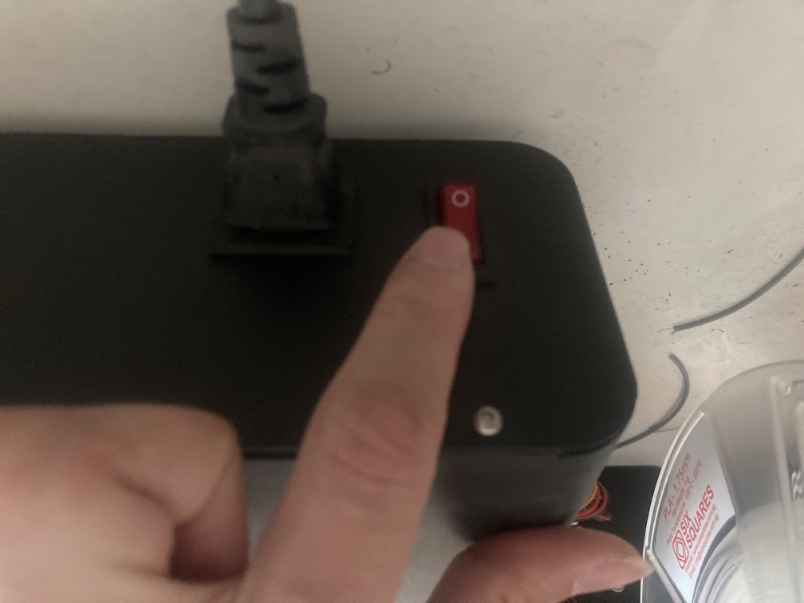
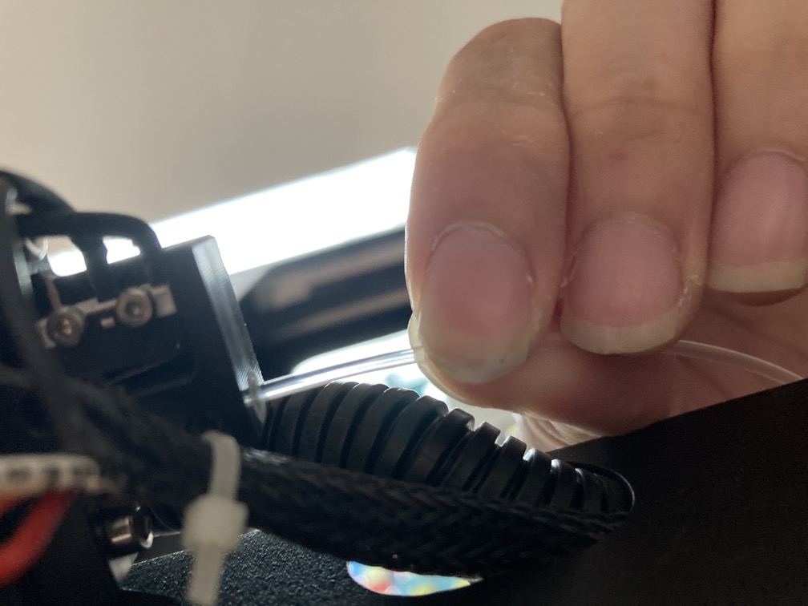
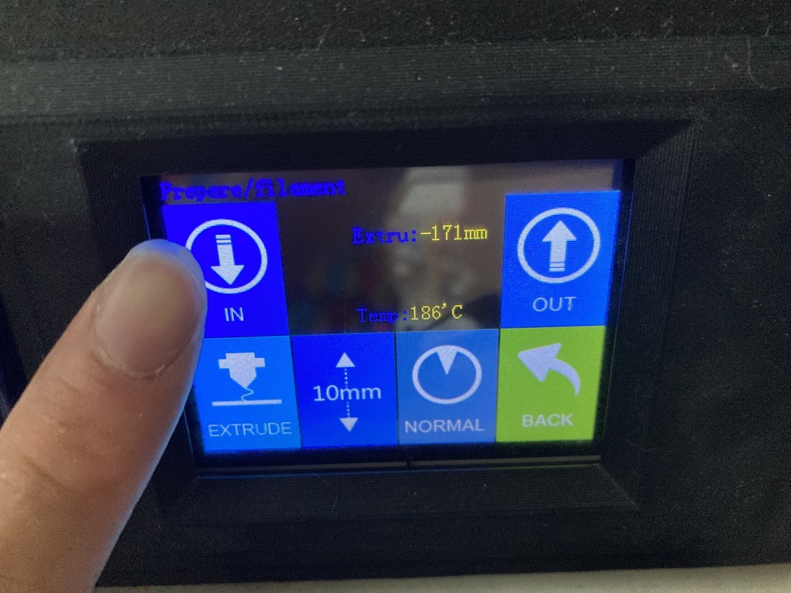
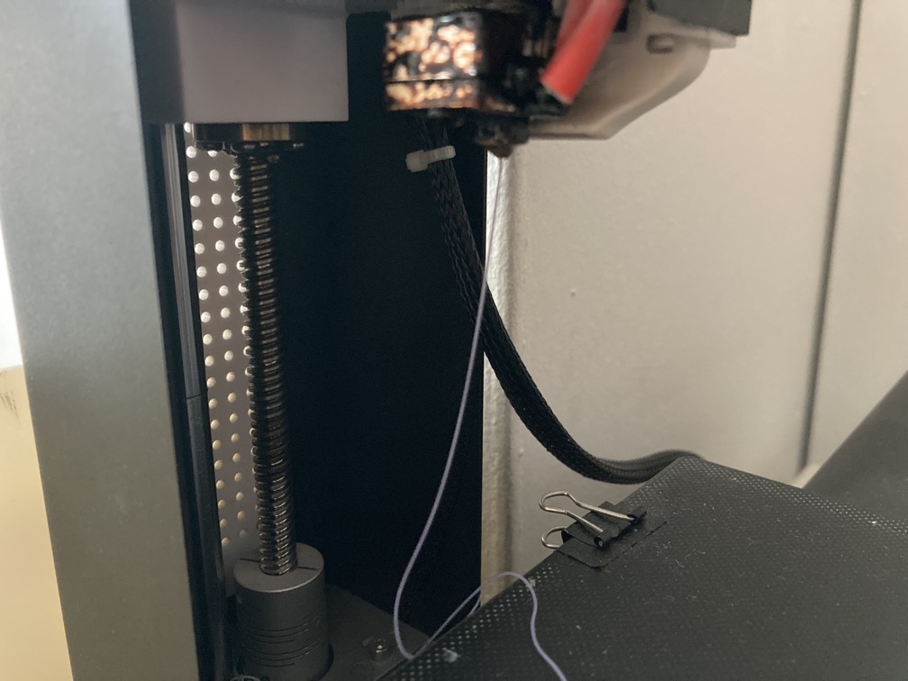
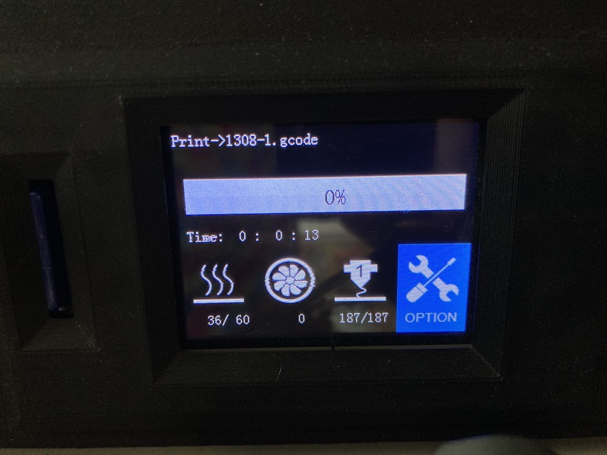

# 4d. Printing The Model

**We are using JG Aurora A5. The following steps will mostly apply to this 3D printer, but the general steps to start a print are similar.**

1. Switch on the machine via the switch at the back of the machine.

2. Insert the SD Card

3. If there is no filament, insert one at the extruder end of the machine.

4. On the main screen, press "Extrude" and switch the speed to "Normal", "10mm" and press "IN". The machine will heat up if it haven't already, and begin to reel the filament in when it is ready.

5. Reel the filament in until some filament have been extruded.

:::warning Note
When the filament is extruded at the nozzle, change the speed to "Slow" as it may damage the extruder if the filament is moving too fast.
:::

6. Exit the "Extrude" menu and enter the "Print" menu. Select the model to print and click "YES" to print.

7. Completed! The printer will now start printing.

:::tip Tip
3D printers are not perfect. Do check on them once in a while to see if there are any errors and you may make adjustments.
:::
