# Version 2.0

### Changes

[Link to repository](https://github.com/screensavers-club/argos-childnode-case/tree/main/2.0)

Version 2.0 is out! After prototying with version 1, the team made some decisions on moving the design forward.

Sketches:
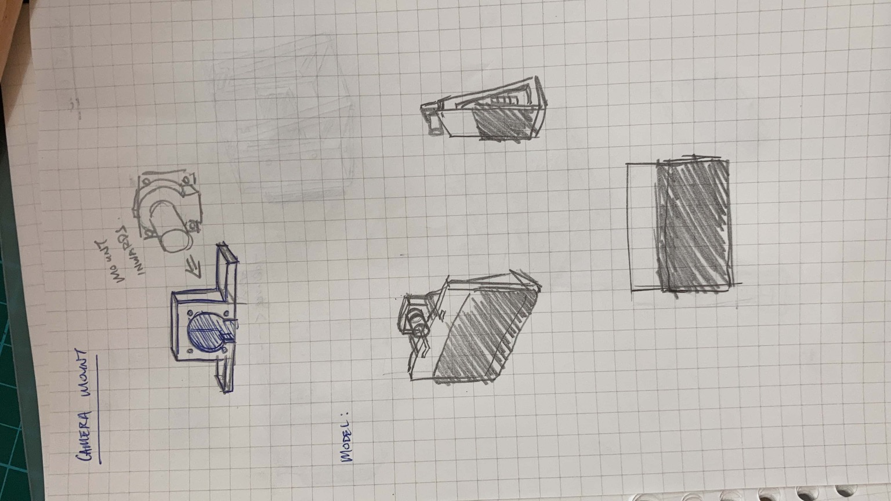

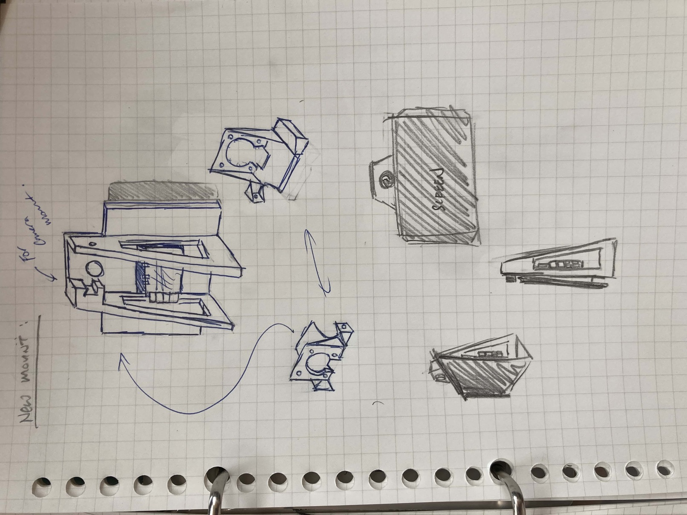

The changes were mostly about optimising space, reducing material and size, centering the CG, and simplifying the assembly. The main goal is to make the model assembly dummy-proof.

**The main changes:**

- Complete removal of Outer Piece and Back Plate, removing a whole lot of material and time spent 3D printing
- Refurbishing the "Inner Piece" into a "Main Body" piece, a simple, compact holder that supports the device.
- Opening up the design: using the Raspberry Pi 7" Touch Display as the screen itself, without a casing going over it.
- Rotated the screen so as to put the ports at the bottom of the model, which frees up the space at the top for the camera mount. This solves the issue of needing to create extra space at the top to cater for the wires, affecting the camera mount's height which is not ideal. The wires are now redirected to the bottom, were holes will be cut for wires to go through directly below the model.
- Added a nut insert for the tripod mount to lock the nut in place, prevent it from unscrewing itself internally when dismounting the tripod.
- The camera is now installed from the back of the camera mount, allowing for a cleaner install. We also changed the screw size so it fits easier.
- The camera mount is now designed to simply slot into the Main Body piece and tightened with a single screw.
- Lowered and centering the CG of the model, allowing better balance.

### Images

**Camera Mount**

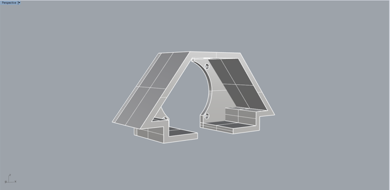

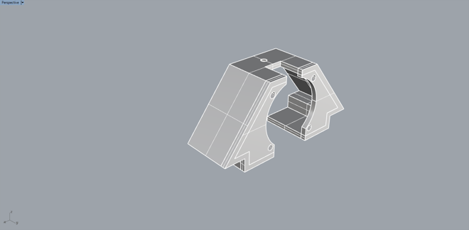

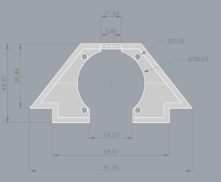

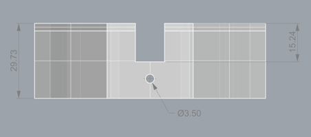

**Main Body**

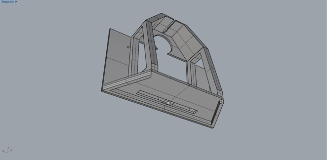

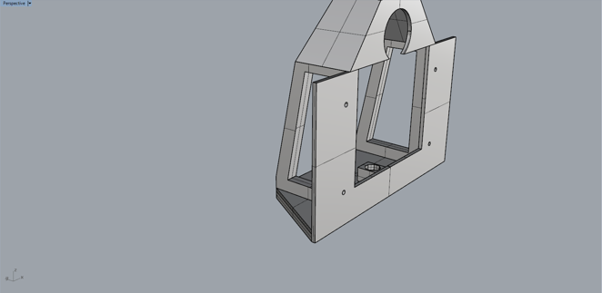

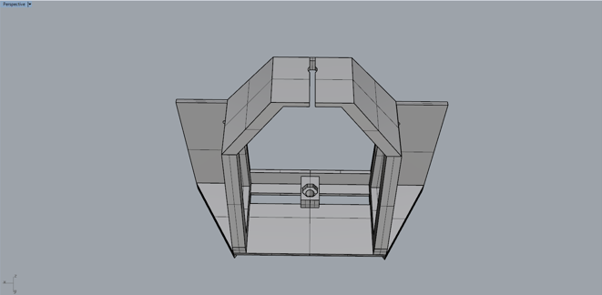

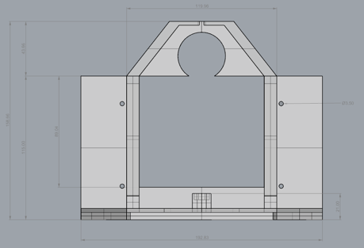

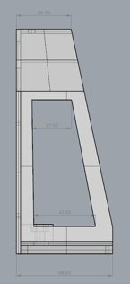

**Overall**

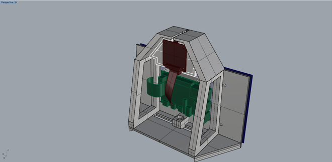

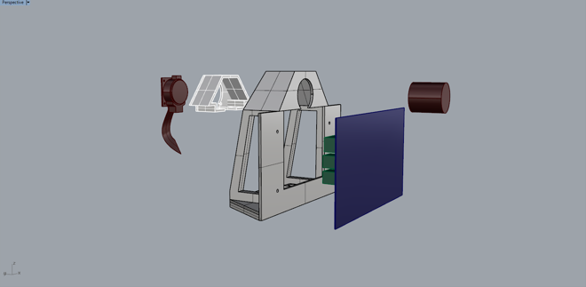

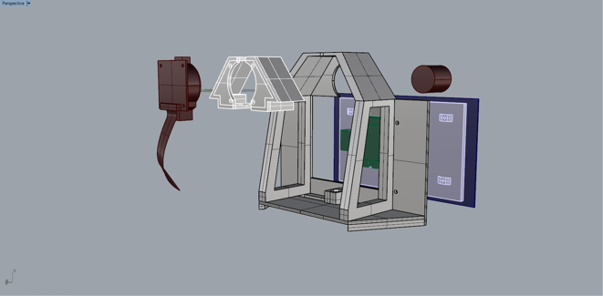

### Issues

1. The tripod mount screw does not have enough allowance to flush. This is due to an error in assumption that the position of the screw is the same as the previous model. This issue is fixed in version 2.1.

2. The 1/4" nut for the tripod mount does not fit where it's supposed to sit. This is due to a tolerance issue which is fixed in version 2.1.

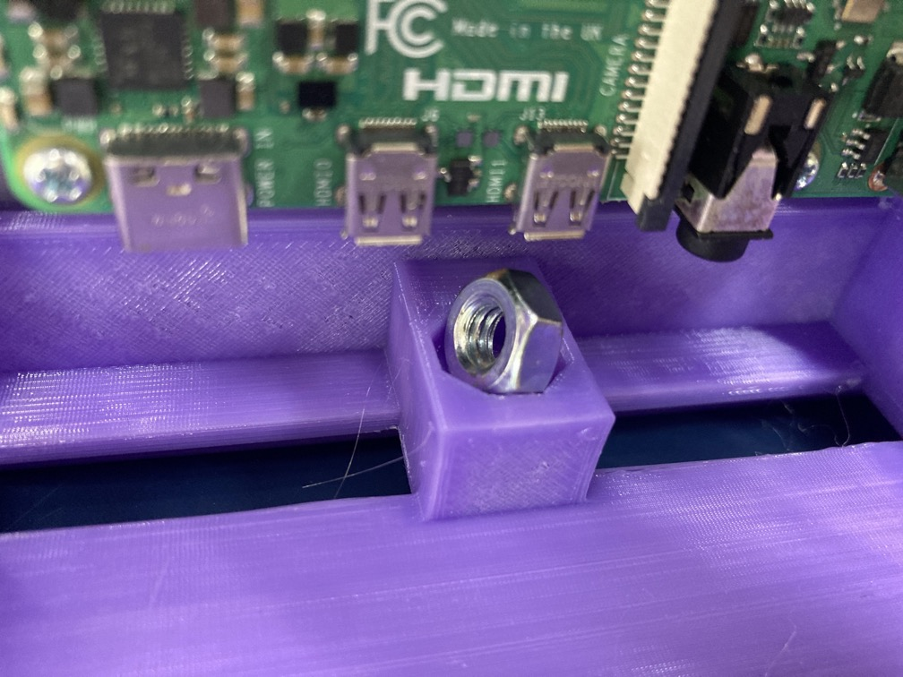

3. The path of the camera len's focal adjustment arm is being blocked by the casing. The camera will thus be required to move backwards slightly to accomodate for the space it needs.

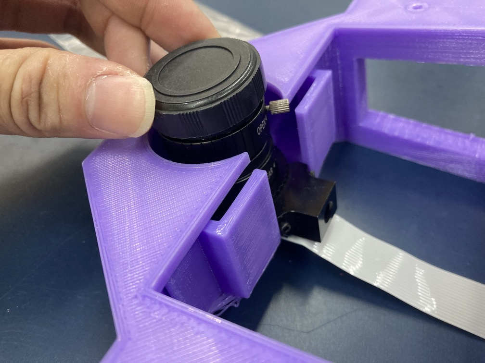

4. The camera lens is inaccessible which can make it difficult to adjust focus and aperture. Version 2.1 features an open top design that allow for such adjustments.
