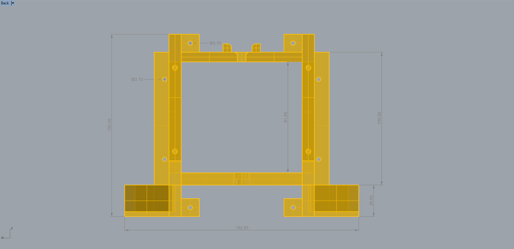
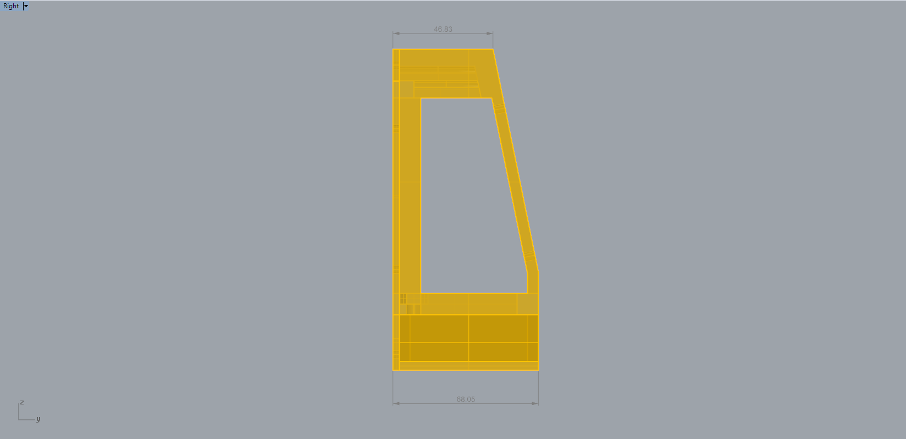
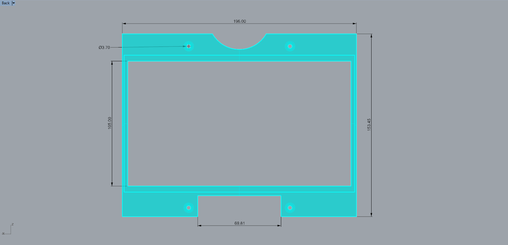
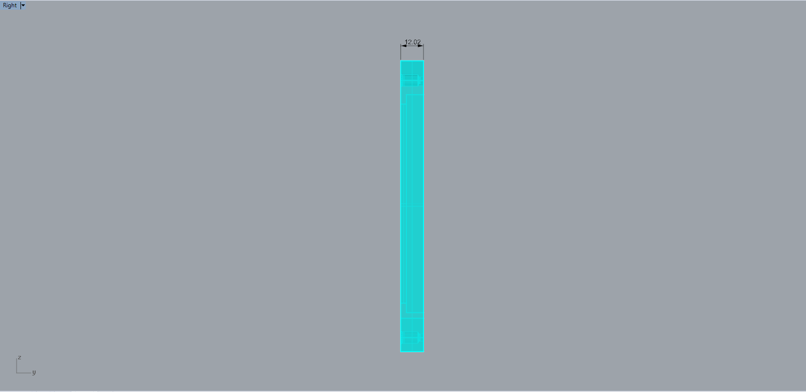
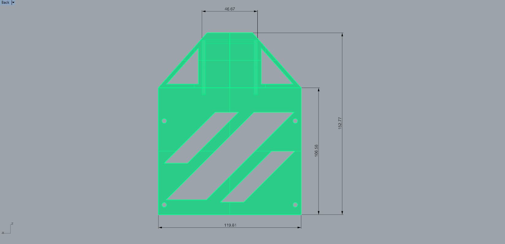
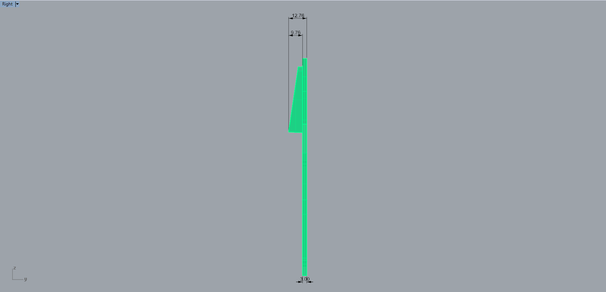
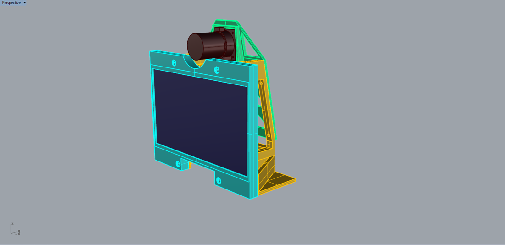

# 4a. Download Files

[Latest version .STL files](https://github.com/screensavers-club/argos-childnode-case/tree/main/3.2/stl)  
All child node casing versions can be found [here](https://github.com/screensavers-club/argos-childnode-case)

**Main Body**  
Dimensions: 193mm(w) x 68mm(d) x 151mm(h) mm

**Front Cover**  
Dimensions: 196mm(w) x 12mm(d) x 154mm(h) mm

**Back Plate**  
Dimensions: 120mm(w) x 13mm(d) x 153mm(h) mm

## The 3D Model

The full model takes approximately 20-30 hours to print, depending on the 3D printer.

The model consists of 3 parts:

- The main body which bears the weight of entire setup and keeps it upright.
- The front cover which protects the screen and provide extra stability.
- The backplate which protects the electronics.

The full 3D model includes the electronics components for reference.
