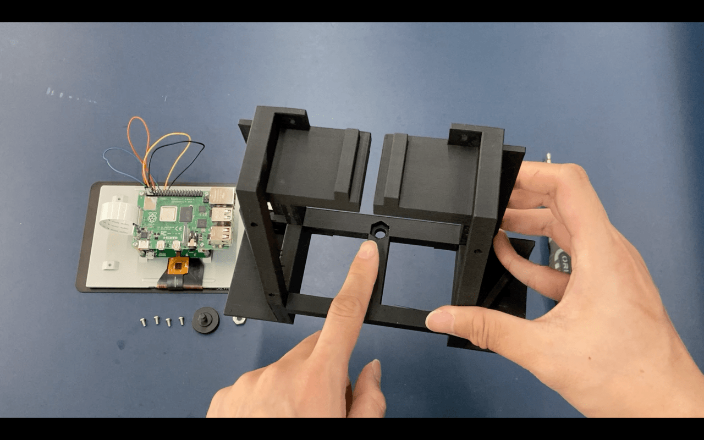

# Assembling the Camera

The items required for the case assembly is:

- Current assembly
- Raspberry Pi HD Camera Module
- 1x 1/4" Tripod adaptor (will be changed to 1/4" 12mm screw soon)

Tools to use:

- Screw driver or battery drill

19. Insert the hex nut onto the hexagonal slot

