# Assembling the Case

The items required for the case assembly is:

- Raspberry Pi & Touch Display assembly
- Main body part
- 4x 6mm M3 screws
- 1x 1/4" Tripod adaptor
- 1x 1/4" Hex Nut

Tools to use:

- Screw driver or battery drill

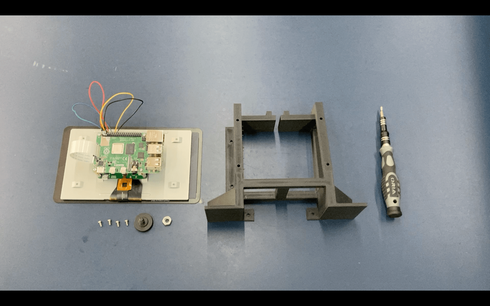

14. Insert the hex nut onto the hexagonal slot

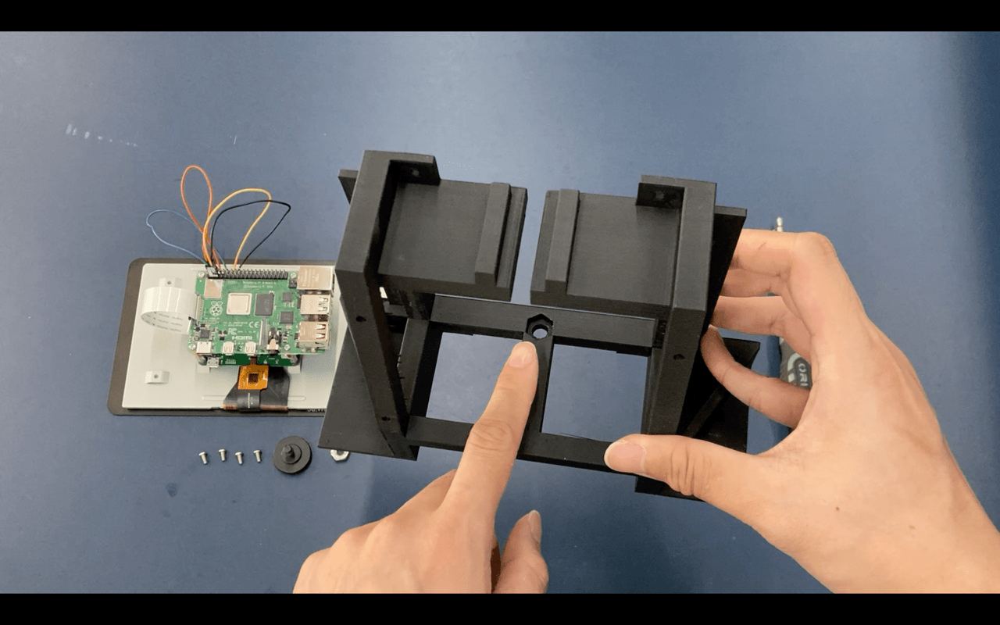

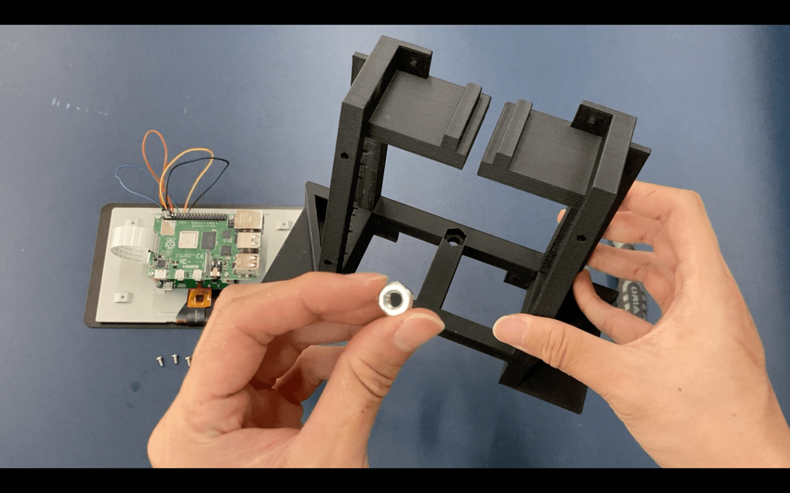

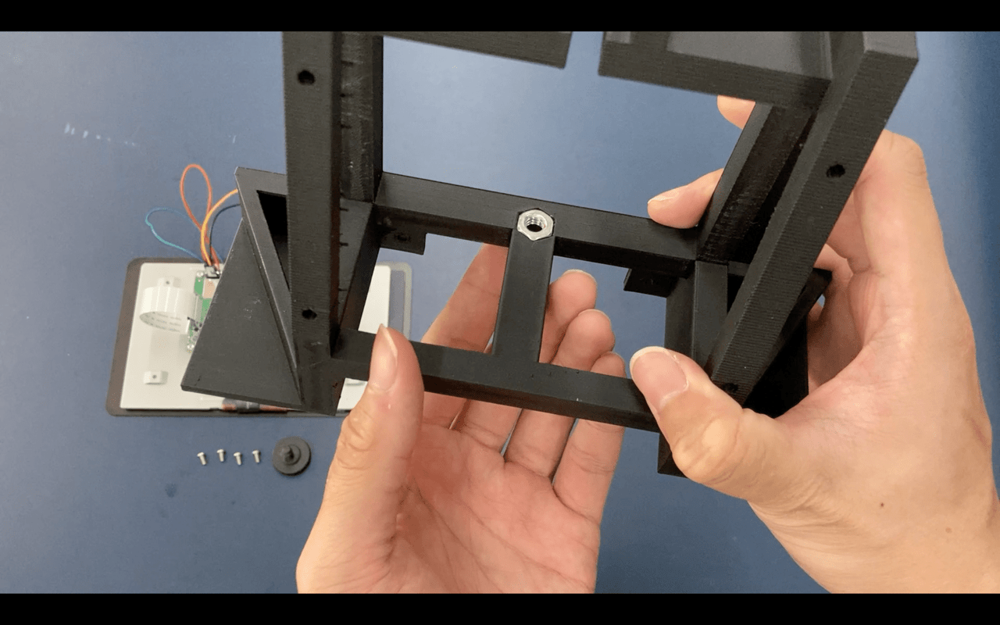

15. Secure the nut using the tripod adaptor

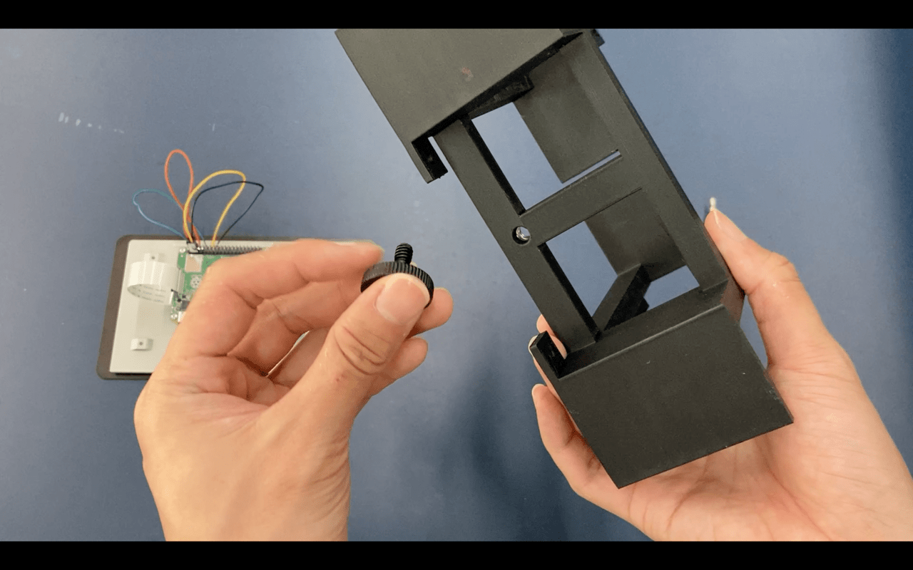

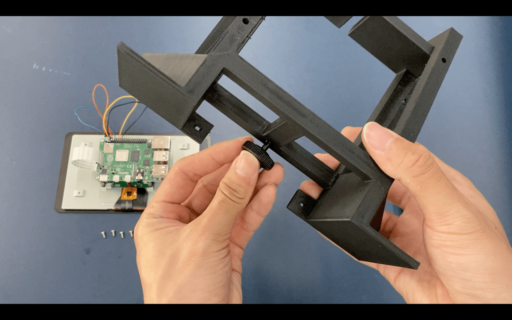

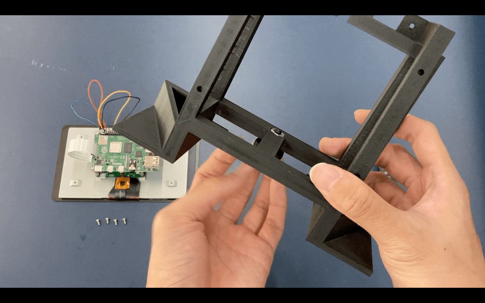

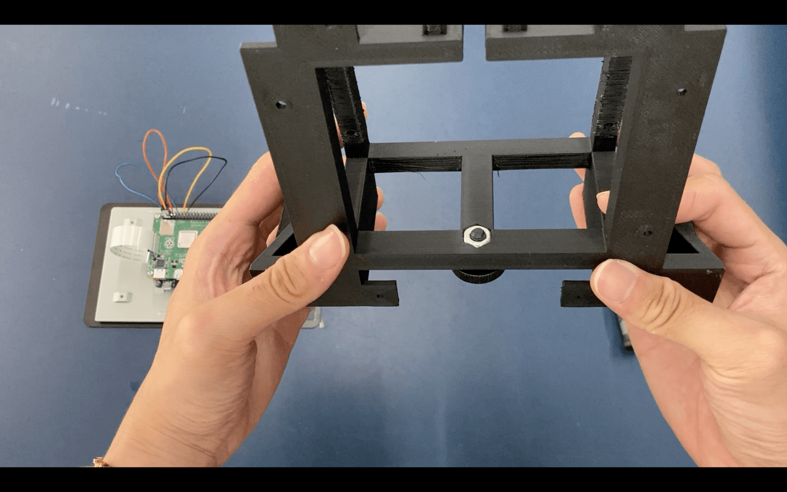

16. With the yellow chip facing downwards, insert the Raspberry Pi assembly into the hole in front of the main body.

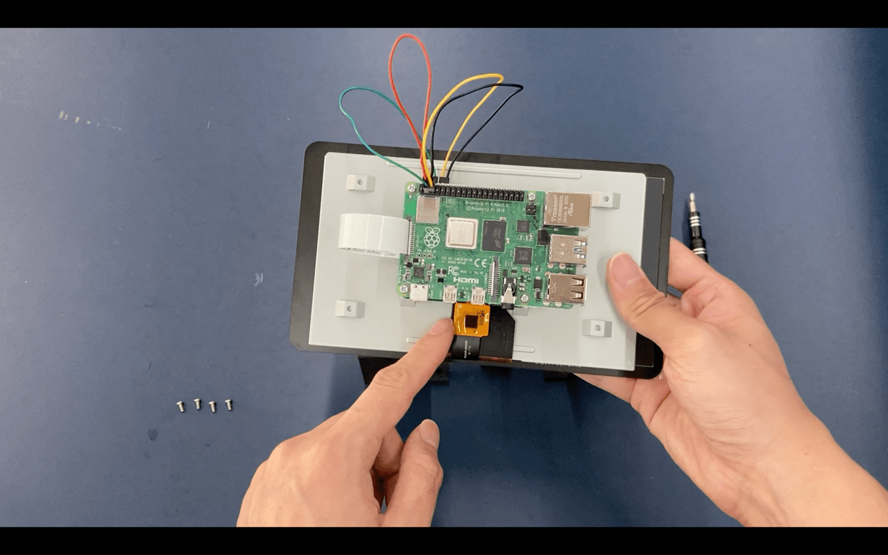

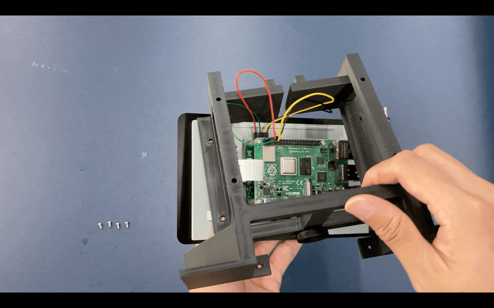

17. Align the screwholes and tie the 2 components together with the 6mm M3 bolts.

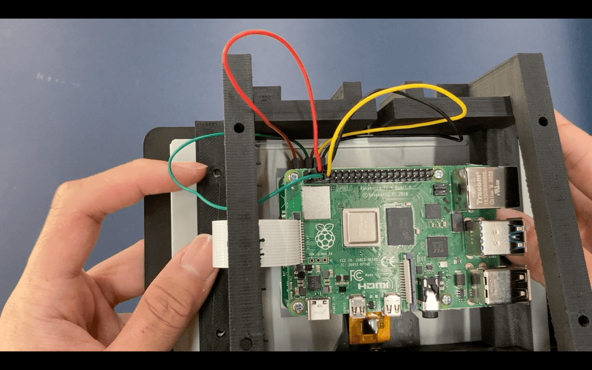

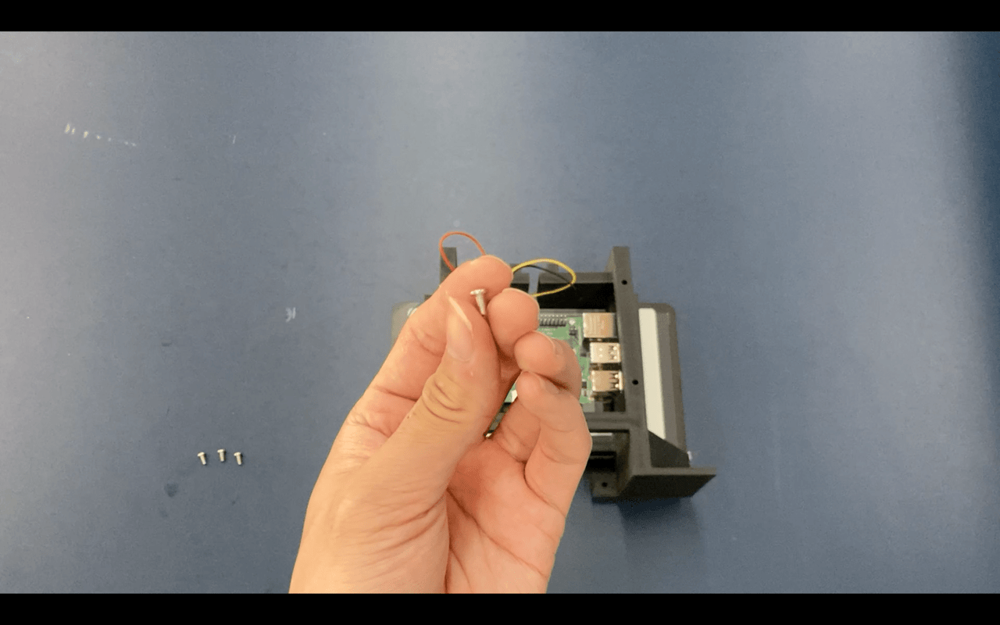

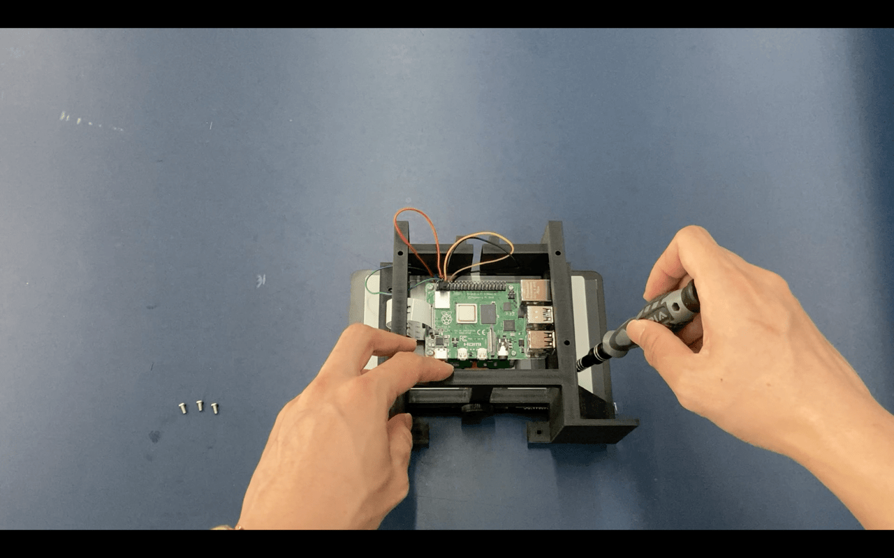

18. Finally, check if the standoff screws are not pushing too much against the screen, to ensure that it does not damage the screen. (This will not happen if you use the correct screw length)

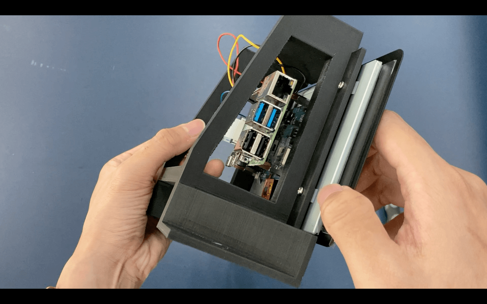

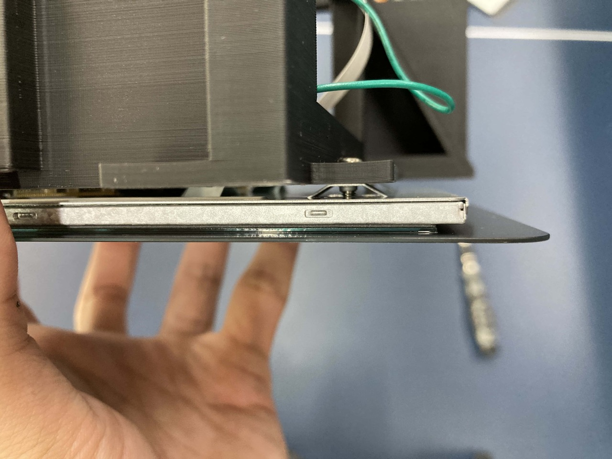
