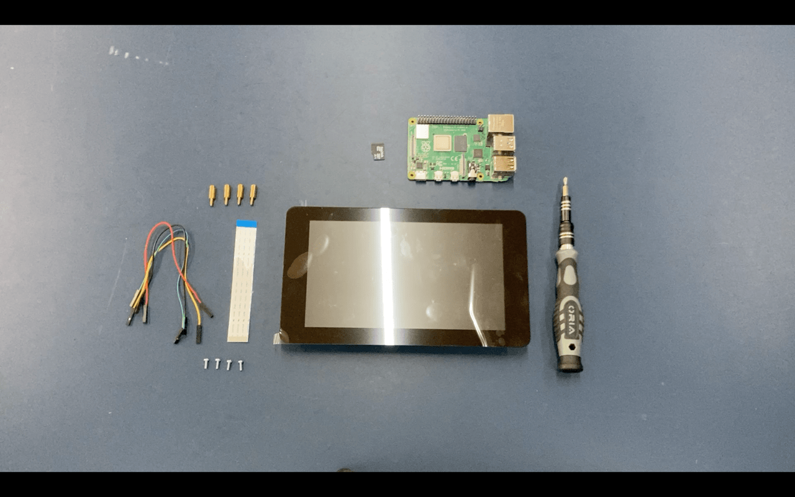

# Raspberry Pi Assembly Requirements

**You will need:**

- 1x Raspberry Pi 4 Model B
- 1x Raspberry Pi Touch Display (7") set (including 4x standoff screws, 1x ribbon cable, 4x jumper cables)
- 1x `Class 10` microSD card (`16GB` or higher) with Raspbian
- 4x 11mm `M2.5` standoffs

**Tools needed:**

- Screw driver or battery drill

:::tip Note
Place the components in the same orientation as the image. It is important to note the orientation of the components.
:::

Continue to the next page.
