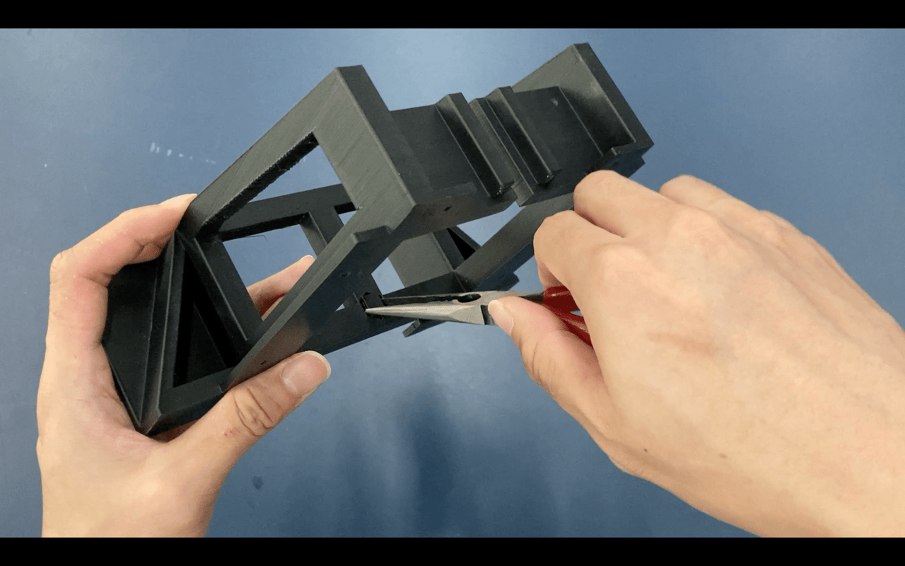

# Removing Supports

Once the model is done printing, the first step is always to remove the supports. You will need your **pliers**.

### Removal Of Support Structures

:::danger Be Careful!
The material can be sharp, becareful not to cut yourself.
:::

1. First, pop out the flimsier supports found at the bottom of the main body case.

   

   

2. Remove the smaller support at the front of the model

   

3. For the side supports (inside the beams), if the support structure is weak enough, you may use your fingers to pop the supports out.

4. If it is not possible to remove using your hands, use pliers.

   

   

5. Twist and crush the supports to remove it easily

   

   

6. Use hands to remove the rest of the support once it is crushed as it is easier to do so.

   

7. For the tripod mount screw and nut area, use a plier to simply pull the support out from the nut side.

   

   

   

8. The front cover have some support structure as well. Use pliers to pull them out from the screw holes.

   
