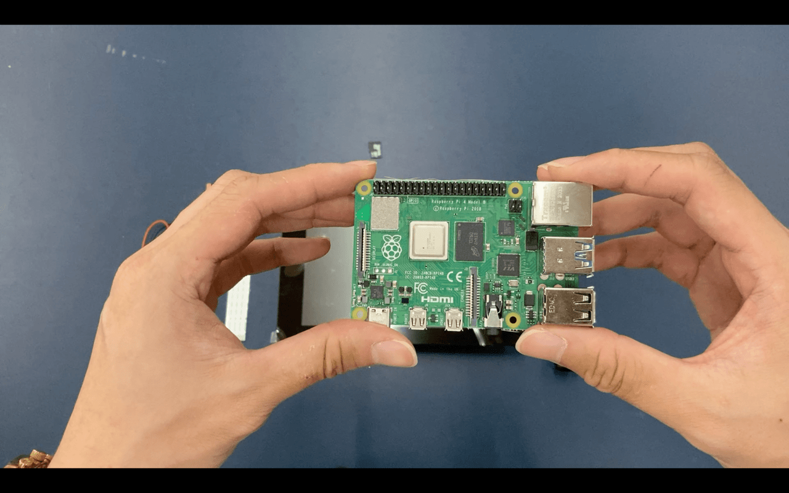
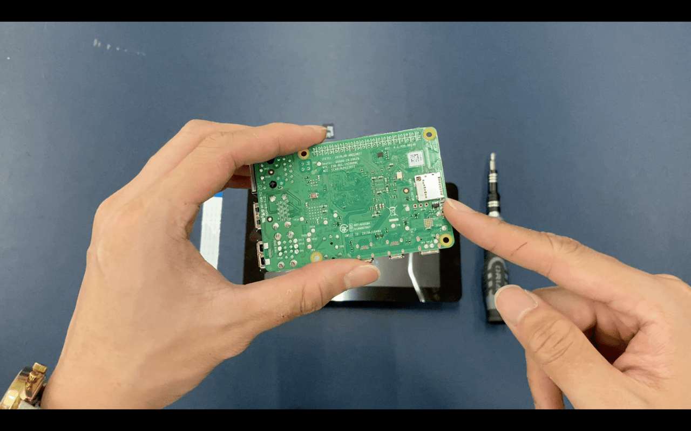
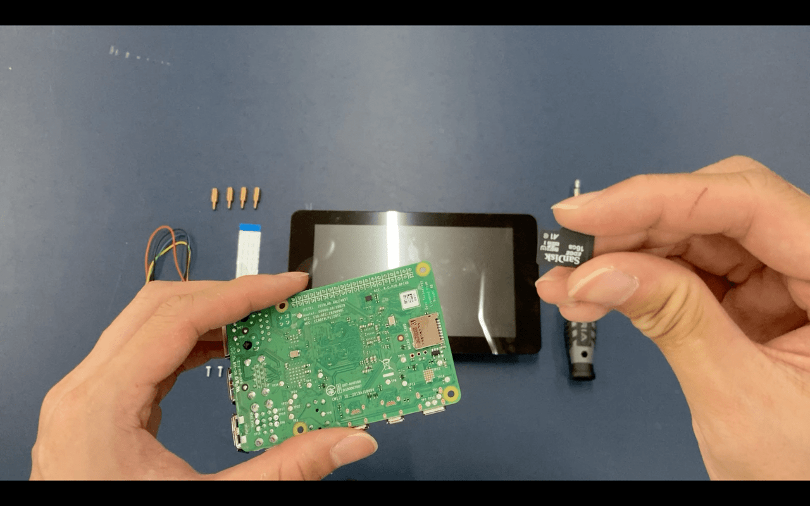
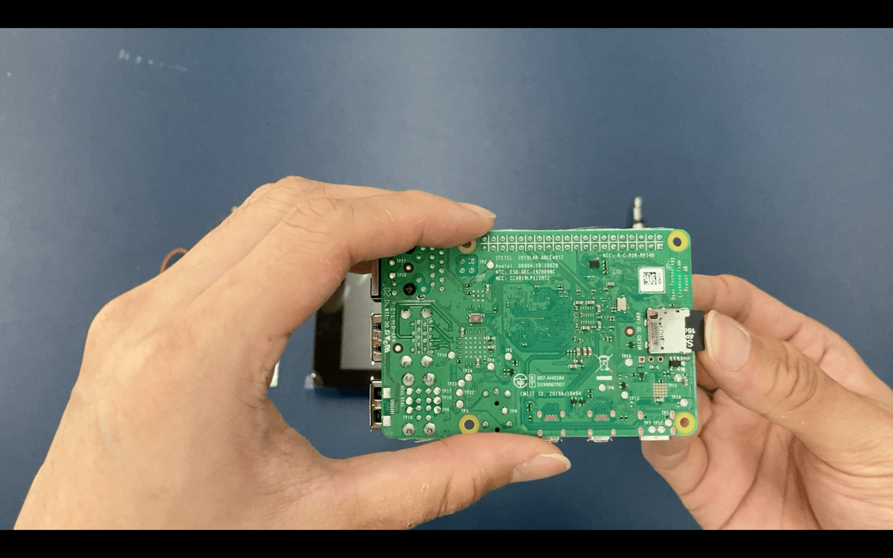

# Insert Raspberry Pi SD Card

1. Pick up the Raspberry Pi and flip it to the underside. 

2. The position of the SD card is as shown.  

3. Insert the SD card into the SD card reader. Take note of the orientation. The side of the SD card with metal contacts should touch the contacts on the reader. 

