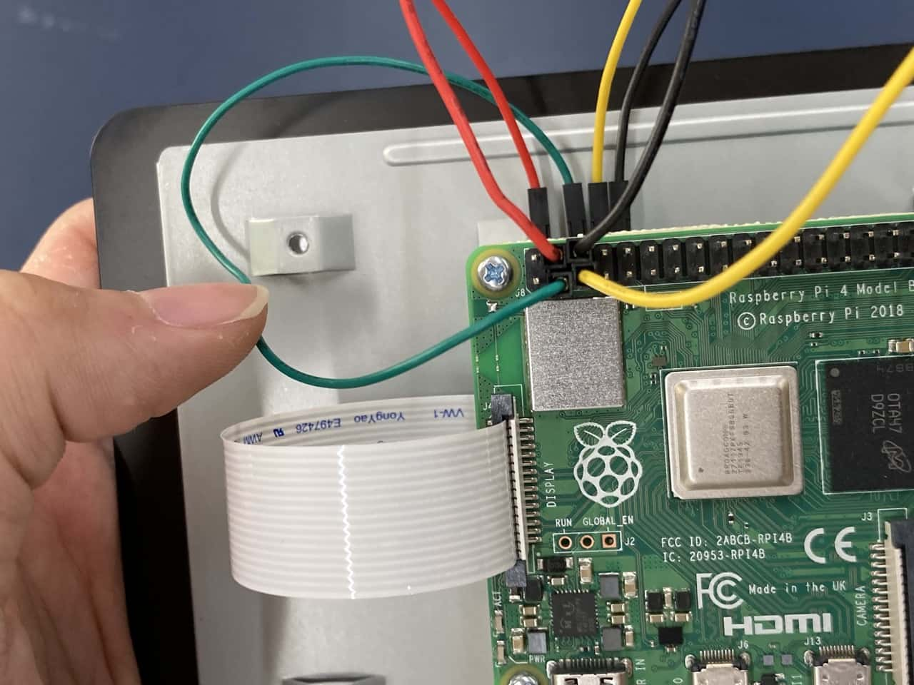

# Attaching The Raspberry Pi To The Screen

1. Attach all 4 11mm M2.5 hex standoffs onto the 7" Touch Display. Refer to the image below. 

2. With the Raspberry Pi's USB inputs facing **right** of the current setup, place it on top of the Touch Display, aligning the screwholes.

10. Screw the Raspberry Pi unit onto the 4 standoffs installed earlier.

11. Once that is done, open up the ribbon cable port labelled "DISPLAY" on the **left** side of the Raspberry Pi.

12. Pick up the ribbon cable and plug it into the open port. Do note that the pins are facing **away** from the black tab. Close the black tab when the cable is secure.

:::warning Fragile!
Make sure the ribbon cable is correctly aligned with the contacts before pushing down the black tab to avoid damaging the cable. Do not force the ribbon cable with excessive force. 
::: 

13. Now for the jumper cables. Plug the cables in according to these positions:

Top down view of where each cable is plugged in:

Refer to the following table and pinout diagram to ensure the cables are plugged in correctly. 

| colour |  pin | pin number on Raspberry Pi |
| ---- | ---- | --- |
| red |  5V |  4 |
| green | SDA | 3 |
| yellow | SCL | 5 |
| black | GND | 6 |

