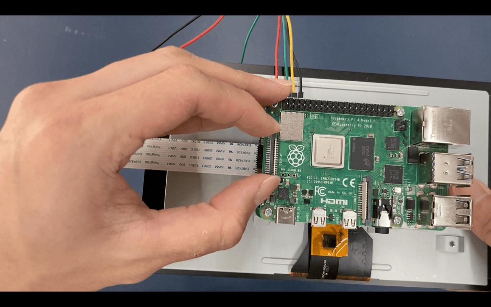
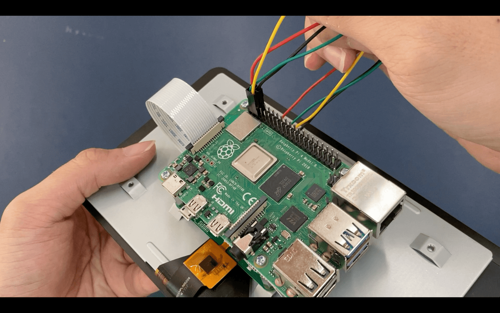

# Attaching The Raspberry Pi To The Screen

8. Pick up the 11mm M2.5 hex standoff. This goes onto all 4 hex standoffs on the 7" Touch Display.

9. With the Raspberry Pi's USB inputs facing **right** of the current setup, place it on top of the Touch Display, aligning the screwholes.

10. Pick up the screw and start tying the 2 components together.

11. Once that is done, open up the ribbon cable port labelled "DISPLAY" on the **left** side of the Raspberry Pi.

12. Pick up the ribbon cable and plug it into the open port. Do note that the pins are facing **away** from the black tab. Close the black tab when the cable is secure and not slanted.

13. Now take a look at the jumper cables. Plug the cables according to these positions:

Top down view for clearer look at where each cable is plugged in

Written instructions to the configuration:
With the Raspberry Pi's USB inputs facing **right**

- red (5V): 2nd to the top-left
- green (SDA): 2nd to the bottom-left
- yellow (SCL): 3rd to the bottom-left
- black (GND): 3rd to the top-left
