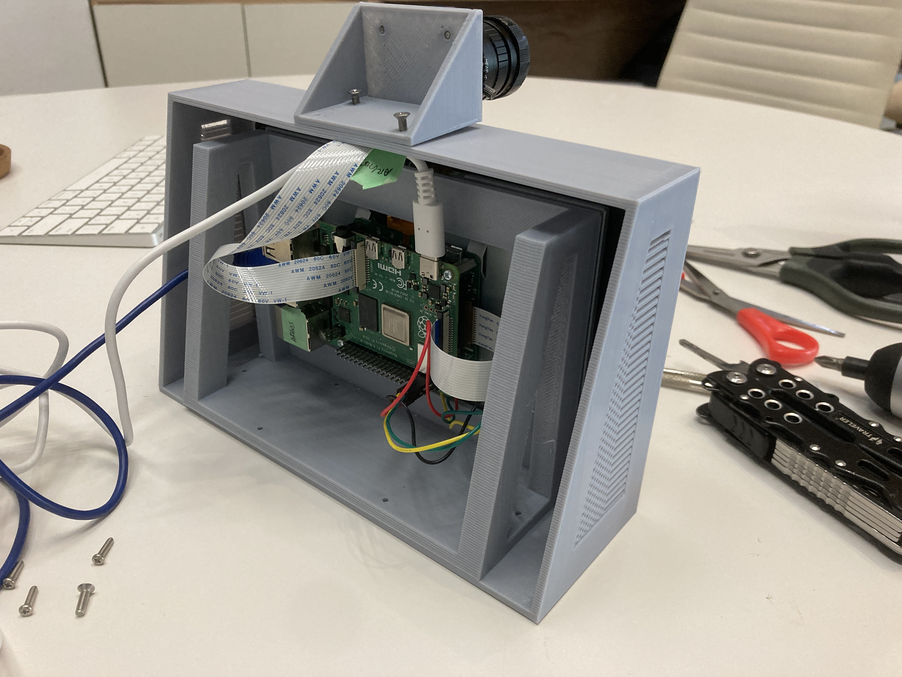

# Assembly Of Casing

### Assembly Of Main Body

1. Once all the files are printed, gently remove the generated support structures with pliers, cutters, and a small phillip screwdriver or a battery drill (for the screw holes).
   

2. Separate the components into three parts: 1) The camera sensor and its ribbon cable, 2) The camera lens, and 3) The rest of the component assembly
   

3. Unplug power and all external connections (i.e. keyboard, mouse, camera) from the Raspberry Pi Touchscreen Display.
   

4. With the touch screen display on the front of the main body part, facing outward, align the screw holes of the touch screen display brackets with the inner mount.

:::tip Note:
The USB C port should be facing downwards.
:::

5. Fasten both parts together using 4 M3 8mm bolts.
   

### Assembly Of Camera Mount

6. Insert the camera from the back of the mount and align the screw holes.
   

7. Fasten the HQ camera onto the camera mount using 4 M2.5 8mm bolts and use its corresponding nuts to secure it tightly.
   

8. Slot the camera mount into the top part of the main body piece until the screw hole on the top of the model aligns.
   

9. Once aligned, use a 10mm M3 bolt to secure the two pieces together. Screw in its corresponding nut at the bottom of the assembly.
   

10. The camera lens can now be inserted through the front of the assembly.
    

11. The assembly is now completed!
    
    
    
