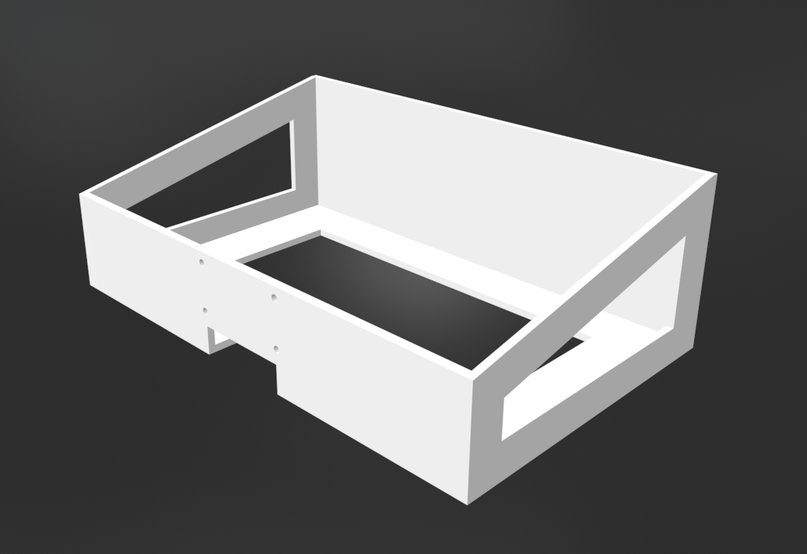
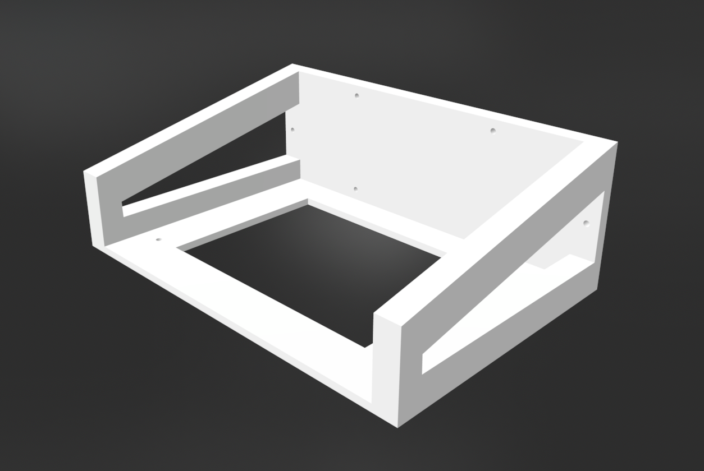
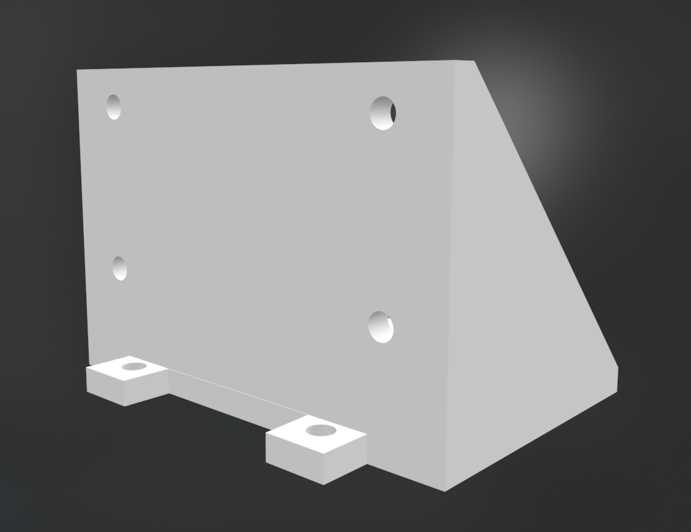
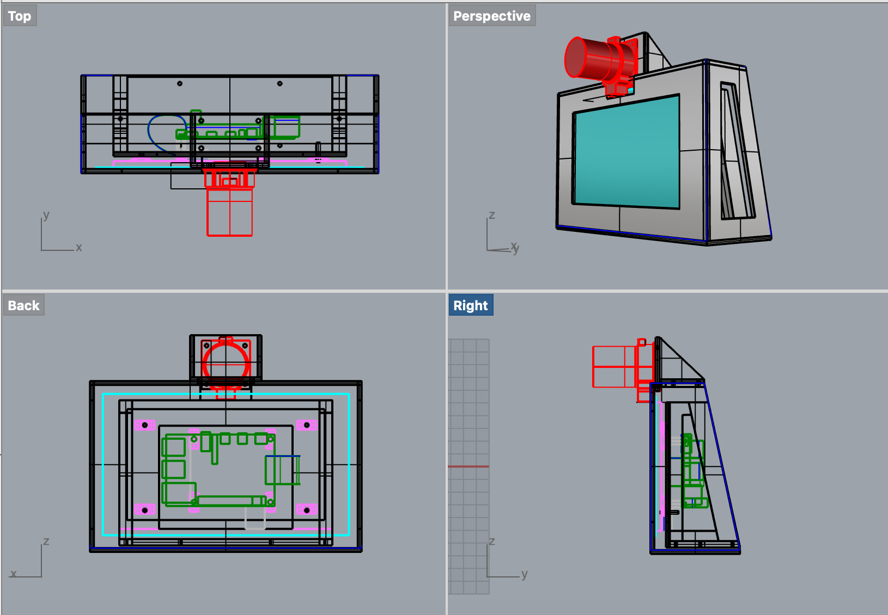
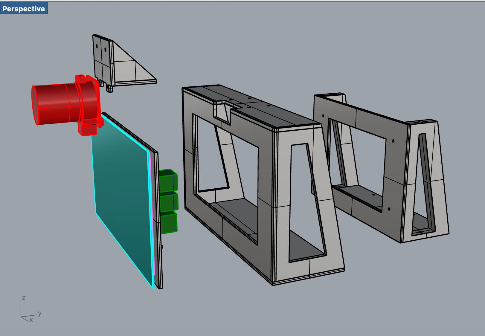
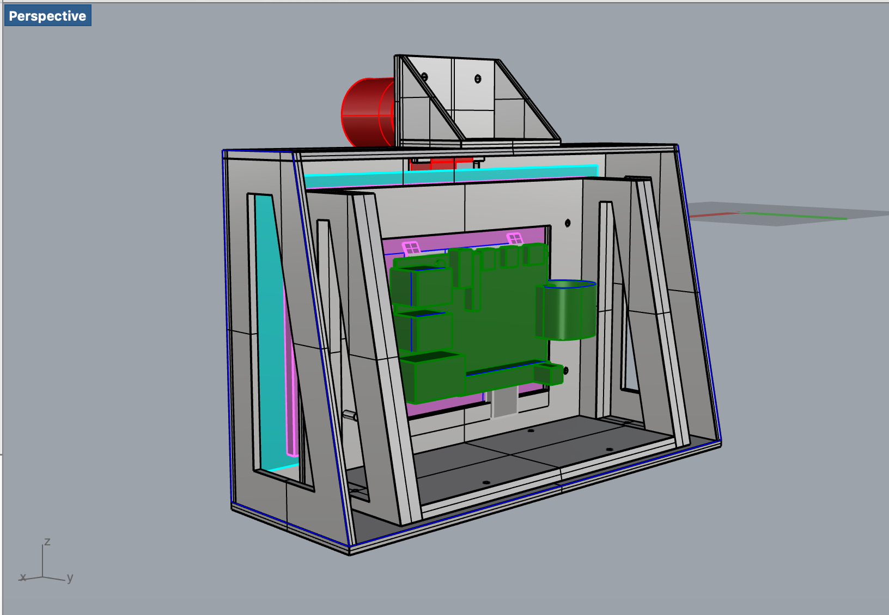

# Printing The Case

This section tells you what to do to print the files

## Download the files

[Rhino file of all parts](https://github.com/screensavers-club/argos-childnode-case/tree/main/1.0/rhino#:~:text=0106_argos%20camera%20mount.3dm)  
[All .stl files in a folder](https://github.com/screensavers-club/argos-childnode-case/tree/main/1.0#:~:text=8%20days%20ago-,stl,-version%201%20stl)  
All child node casing 3D models can be found [here](https://github.com/screensavers-club/argos-childnode-case)

Outer Casing  
Dimensions: xx x yy x zz mm

[Download .stl file](https://github.com/screensavers-club/argos-childnode-case/tree/main/1.0/stl#:~:text=8%20days%20ago-,0706_outercase.stl,-version%201%20stl)

Inner Mount  
Dimensions: xx x yy x zz mm

[Download .stl file](https://github.com/screensavers-club/argos-childnode-case/tree/main/1.0/stl#:~:text=8%20days%20ago-,0706_innercase.stl,-version%201%20stl)

Camera Mount  
Dimensions: xx x yy x zz mm

[Download .stl file](https://github.com/screensavers-club/argos-childnode-case/tree/main/1.0/stl#:~:text=0106_argos%20camera%20mount.stl)

## The 3D Model

The model consists of 3 parts:

- The inner touchscreen display mount which holds the touchscreen in an upright position
- The camera mount which holds the camera
- The outer case which holds all the components together

The full 3D model includes the electronics components for reference.

## 3D Printing: Setting Up

We used [Simplify 3D](https://www.simplify3d.com/) to slice our models. However, you can use any slicer you feel comfortable with as long as you use similar settings.

(Use a better image in future updates)

:::tip Note
Ensure your 3D printer is big enough to print the case.
:::

Here are the properties we use for the printing

|     Properties     |                                               Settings                                               |
| :----------------: | :--------------------------------------------------------------------------------------------------: |
|      Material      | [PLA](https://shopee.sg/PLA-TPU-PETG-ABS-Filament-1.75mm-1KG-330M-3D-Printing-i.88065474.4233167606) |
| Nozzle Temperature |                                                190°C                                                 |
|  Bed Temperature   |                                                 60°C                                                 |
|       Infill       |                                                 30%                                                  |
|   Infill Pattern   |                                             Rectilinear                                              |
|      Supports      |                                            Auto Generated                                            |

:::tip Note
Place the models in ways which generates the least amount of supports.
:::

Once sliced, you can print the files.

Printing the camera mount
(Add images of the other parts in future updates)
