# Printing The Case

This section tells you what to do to print the files.

The latest version of the model is Version 2.2.

## Download the files

[Latest version Rhino file (Rhino 5 and Rhino 7)](https://github.com/screensavers-club/argos-childnode-case/tree/main/2.2)  
[Latest version .STL files](https://github.com/screensavers-club/argos-childnode-case/tree/main/2.2/stl)  
All child node casing versions can be found [here](https://github.com/screensavers-club/argos-childnode-case)

**Main Body**  
Dimensions: 193mm(w) x 68mm(d) x 115mm(h) mm

**Camera Mount**  
Dimensions: 91mm(w) x 29mm(d) x 45mm(h) mm

## The 3D Model

The model consists of 2 parts:

- The main body which bears the weight of entire setup and keeps it upright.
- The camera mount which holds the camera

The full 3D model includes the electronics components for reference.

## 3D Printing: Setting Up

We used [Simplify 3D](https://www.simplify3d.com/) to slice our models. However, you can use any slicer you feel comfortable with as long as you use similar settings.

:::tip Note
Ensure your 3D printer is big enough to print the case. A minimum of 200mm by 200mm print bed is recommended.
:::

Here are the properties we use for the printing

|     Properties     |                                               Settings                                               |
| :----------------: | :--------------------------------------------------------------------------------------------------: |
|      Material      | [PLA](https://shopee.sg/PLA-TPU-PETG-ABS-Filament-1.75mm-1KG-330M-3D-Printing-i.88065474.4233167606) |
| Nozzle Temperature |                                                190°C                                                 |
|  Bed Temperature   |                                                 60°C                                                 |
|       Infill       |                                                 15%                                                  |
|   Infill Pattern   |                                             Rectilinear                                              |
|      Supports      |                                            Auto Generated                                            |

:::tip Note
Place the models in ways which generates the least amount of supports.
:::

## Slicing

1. Once the files are downloaded, open up Simplify3D.

2. Drag the file you wish to print into the print bed.

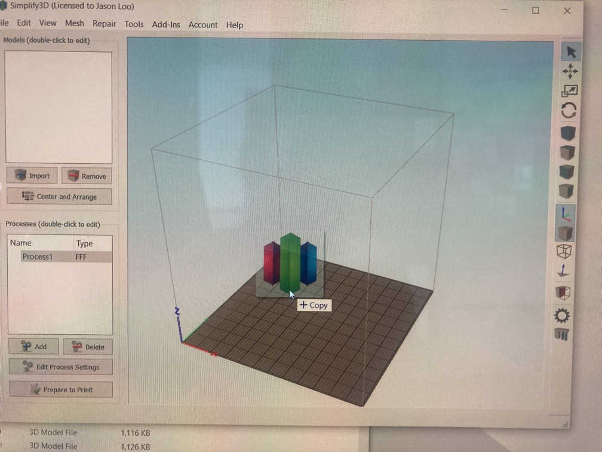

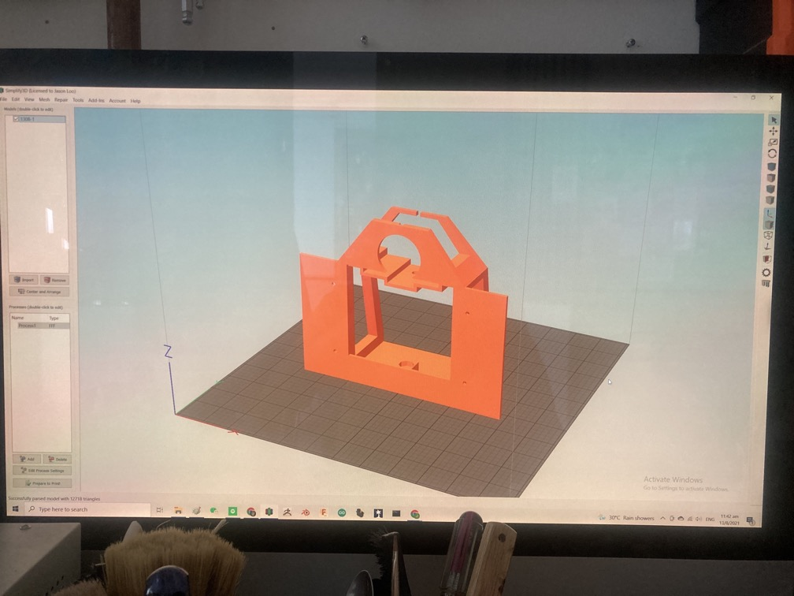

3. Press "ctrl + L" to activate "face selection mode".

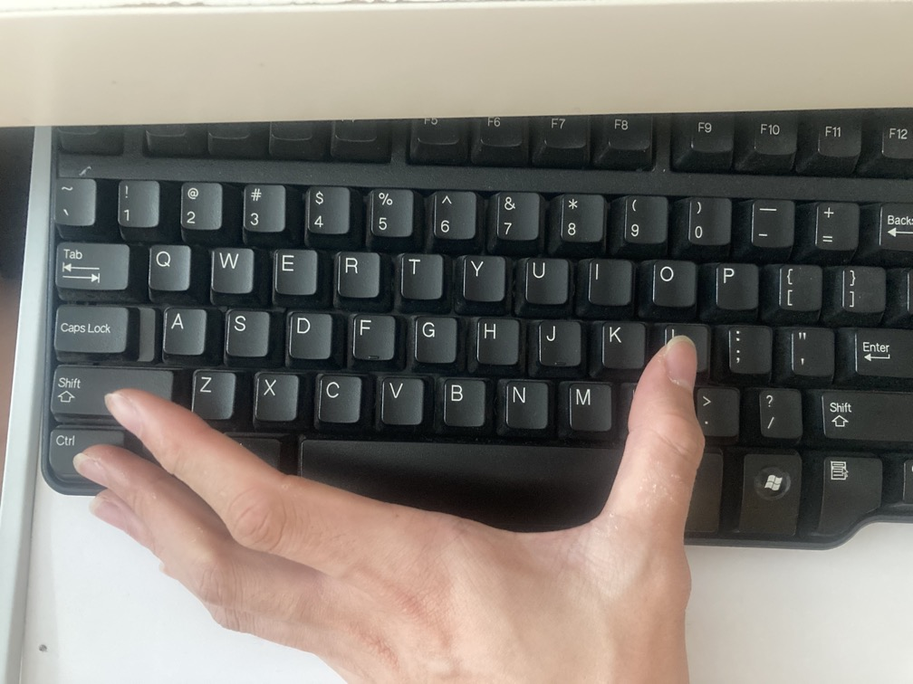

4. Select the face you wish to be the base of the model. In this case, we selected the front face of the main body as it will result in the most efficient print.

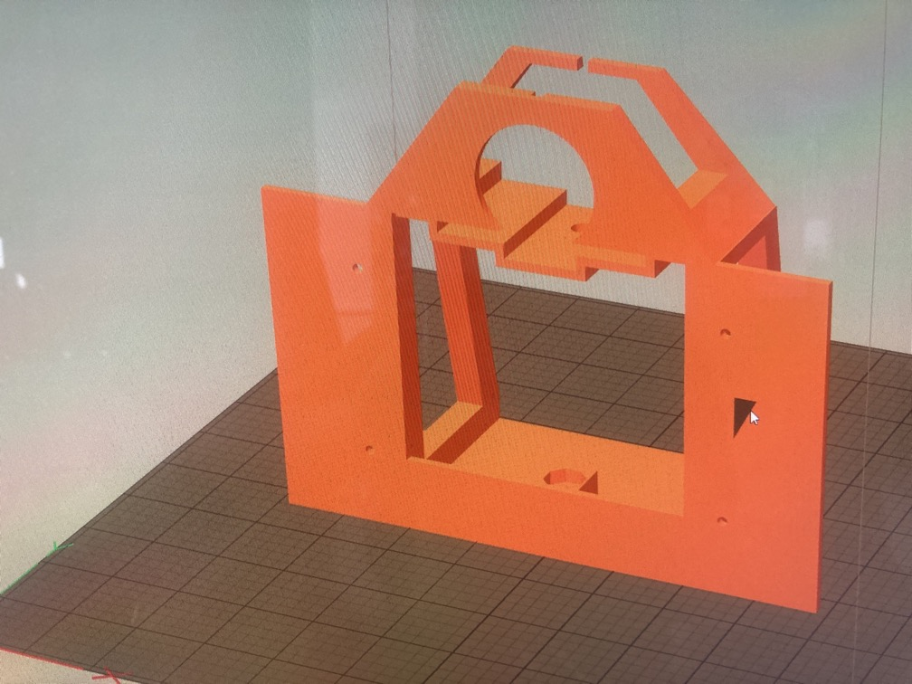

5. Press "ctrl + R" to center the model. Alternatively, you may manually drag the model to a desired part of the print bed.

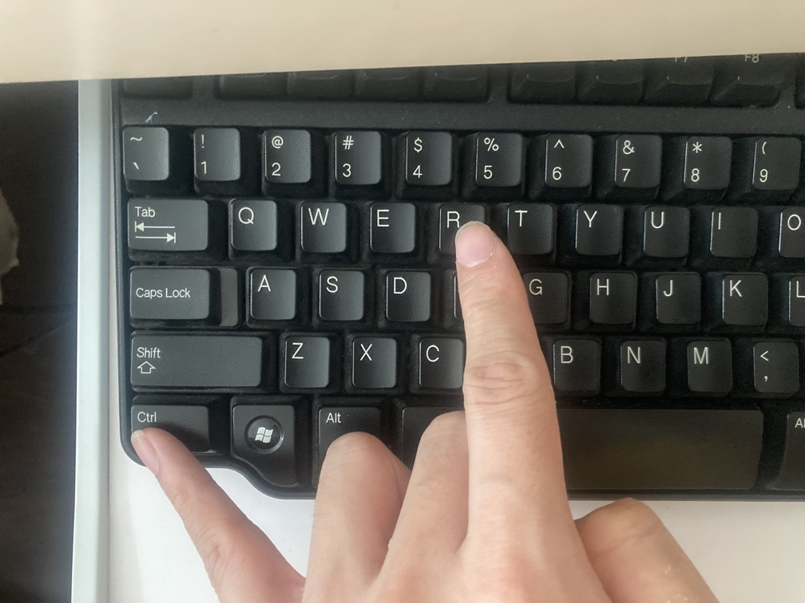

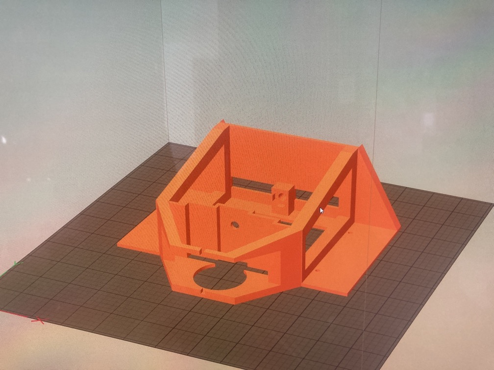

6. Under the "Processes" section, select your desired process (will explain more in the next step). If this section is empty, click the "Add" button below to add a process.

7. You should see this window appear. This is your printer settings. For this print, we are using "PLA", print on "Medium" quality, with 15% infill. Make sure you have "Generate Support" checked.

:::tip Tip
You may use your own settings as well! These are just the recommended settings as we have been using these settings for the prototypes.
:::

:::warning Note
As all printers are different, there are many printer default settings that you do not need to change or follow. The only things you should take note are: material, quality, supports, infills, temperature. Everything else you may leave as default.
:::

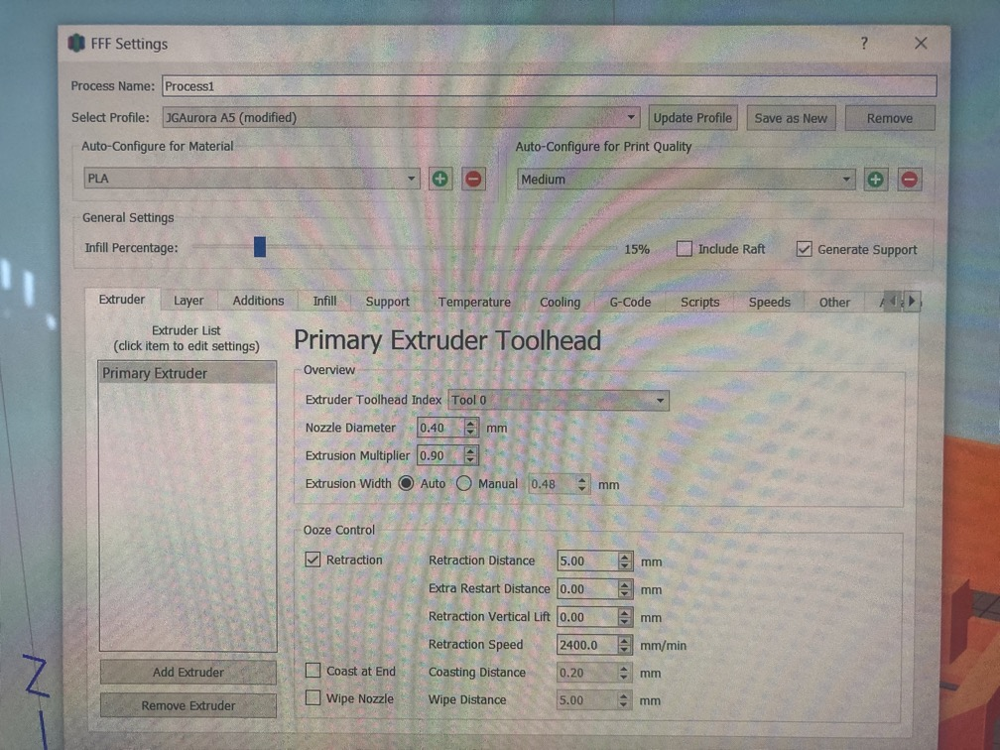

8. You may change the infill settings under the "Infill" tab.

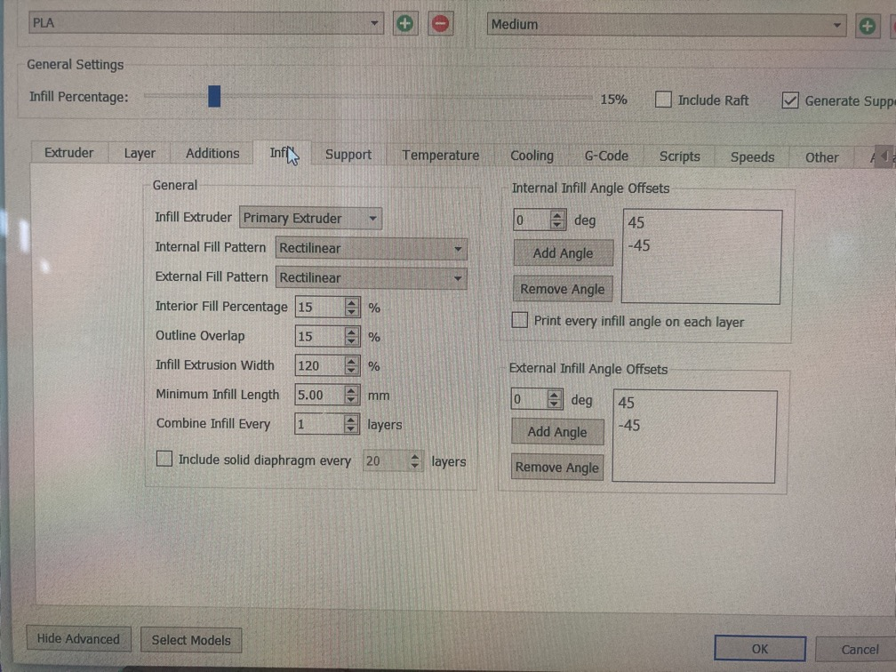

9. Under the "Temperature" tab, ensure that the temperature is suitable for your printing material. As we are using PLA, our setting is 60 degrees for print bed, 200 degrees for extruder.

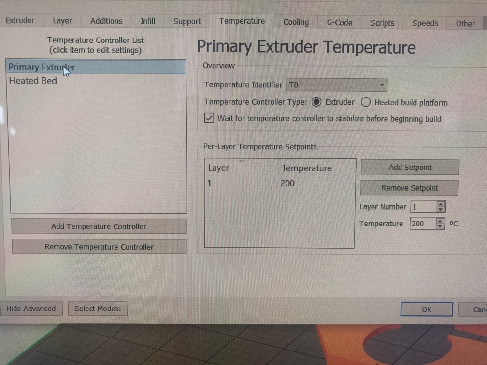

10. Once you are done setting, close the window and click "Prepare to Print!".

11. The computer will render the model with generated supports. You may check if there are errors, but generally this is alright.

12. You can also check the build time and filament used under the "Build Statistics" section.

13. You can then save the file into your SD Card by clicking on "Save Toolpaths to Disk".

## 3D Printing

**We are using JG Aurora A5. The following steps will mostly apply to this 3D printer, but the general steps to start a print are similar.**

1. Switch on the machine via the switch at the back of the machine.

2. Insert the SD Card

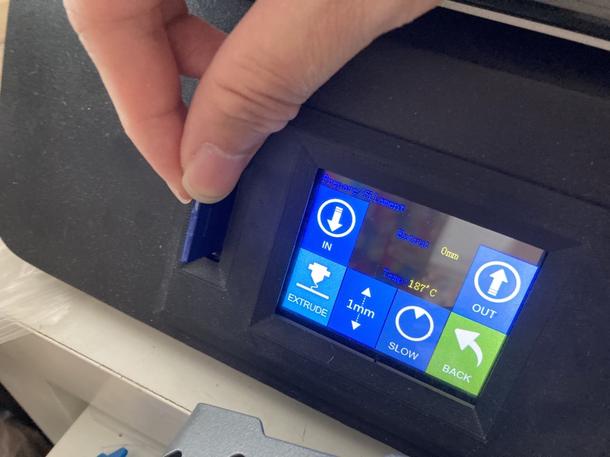

3. If there is no filament, insert one at the extruder end of the machine.

4. On the main screen, press "Extrude" and switch the speed to "Normal", "10mm" and press "IN". The machine will heat up if it haven't already, and begin to reel the filament in when it is ready.

5. Reel the filament in until some filament have been extruded.

:::warning Note
When the filament is extruded at the nozzle, change the speed to "Slow" as it may damage the extruder if the filament is moving too fast.
:::

6. Exit the "Extrude" menu and enter the "Print" menu. Select the model to print and click "YES" to print.

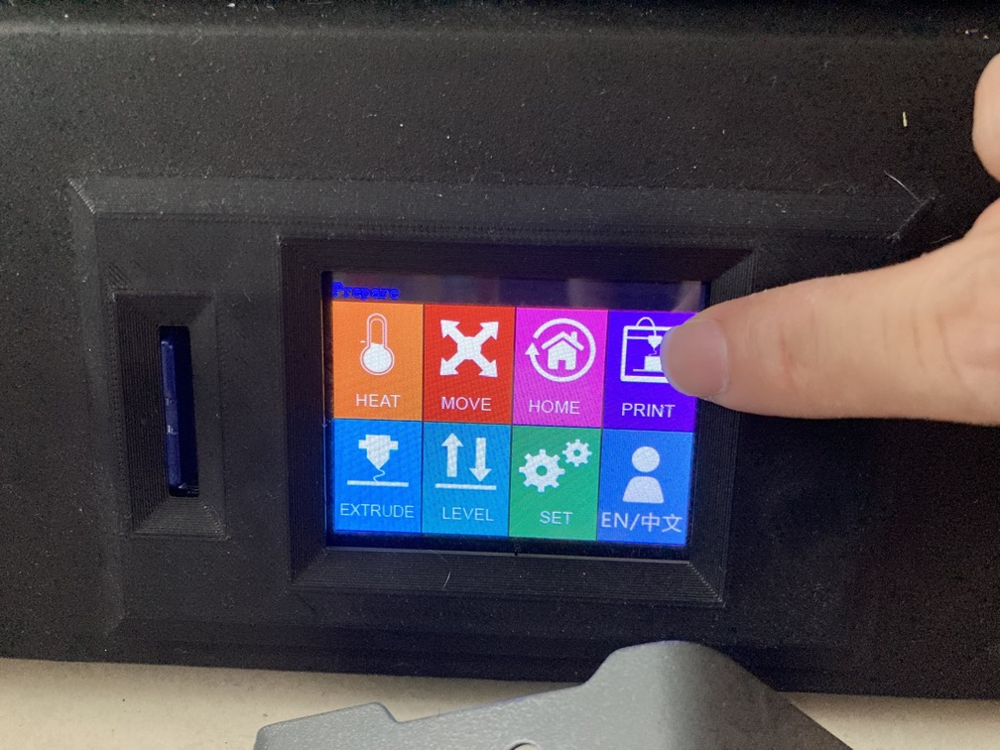

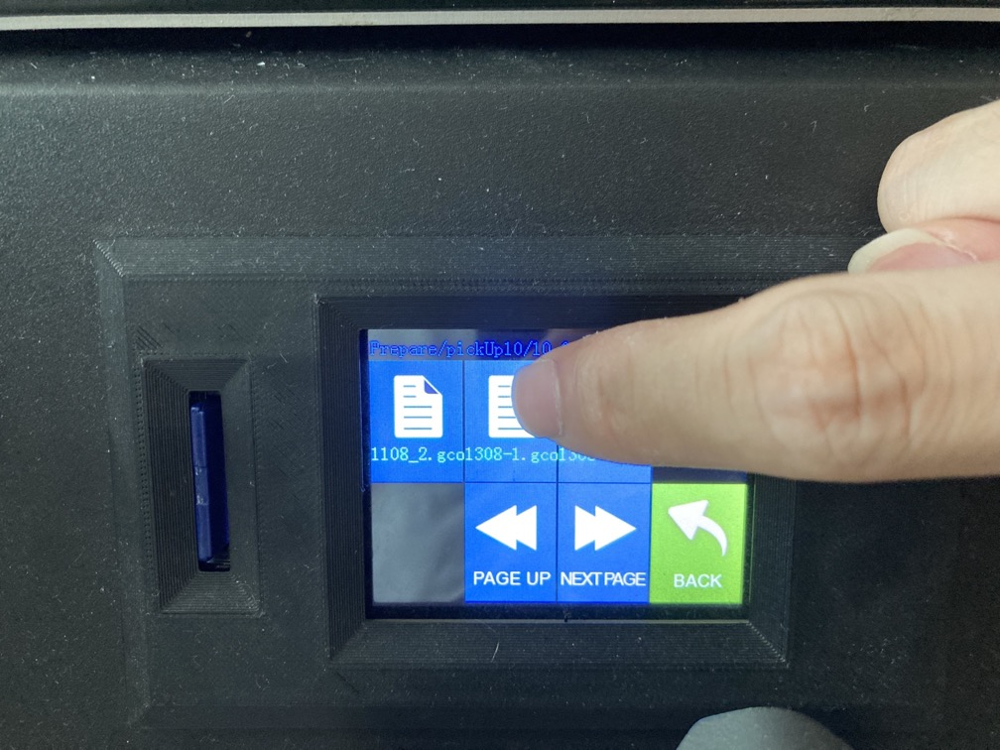

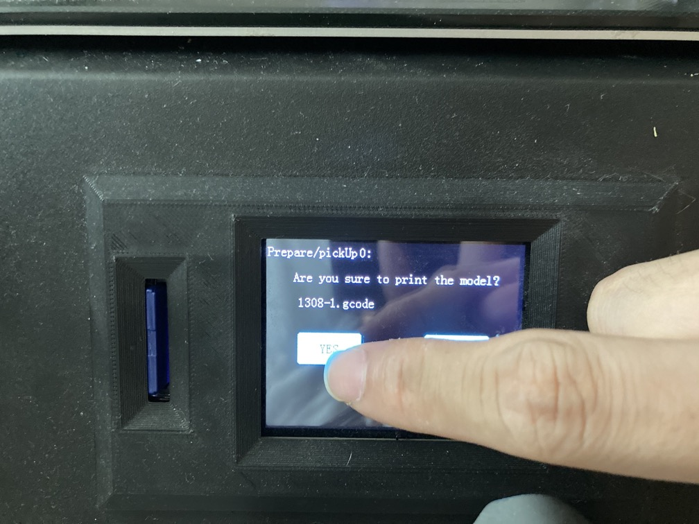

7. Completed! The printer will now start printing.

:::tip Tip
3D printers are not perfect. Do check on them once in a while to see if there are any errors and you may make adjustments.
:::

## Printer Troubleshooting

- Under-extrusion

- Uneven or imbalanced surface

- Stuck filament
