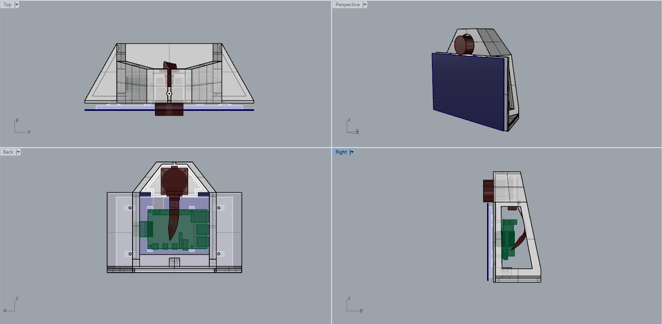

# Printing The Case

This section tells you what to do to print the files.

The latest version of the model is Version 2.1.

## Download the files

[Latest version Rhino file (Rhino 5 and Rhino 7)](https://github.com/screensavers-club/argos-childnode-case/tree/main/2.1)  
[Latest version .STL files](https://github.com/screensavers-club/argos-childnode-case/tree/main/2.1/stl)  
All child node casing versions can be found [here](https://github.com/screensavers-club/argos-childnode-case)

**Main Body**  
Dimensions: 193mm(w) x 68mm(d) x 115mm(h) mm

**Camera Mount**  
Dimensions: 91mm(w) x 29mm(d) x 45mm(h) mm

## The 3D Model

The model consists of 2 parts:

- The main body which bears the weight of entire setup and keeps it upright.
- The camera mount which holds the camera

The full 3D model includes the electronics components for reference.

## 3D Printing: Setting Up

We used [Simplify 3D](https://www.simplify3d.com/) to slice our models. However, you can use any slicer you feel comfortable with as long as you use similar settings.

:::tip Note
Ensure your 3D printer is big enough to print the case. A minimum of 200mm by 200mm print bed is recommended.
:::

Here are the properties we use for the printing

|     Properties     |                                               Settings                                               |
| :----------------: | :--------------------------------------------------------------------------------------------------: |
|      Material      | [PLA](https://shopee.sg/PLA-TPU-PETG-ABS-Filament-1.75mm-1KG-330M-3D-Printing-i.88065474.4233167606) |
| Nozzle Temperature |                                                190°C                                                 |
|  Bed Temperature   |                                                 60°C                                                 |
|       Infill       |                                                 30%                                                  |
|   Infill Pattern   |                                             Rectilinear                                              |
|      Supports      |                                            Auto Generated                                            |

:::tip Note
Place the models in ways which generates the least amount of supports.
:::

Once sliced, you can print the files.

Printing the camera mount
(Add images of the other parts in future updates)
