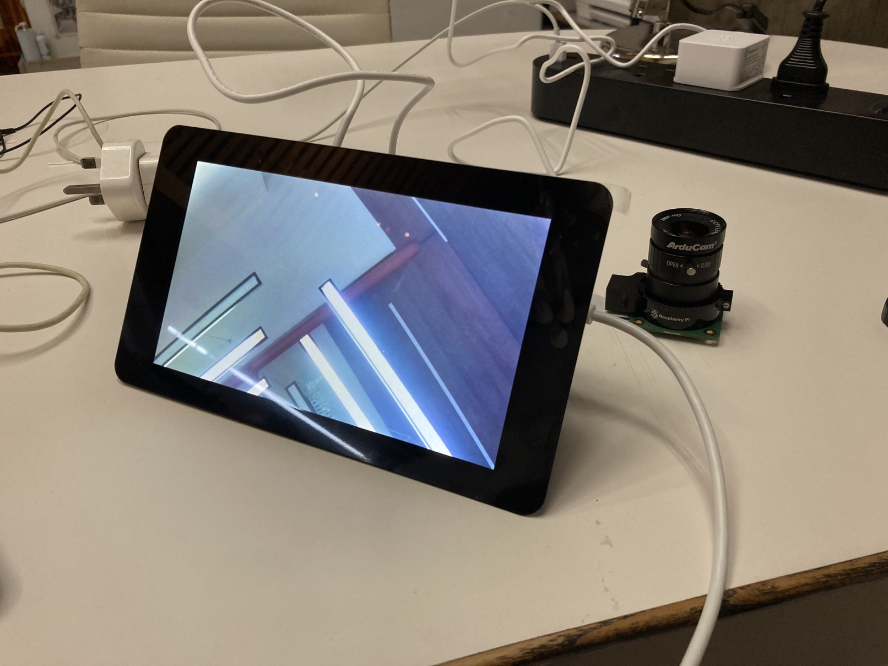

# 3c. Setting Up The Camera Module

Assemble the [HQ Camera](https://sg.cytron.io/p-official-raspberry-pi-high-quality-camera-module?r=1&gclid=CjwKCAjw9MuCBhBUEiwAbDZ-7rqOhHxh26woCkWNwUcZoP5yE4zOWMxfaXFyMx4pFqHFTSwJEr4vBhoC24gQAvD_BwE) using [Getting Started With The Camera Module](https://projects.raspberrypi.org/en/projects/getting-started-with-picamera)

:::tip Note

You may try other commands to view the camera output. For example, you can set to fullscreen preview for 10 seconds by writing `raspistill -f -t 10000` More on [Raspberry Pi Camera Module Documentation](https://www.raspberrypi.org/documentation/raspbian/applications/camera.md) and [Raspberry Pi High Quality Camera Getting Started](https://static.raspberrypi.org/files/product-guides/Raspberry_Pi_High_Quality_Camera_Getting_Started.pdf)

:::

Once fully assembled, the setup should look like this 

:::warning Note

The camera module comes with an **C-CS Adaptor** that is used for certain lenses. Check if your lens require this adaptor before installation as it will cause focusing issues.

Please check this [issue](https://www.raspberrypi.org/forums/viewtopic.php?t=276558) and this [documentation](https://static.raspberrypi.org/files/product-guides/Typical_C-Mount_Lens_Guide.pdf) to understand more about this issue.
:::
