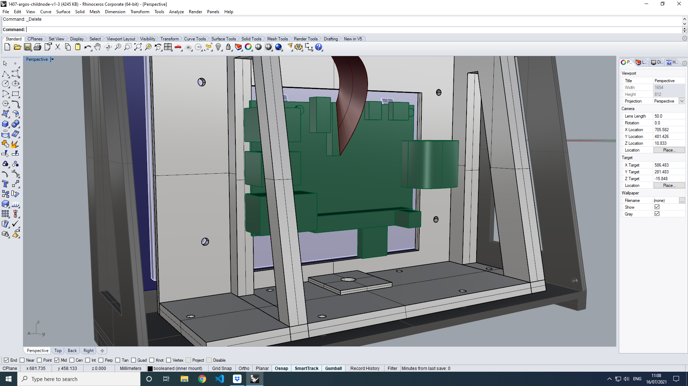
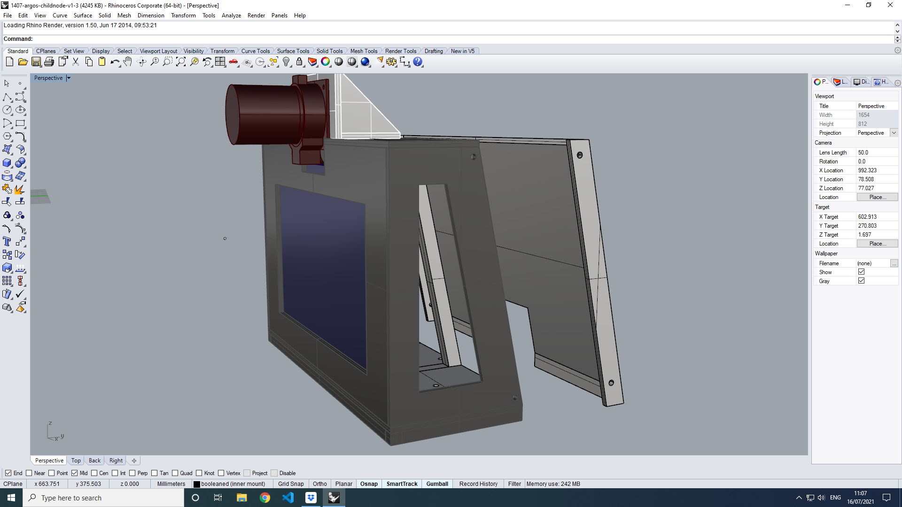
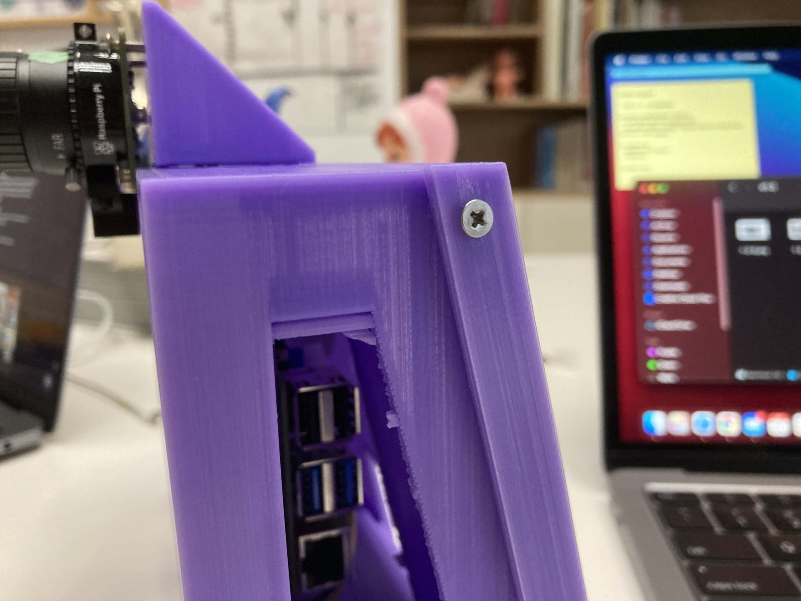
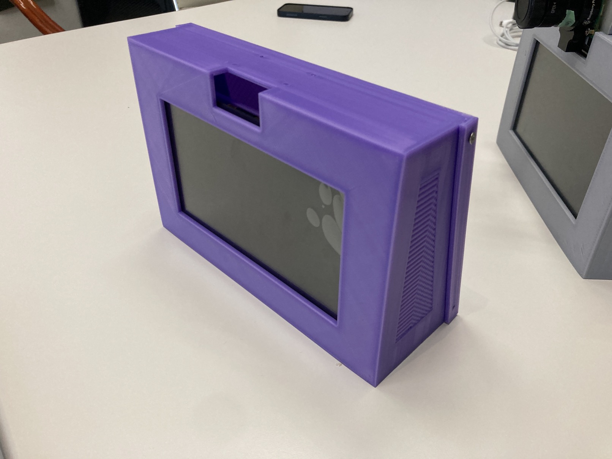
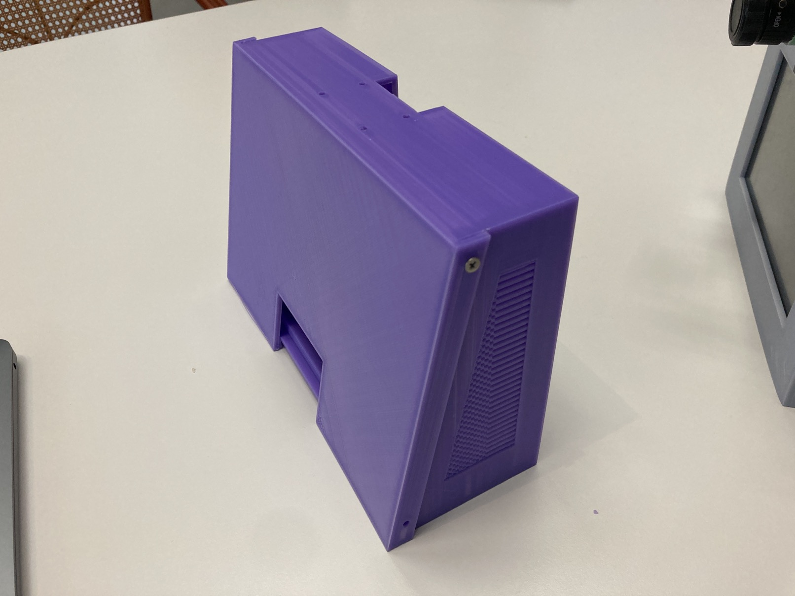
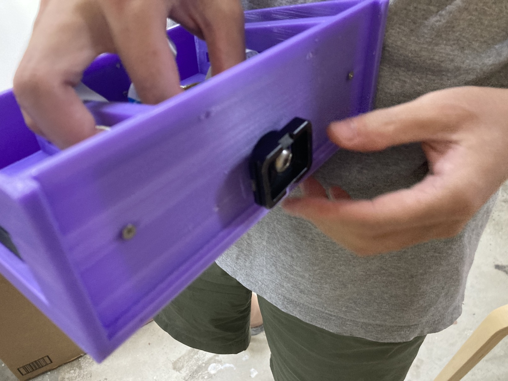
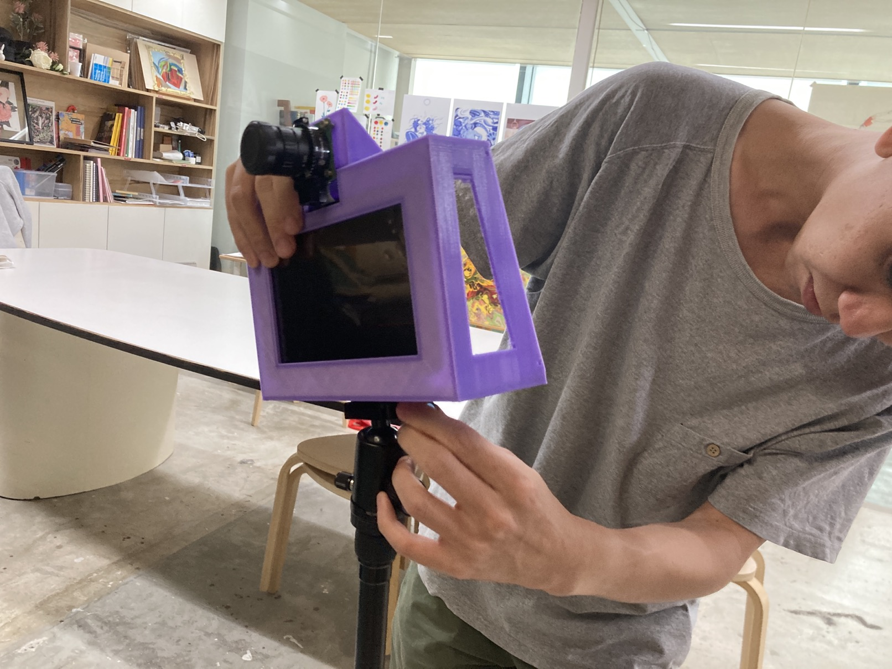
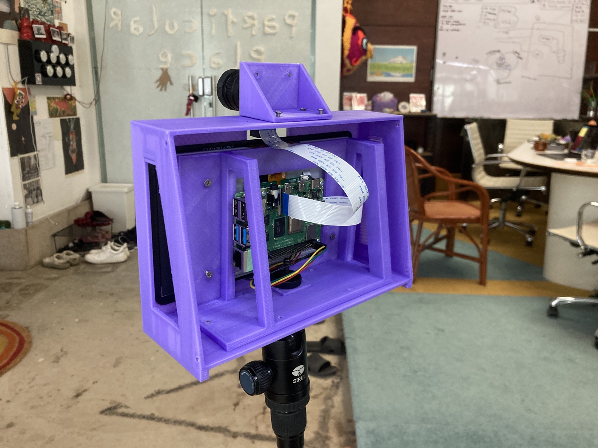
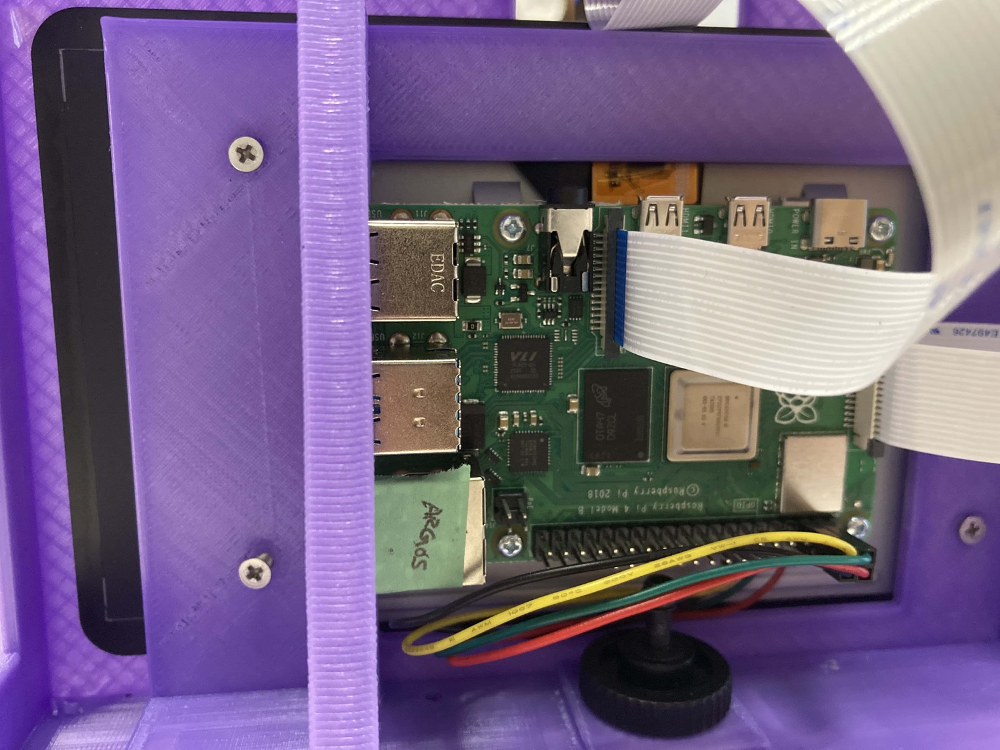

# Version 1.3

### Changes

[Link to repository](https://github.com/screensavers-club/argos-childnode-case/tree/main/1.3)

- Realigned inner piece screwholes to fit the Touch Display Mount
- add additional 2mm thickness for tripod mount screw to be tightened snugly.
  

- Added screwholes onto outercase for backplate mounting.
  

  

### Assembly

The front of the case

The back of the case

We tried to mount the case onto a tripod.

The mount is very secure and looks good!

### Issues

- The screwholes are still very slightly misaligned. We will need to realign the screw in the next iteration.
  
