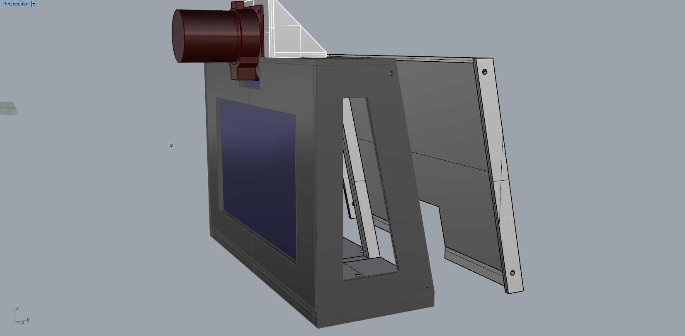

# Version 1.3

### Changes

[Link to repository](https://github.com/screensavers-club/argos-childnode-case/tree/main/1.3)

- Realigned inner piece screwholes to fit the Touch Display Mount
- add additional 2mm thickness for tripod mount screw to be tightened snugly.
  

- Added screwholes onto outercase for backplate mounting.
  
