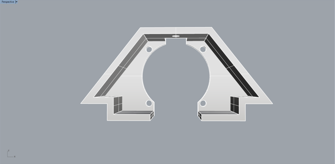
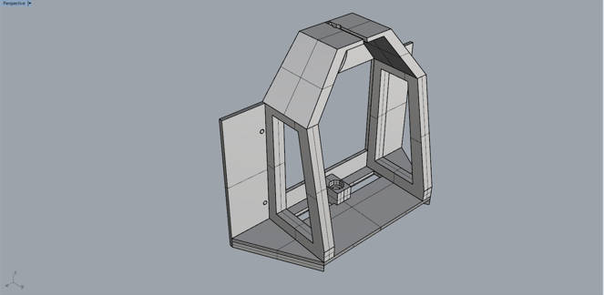
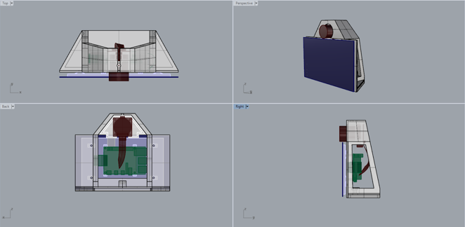
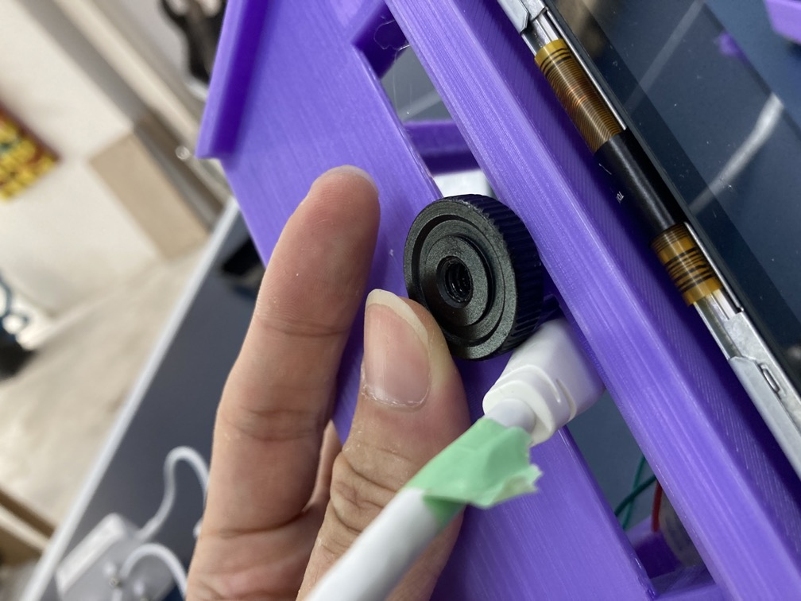

# Version 2.1

### Changes

[Link to repository](https://github.com/screensavers-club/argos-childnode-case/tree/main/2.0)

Version 2.1 features fixes to 2.0 issues:

- Fixed positioning of tripod mount area
- Added tolerance for 1/4" nut
- Redesigned the area around the camera lens to provide access and more space for adjusting the camera lens

### Images

**Camera Mount**

:::warning Outdated!
Images are outdated. Will update ASAP.
:::

**Main Body**

**Overall**

### Issues

1. The slot for the wires is not aligned to the new position of where the wires connect to the Raspberry Pi. This needs to be fixed in the next variation.

