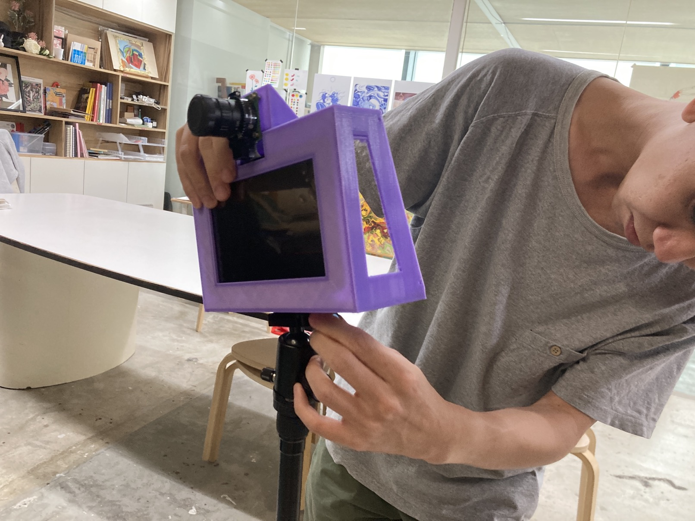

# Version 2.1

### Changes

[Link to repository](https://github.com/screensavers-club/argos-childnode-case/tree/main/2.1)

Version 2.1 is out! After prototying with version 1, the team made some decisions on moving the design forward.

Sketches:

The changes were mostly about optimising space, reducing material and size, centering the CG, and simplifying the assembly. The main goal is to make the model assembly dummy-proof.

The main changes:

- Complete removal of Outer Piece and Back Plate, removing a whole lot of material and time spent 3D printing
- Refurbishing the "Inner Piece" into a "Main Body" piece, a simple, compact holder that supports the device.
- Opening up the design: using the Raspberry Pi 7" Touch Display as the screen itself, without a casing going over it.
- Rotated the screen so as to put the ports at the bottom of the model, which frees up the space at the top for the camera mount. This solves the issue of needing to create extra space at the top to cater for the wires, affecting the camera mount's height which is not ideal. The wires are now redirected to the bottom, were holes will be cut for wires to go through directly below the model.
- Added a nut insert for the tripod mount to lock the nut in place, prevent it from unscrewing itself internally when dismounting the tripod.
- The camera is now installed from the back of the camera mount, allowing for a cleaner install. We also changed the screw size so it fits easier.
- The camera mount is now designed to simply slot into the Main Body piece and tightened with a single screw.

### Images

### Issues

- Might have issues with the accessibility of the focus and aperture function of the camera lens. We will see if this will become a bigger issue that needs to be fixed.
