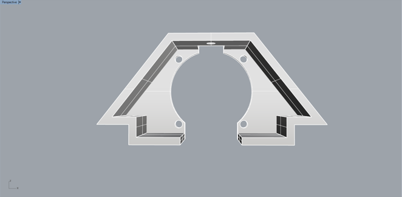
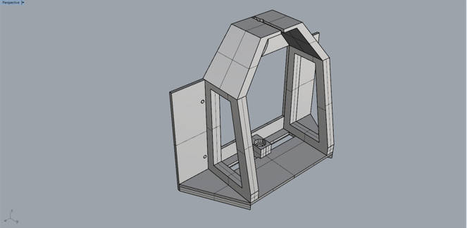
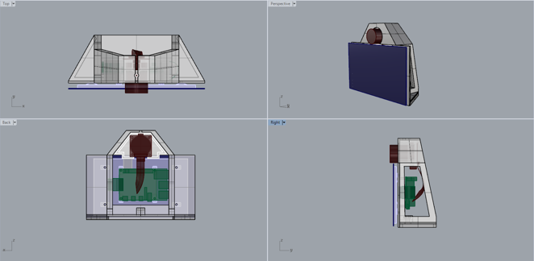
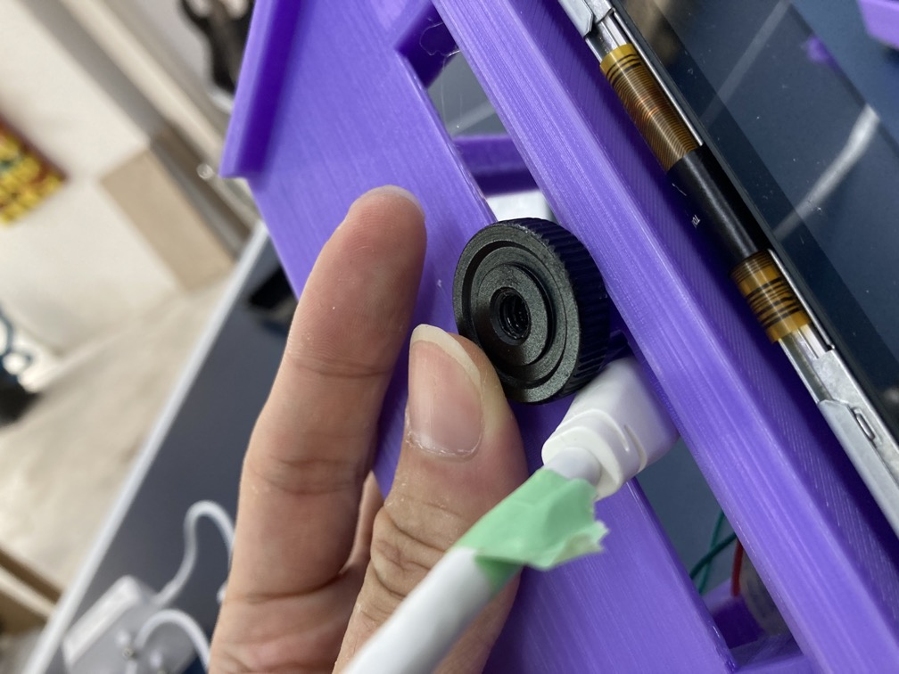

# Version 3.1

### Changes

[Link to repository](https://github.com/screensavers-club/argos-childnode-case/tree/main/3.0)

**Version 3.1 features:**

- Much more open design on the top of the model for camera lens (removed the front "cover" part)
- Clip design for front cover to snap onto the front of the main body
- Moved tripod mount forward for more space for the cables
- Added backplate that covers the back of the model as well as protect the back of the camera

**Version 3.1.1 features:**

- Stronger tripod mount area as previous one snapped while being removed from the printer
- Added shorter version of the front cover which can fit smaller 3D printer beds

### Images

**Camera Mount**

**Main Body**

**Overall**

### Issues

1. The snap design of the front cover is weak and snaps off very easily.

