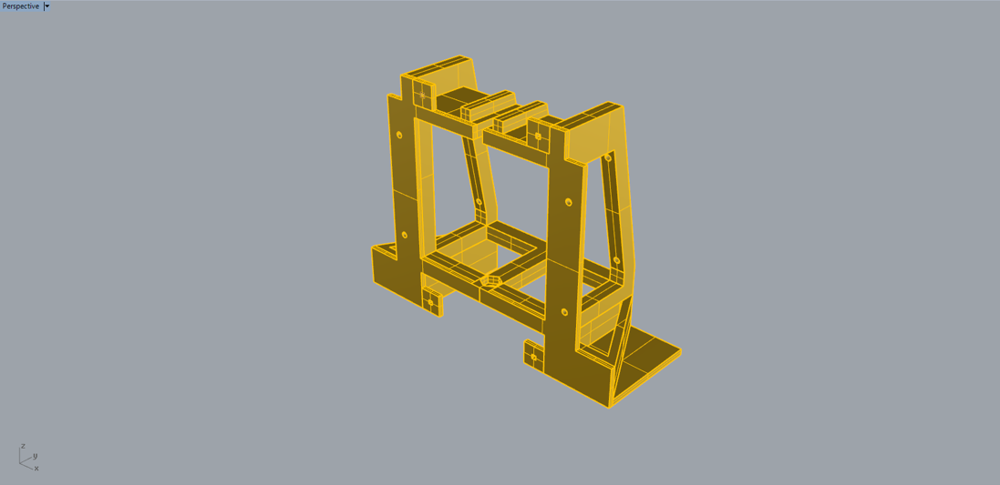
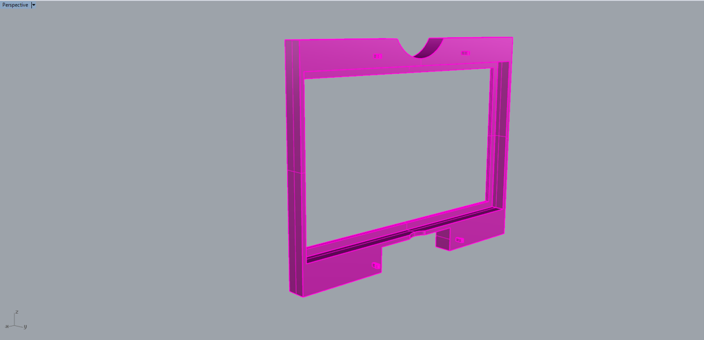
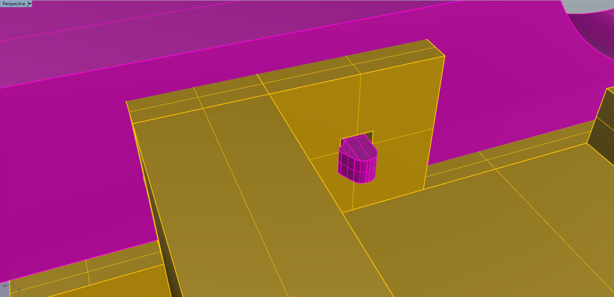

# Version 3.1

### Changes

[Link to repository](https://github.com/screensavers-club/argos-childnode-case/tree/main/3.1)

**Version 3.1 features:**

- Much more open design on the top of the model for camera lens (removed the front "cover" part)
- Clip design for front cover to snap onto the front of the main body
- Moved tripod mount forward for more space for the cables
- Added backplate that covers the back of the model as well as protect the back of the camera

**Version 3.1.1 features:**

- Stronger tripod mount area as previous one snapped while being removed from the printer
- Added shorter version of the front cover which can fit smaller 3D printer beds

### Images

**Main Body**

**Front Cover**

**Backplate**

**Overall**

**On Tripod**

**Other notes**

The long-time problem of camera knob hitting the model is solved!

### Issues

1. The snap design of the front cover is weak and snaps off very easily.

2. The beams at the back of the model is a bit too thick for any of the screws we got to go through. In order to note waste bought resources, as well as save some material cost, the beams will be thinned. Hopefully this does not cause any structural problems (very unlikely)

