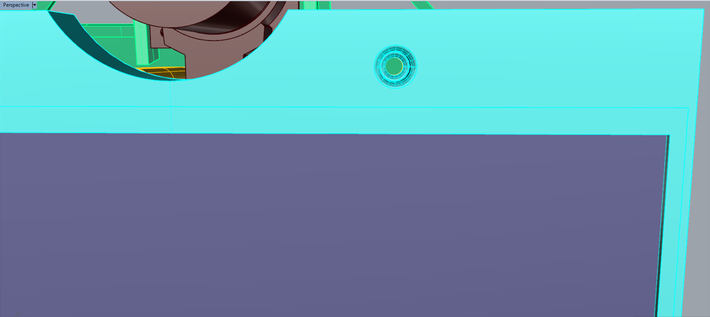
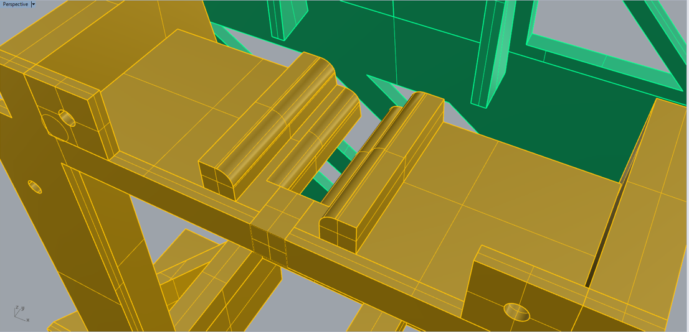
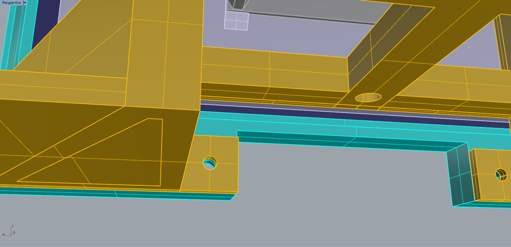
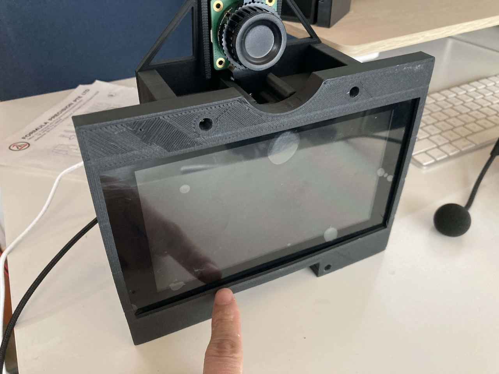
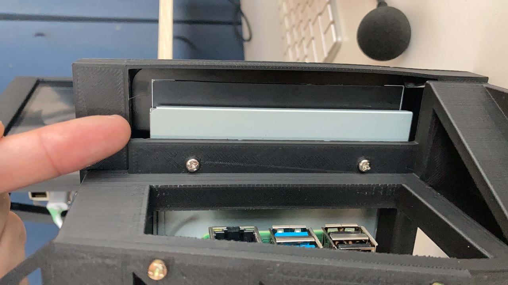
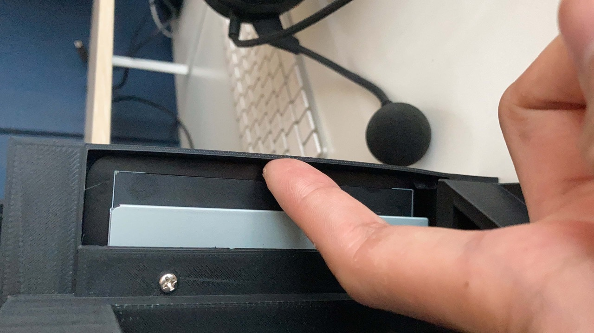

# Version 3.2

### Changes

[Link to repository](https://github.com/screensavers-club/argos-childnode-case/tree/main/3.2)

**Version 3.2 features:**

- The front cover is now screw on instead of snap on.
- Overall design smoothening (filleting of edges) to improve fitting

### Images

**Overall**

### Issues

1. The current model is using too many screws.

2. Front cover is too tight for the screen. Will need to add more spaces for it.

