# Version 3.3

### Changes

[Link to repository](https://github.com/screensavers-club/argos-childnode-case/tree/main/3.3)

**Version 3.3 features:**

- Reduced the number of screws for front cover from 4 to 2 (still compatible with old models)
- Reduced the number of screws for back plate from 4 to 1 (still compatible with old models)
- Changed the camera mount to an experimental mount that uses a 1/4" nut for security
- Improved screw area between main body and touch display

### Images

**Overall**

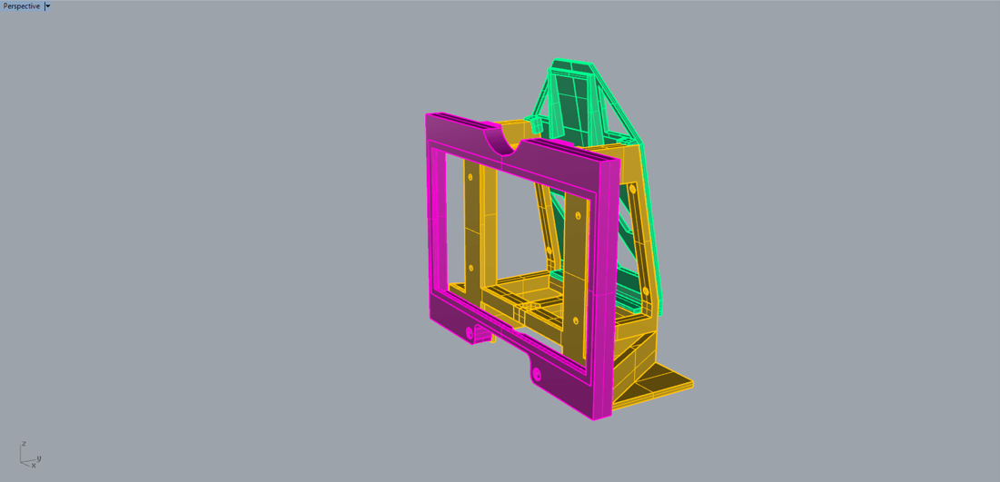

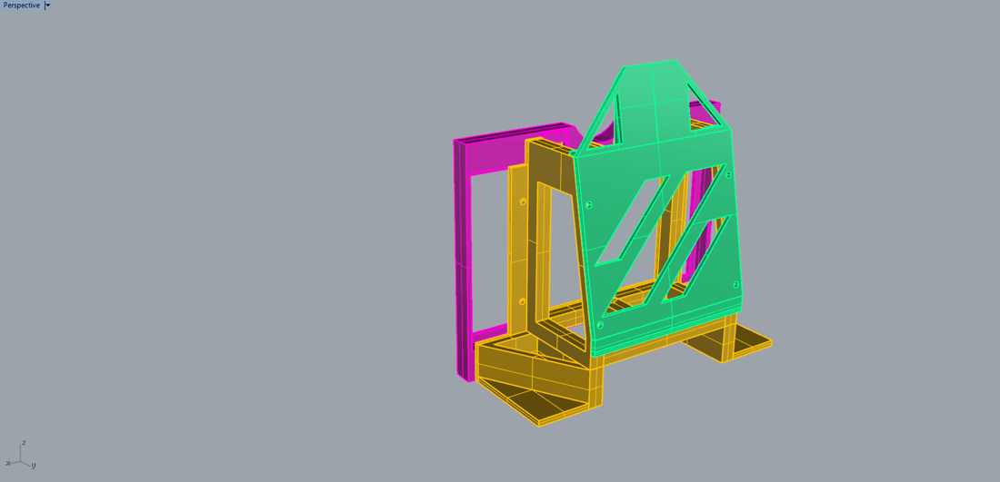

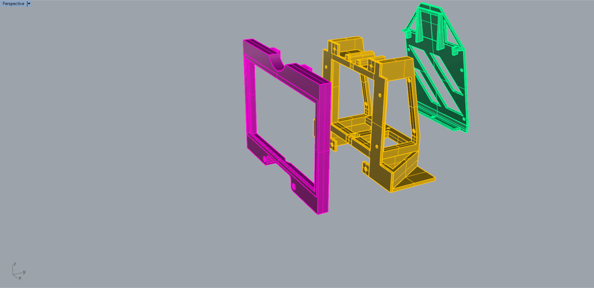

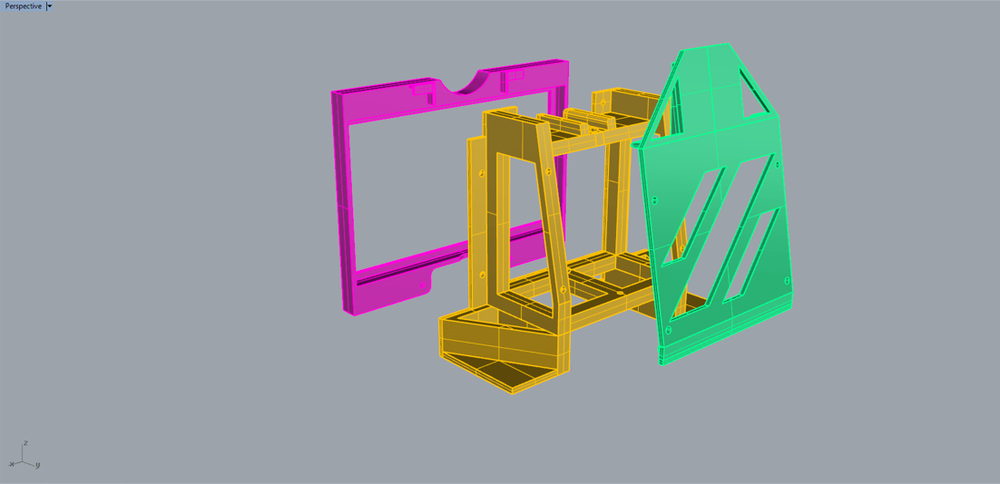

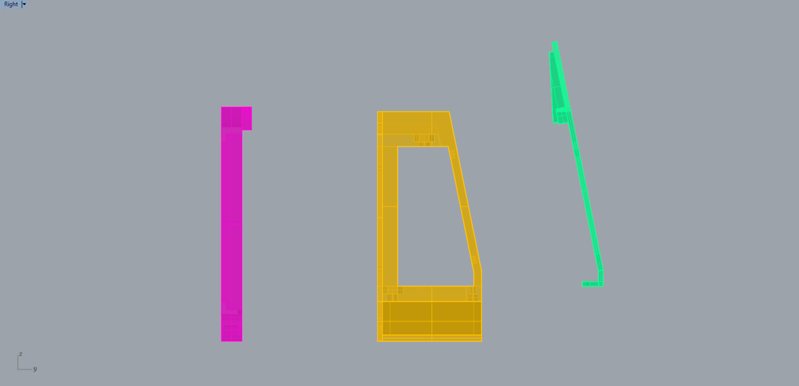

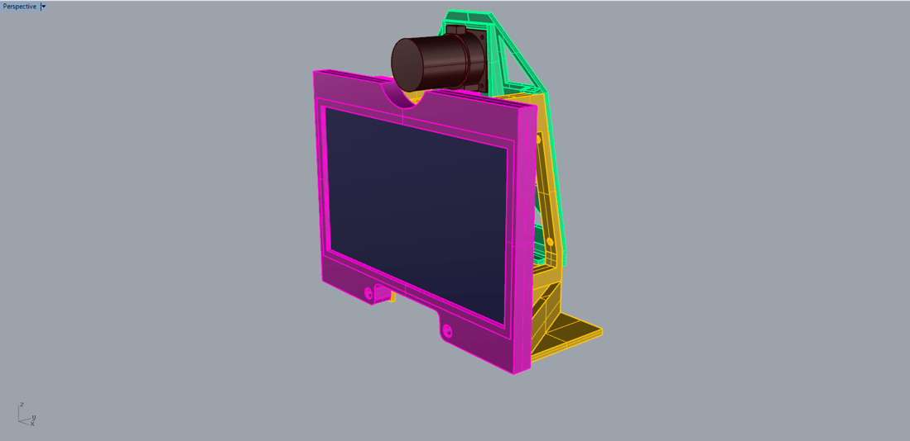

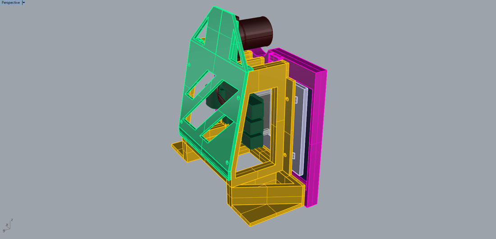

**Camera**

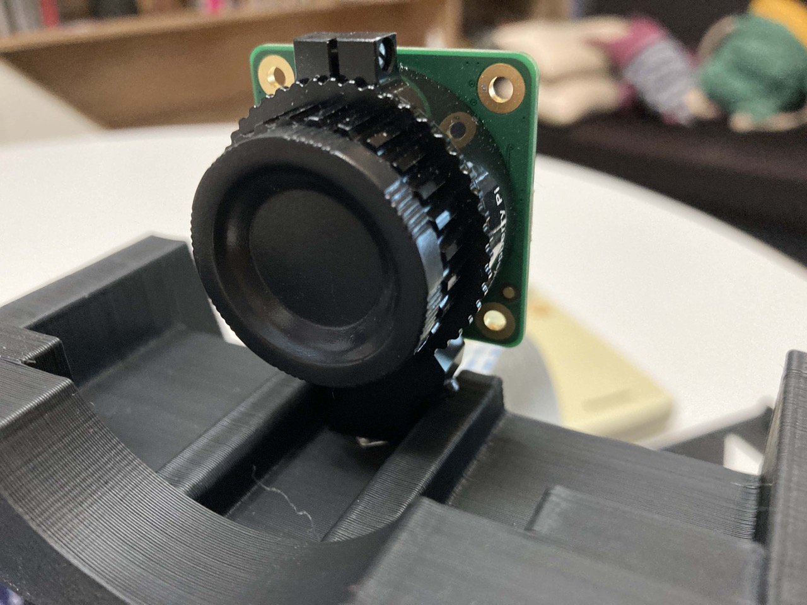

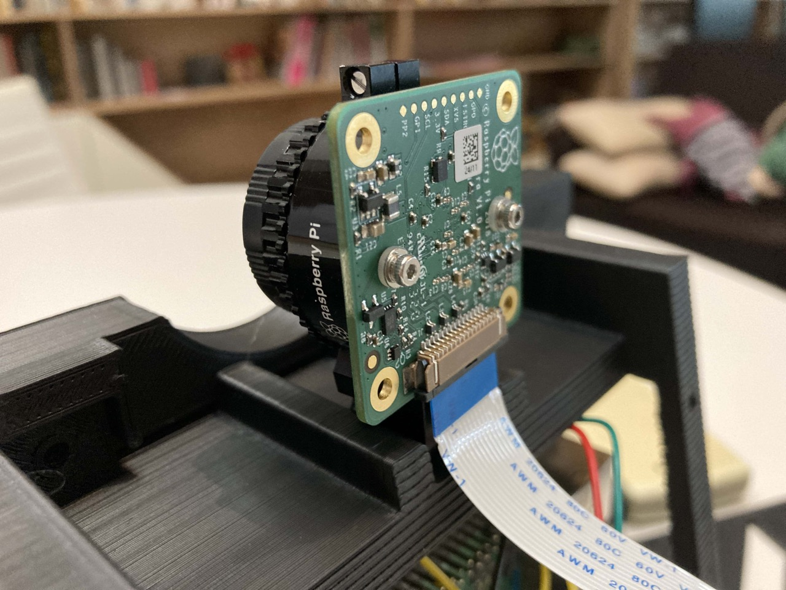

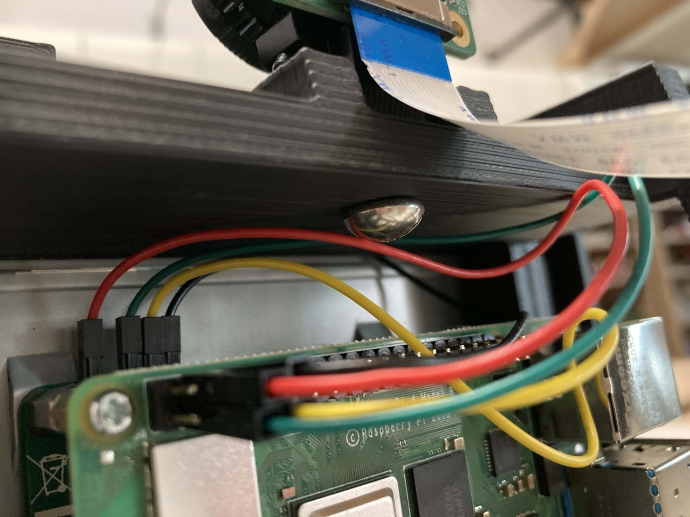

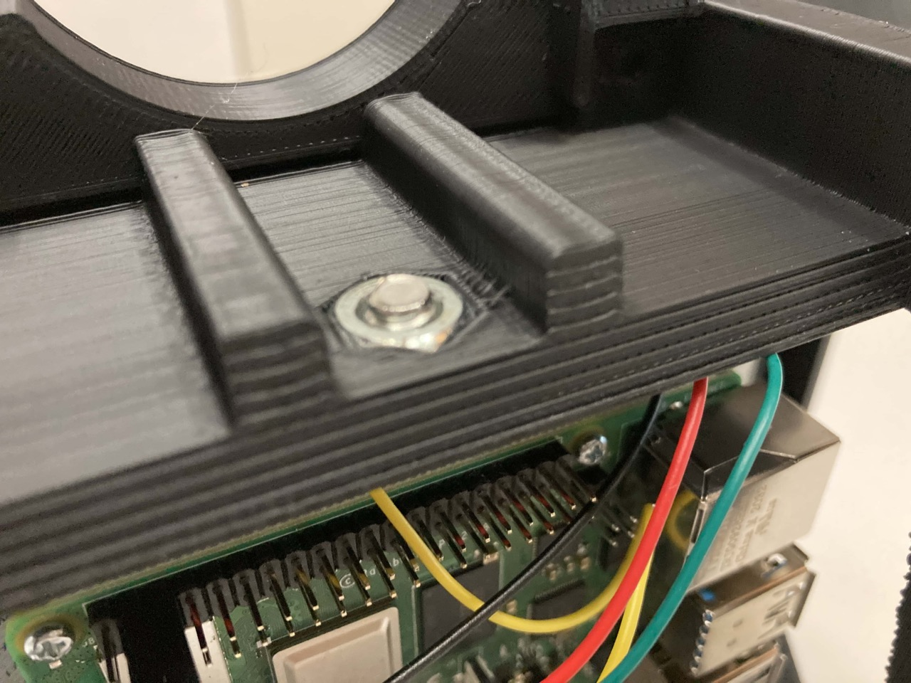

**Front Cover**

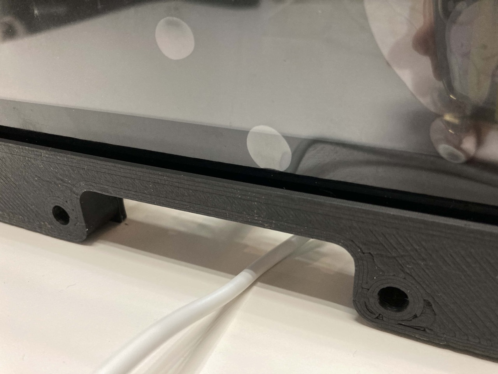

### Issues

1. Camera mount is secure, but camera can still move around freely.

2. The ribbon cable may get damaged if the camera moves around too much. Need to remove a bit of material on the main body at that area.

3. Slots made for the M3 nuts are too small.

4. The tripod mount area is too small for some tripods.

5. Backplate is not secure with just 1 screw.
