# What You'll Need

### Electronics

| Component                                                                                                                                                                                                                                                                                                                                                                                                  | Image                                                                                    | Model                                                          |
| ---------------------------------------------------------------------------------------------------------------------------------------------------------------------------------------------------------------------------------------------------------------------------------------------------------------------------------------------------------------------------------------------------------- | ---------------------------------------------------------------------------------------- | -------------------------------------------------------------- |
| [Raspberry Pi 4 Model B 8G](https://www.digikey.sg/product-detail/en/raspberry-pi/RASPBERRY-PI-4-MODEL-B-8G/1690-RASPBERRYPI4MODELB8G-ND/12159401)                                                                                                                                                                                                                                                         | 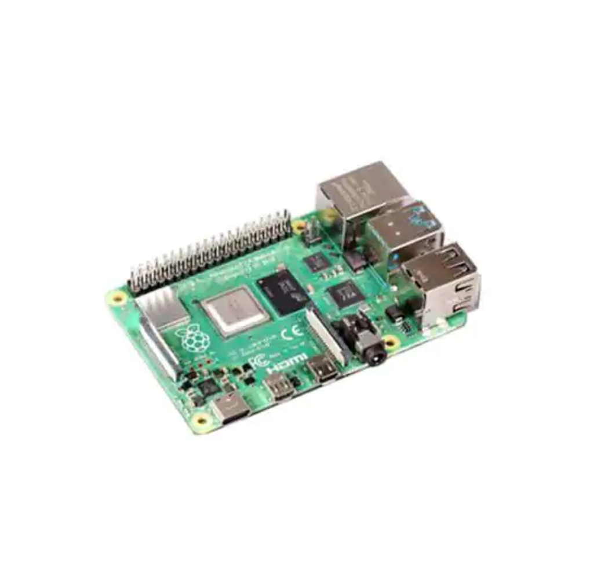                    | Raspberry Pi 4 Model B 8G                                      |
| [Raspberry Pi HQ Camera](https://sg.cytron.io/p-official-raspberry-pi-high-quality-camera-module?r=1&gclid=CjwKCAjw9MuCBhBUEiwAbDZ-7rqOhHxh26woCkWNwUcZoP5yE4zOWMxfaXFyMx4pFqHFTSwJEr4vBhoC24gQAvD_BwE)                                                                                                                                                                                                    | 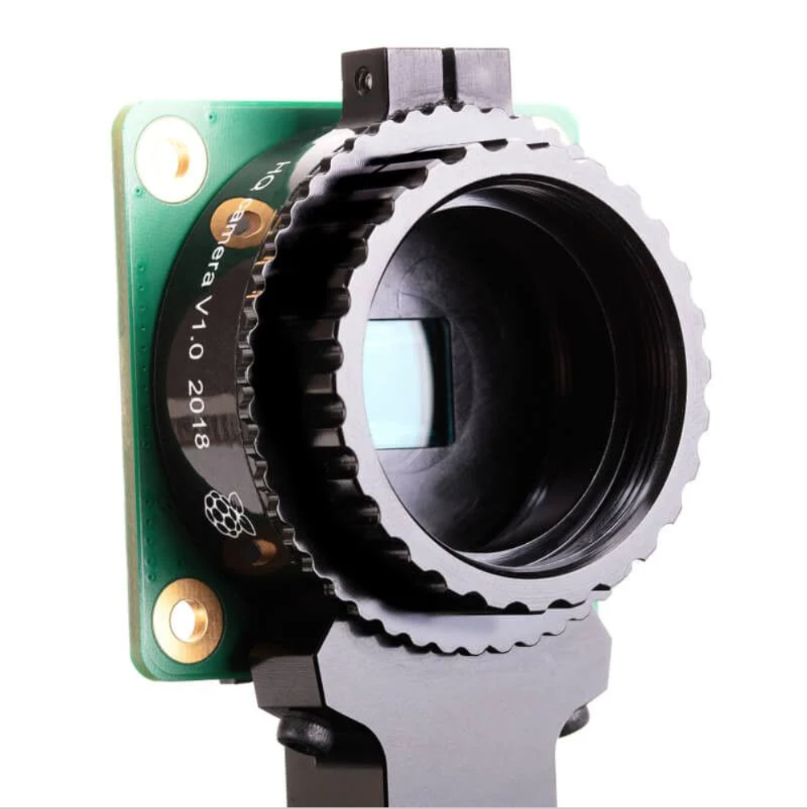                   | Raspberry Pi HQ Camera                                         |
| [8mm CS Mount Lens for Raspberry Pi HQ Camera](https://sg.cytron.io/Arducam/p-8mm-cs-mount-lens-for-raspberry-pi-hq-camera)                                                                                                                                                                                                                                                                                | 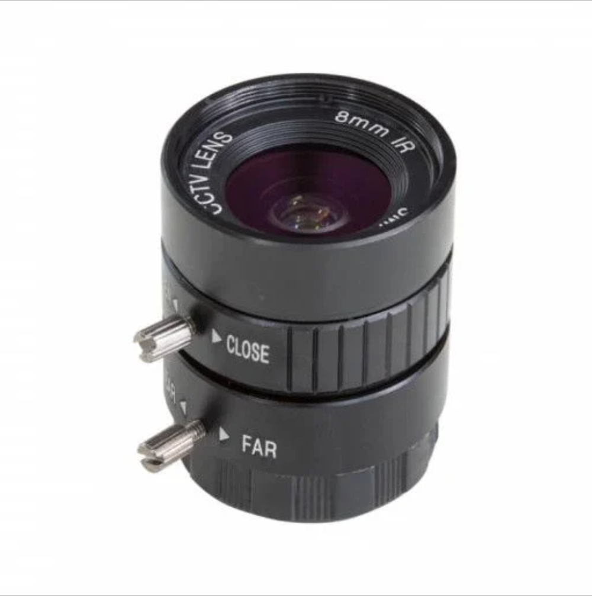                     | RPI-CSL-8MM                                                    |
| [12mm CS Mount Lens for Raspberry Pi HQ Camera](https://sg.cytron.io/p-12mm-cs-mount-lens-for-raspberry-pi-hq-camera)                                                                                                                                                                                                                                                                                      | 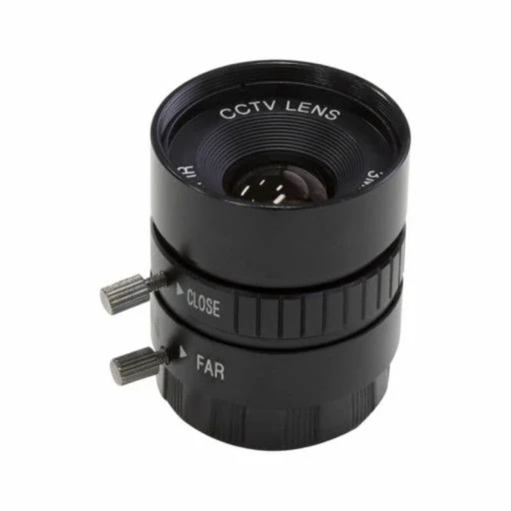                   | RPI-CSL-12MM                                                   |
| [Raspberry Pi Display](https://sg.element14.com/raspberry-pi/raspberrypi-display/raspberry-pi-7inch-touchscreen/dp/2473872?gclid=Cj0KCQjwrsGCBhD1ARIsALILBYrVH53SWpgaRqqXUlPY6soTGs_SfPuokHiJeSSbDJZlW-Bo9OajY30aAkUlEALw_wcB&mckv=_dc%7Cpcrid%7C500903722922%7Cpkw%7C%7Cpmt%7C%7Cslid%7C%7Cproduct%7C2473872%7Cpgrid%7C116112299217%7Cptaid%7Cpla-293946777986%7C&CMP=KNC-GSG-SHOPPING-SMART-ALLPRODUCTS) | 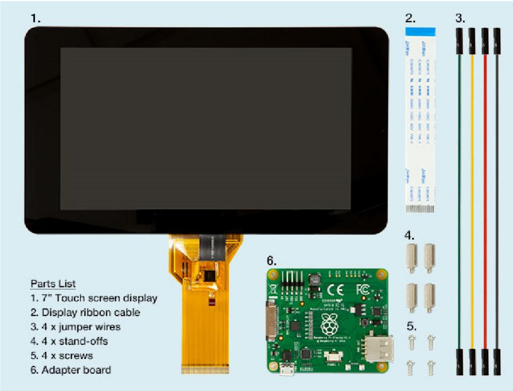               | RASPBERRYPI-DISPLAY                                            |
| [UGREEN USB External Sound Audio Adapter with 3.5mm Stereo Jack](https://www.lazada.sg/products/ugreen-2-in1-usb-external-sound-audio-adapter-with-35mm-stereo-for-headset-intl-i105737946.html)                                                                                                                                                                                                           | 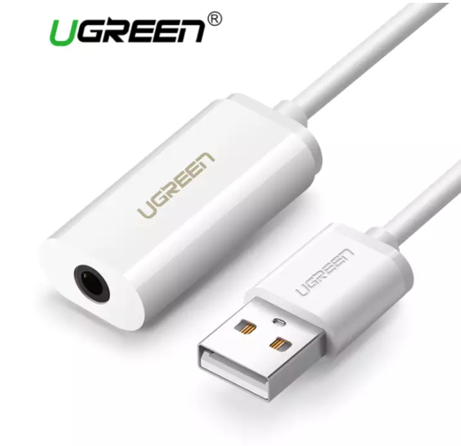 | UGREEN USB External Sound Audio Adapter with 3.5mm Stereo Jack |
| [Raspberry Pi USB C Power Cable](https://sg.element14.com/raspberry-pi/sc0212/rpi-power-supply-usb-c-5-1v-3a/dp/3106940)                                                                                                                                                                                                                                                                                   | 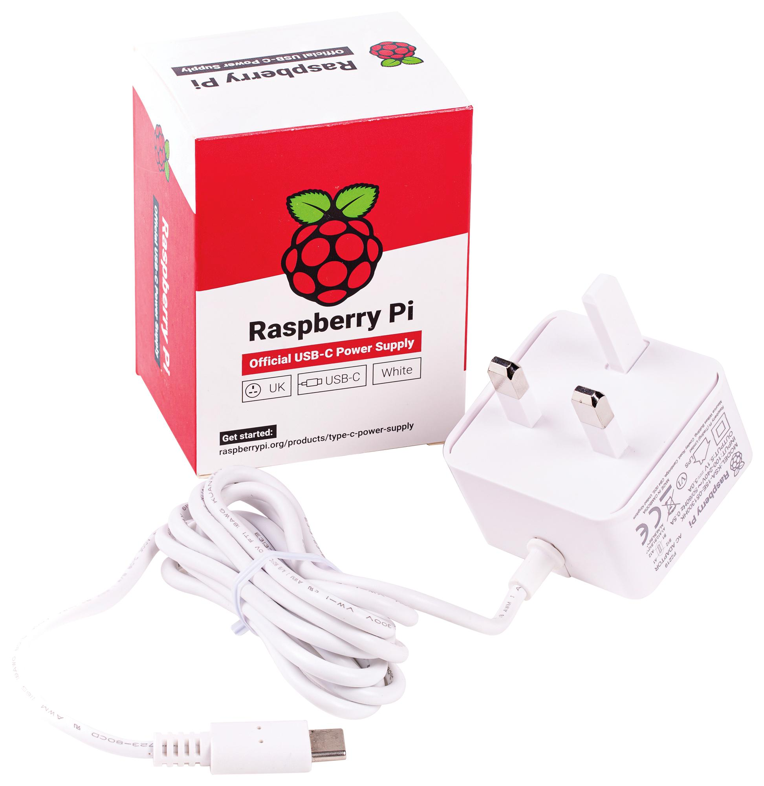                                  | Raspberry Pi USB C Power Cable                                 |
| [L-Shaped Mini HDMI adaptor cable](https://www.lazada.sg/products/90-degree-angled-mini-usb-hdmi-male-to-hdmi-female-extension-data-cable-21cm-i1058846288-s3988470082.html?spm=a2o42.searchlist.list.7.4b9312d6aSB6Cu&search=1)                                                                                                                                                                           |                                  | L-Shaped Mini HDMI adaptor cable                               |

### Consumables

| Component                                                                                                                                                                                                                                                                                                               | Image                                                     | Type               | Diameter                                                  | Nominal Length | Quantity |
| ----------------------------------------------------------------------------------------------------------------------------------------------------------------------------------------------------------------------------------------------------------------------------------------------------------------------- | --------------------------------------------------------- | ------------------ | --------------------------------------------------------- | -------------- | -------- |
| [M2.5 Phillips 10mm Pan Head Bolts](https://sg.misumi-ec.com/vona2/detail/221000547304/?CategorySpec=00000230744%3a%3anvd00000000000002%0900000230683%3a%3amig00000001806032), and [M2.5 Nuts](https://sg.misumi-ec.com/vona2/detail/110300250540/?CategorySpec=00000230742%3a%3amig00000001842151%2cmig00000001860615) | 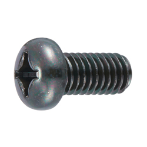         | Phillips, pan head | M2.5                                                      | 10mm           | 4        |
| [M3 Phillips 8mm Pan Head Bolts](https://sg.misumi-ec.com/vona2/detail/221000547304/?CategorySpec=00000230744%3a%3anvd00000000000002%0900000230683%3a%3amig00000001806032)                                                                                                                                              |          | Phillips, pan head | M3                                                        | 8mm            | 4        |
| [M3 Phillips 10mm Pan Head Bolts](https://sg.misumi-ec.com/vona2/detail/221000547304/?CategorySpec=00000230744%3a%3anvd00000000000002%0900000230683%3a%3amig00000001806032), and [M3 Nuts](https://sg.misumi-ec.com/vona2/detail/110300250540/?CategorySpec=00000230742%3a%3amig00000001842151%2cmig00000001860615)     |          | Phillips, pan head | M3                                                        | 10mm           | 1        |
| [1/4" Male to 1/4" Female Thread Thumb Screw Camera Mount Adaptor](https://shopee.sg/Lammcou-Quick-Release-1-4-Male-to-1-4-Female-Thread-Thumb-Screw-Adapter-for-Camera-Flash-Bracket-Tripod-L-Type-Bracket-Stand-i.317764291.6555811474)                                                                               | 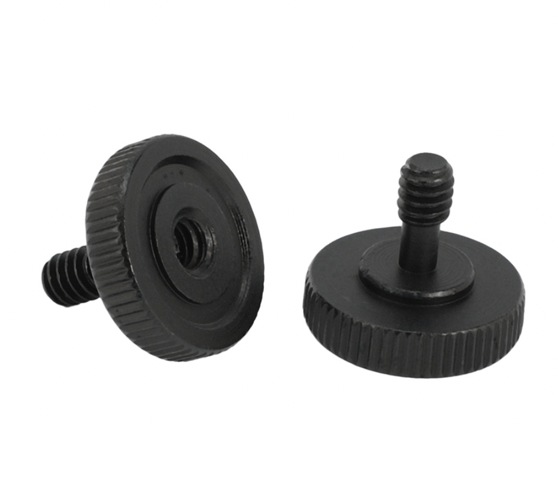 | Thumb screw        | 1/4"                                                      |                | 2        |
| [1/4" 5mm Nut](https://sg.misumi-ec.com/vona2/detail/221000236130/?CategorySpec=00000230711%3a%3al)                                                                                                                                                                                                                     | 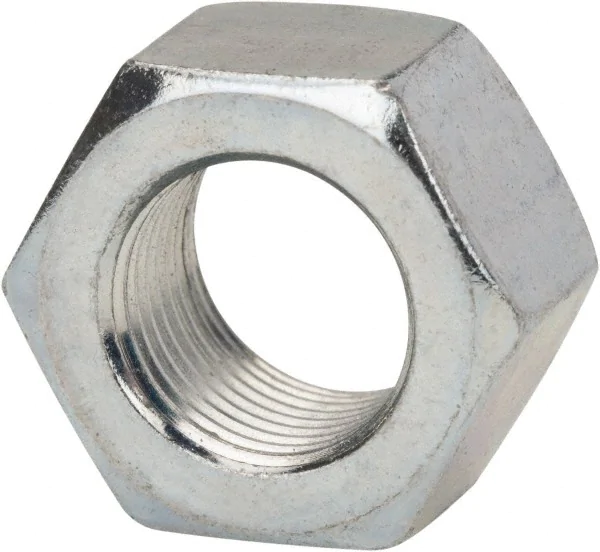     | Nut                | 1/4"                                                      | 5mm            | 1        |
| [m2.5 11mm Raspberry Pi Standoff](https://sg.element14.com/ettinger/05-12-055/standoff-hex-m-f-brass-5mm-m2/dp/2494582)                                                                                                                                                                                                 | 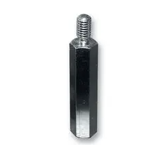             | Standoff           | 11mm (standoff length) / 6mm threaded length (total 17mm) | m2.5           | 4        |
=======
| Component                                                                                                                                                                                                                                 | Image                                                     | Type               | Diameter | Nominal Length | Quantity |
| ----------------------------------------------------------------------------------------------------------------------------------------------------------------------------------------------------------------------------------------- | --------------------------------------------------------- | ------------------ | -------- | -------------- | -------- |
| [M3 Phillips 8mm Pan Head Bolts](https://sg.misumi-ec.com/vona2/detail/221000547304/?CategorySpec=00000230744%3a%3anvd00000000000002%0900000230683%3a%3amig00000001806032)                                                                |          | Phillips, pan head | M3       | 10mm (previously 8mm)           | 20       |
| [1/4" Male to 1/4" Female Thread Thumb Screw Camera Mount Adaptor](https://shopee.sg/Lammcou-Quick-Release-1-4-Male-to-1-4-Female-Thread-Thumb-Screw-Adapter-for-Camera-Flash-Bracket-Tripod-L-Type-Bracket-Stand-i.317764291.6555811474) |  | Thumb screw        | 1/4"     |                | 2        |
| [1/4-20 Threaded Inserts for Wood 10mm Length Pack of 50](https://www.amazon.sg/4-20-Threaded-Inserts-Wood-Length/dp/B083HVLST5)                                                                                                          | 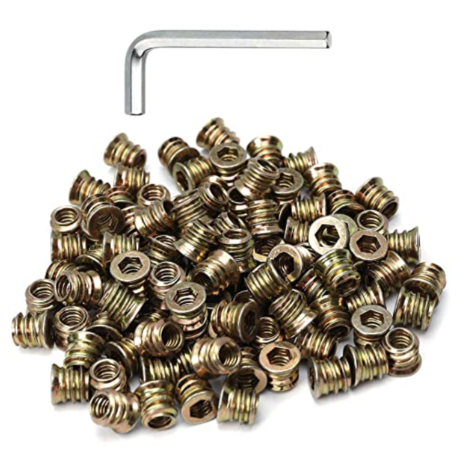      | Threaded insert    | 1/4"     | 10mm           | NIL      |

### 3D Printing

| Item                                                                                                                      | Image          | Type   |
| ------------------------------------------------------------------------------------------------------------------------- | -------------- | ------ |
| [PLA 3D Printing Filament](https://shopee.sg/PLA-TPU-PETG-ABS-Filament-1.75mm-1KG-330M-3D-Printing-i.88065474.4233167606) | (insert image) | 1.75mm |

### Tools

| Tools Required           | Application                                  |
| ------------------------ | -------------------------------------------- |
| Monitor or Screen        | Setting up Raspberry Pi                      |
| Keyboard and Mouse       | Setting up Raspberry Pi                      |
| Phillip screwdriver      | Fastening screws                             |
| Pliers                   | Removing support structure                   |
| Cutters or Scissors      | Removing support structure                   |
| (optional) Battery Drill | Removing support structure, fastening screws |
