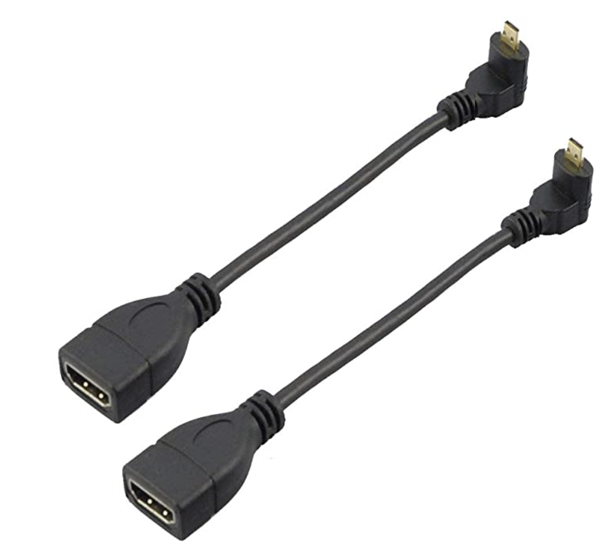
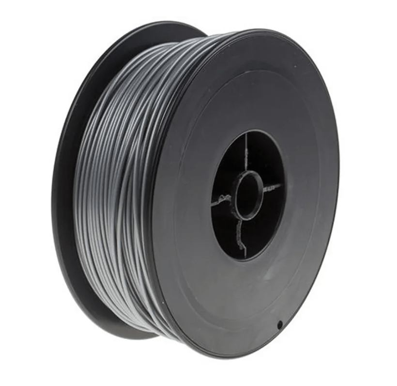

# What You'll Need

Refer to this [link](https://docs.google.com/spreadsheets/d/1_uIQNqr7DHm4aWreP0g8PzooJxB9vwsrXJ6rtsHg4Rk/edit?usp=sharing) to see the excel sheet of components and the links.

### Electronics

| Component                                                                                                                                                                                                                                                                                                                                                                                                                                                                     | Image                                                                                    | Model                                                          |
| ----------------------------------------------------------------------------------------------------------------------------------------------------------------------------------------------------------------------------------------------------------------------------------------------------------------------------------------------------------------------------------------------------------------------------------------------------------------------------- | ---------------------------------------------------------------------------------------- | -------------------------------------------------------------- |
| [Raspberry Pi 4 Model B 8G](https://www.digikey.sg/product-detail/en/raspberry-pi/RASPBERRY-PI-4-MODEL-B-8G/1690-RASPBERRYPI4MODELB8G-ND/12159401)                                                                                                                                                                                                                                                                                                                            |                     | Raspberry Pi 4 Model B 8G                                      |
| [Raspberry Pi HQ Camera](https://sg.cytron.io/p-official-raspberry-pi-high-quality-camera-module?r=1&gclid=CjwKCAjw9MuCBhBUEiwAbDZ-7rqOhHxh26woCkWNwUcZoP5yE4zOWMxfaXFyMx4pFqHFTSwJEr4vBhoC24gQAvD_BwE) (Comes with 1x ribbon cable)                                                                                                                                                                                                                                          |                    | Raspberry Pi HQ Camera                                         |
| [8mm CS Mount Lens for Raspberry Pi HQ Camera](https://sg.cytron.io/Arducam/p-8mm-cs-mount-lens-for-raspberry-pi-hq-camera)                                                                                                                                                                                                                                                                                                                                                   |                      | RPI-CSL-8MM                                                    |
| [12mm CS Mount Lens for Raspberry Pi HQ Camera](https://sg.cytron.io/p-12mm-cs-mount-lens-for-raspberry-pi-hq-camera)                                                                                                                                                                                                                                                                                                                                                         |                    | RPI-CSL-12MM                                                   |
| [Raspberry Pi Display](https://sg.element14.com/raspberry-pi/raspberrypi-display/raspberry-pi-7inch-touchscreen/dp/2473872?gclid=Cj0KCQjwrsGCBhD1ARIsALILBYrVH53SWpgaRqqXUlPY6soTGs_SfPuokHiJeSSbDJZlW-Bo9OajY30aAkUlEALw_wcB&mckv=_dc%7Cpcrid%7C500903722922%7Cpkw%7C%7Cpmt%7C%7Cslid%7C%7Cproduct%7C2473872%7Cpgrid%7C116112299217%7Cptaid%7Cpla-293946777986%7C&CMP=KNC-GSG-SHOPPING-SMART-ALLPRODUCTS) (comes with 4x standoff screws, 1x ribbon cable, 4x jumper cables) |                | RASPBERRYPI-DISPLAY                                            |
| [UGREEN USB External Sound Audio Adapter with 3.5mm Stereo Jack](https://www.lazada.sg/products/ugreen-2-in1-usb-external-sound-audio-adapter-with-35mm-stereo-for-headset-intl-i105737946.html)                                                                                                                                                                                                                                                                              |  | UGREEN USB External Sound Audio Adapter with 3.5mm Stereo Jack |
| [Raspberry Pi USB C Power Cable](https://sg.element14.com/raspberry-pi/sc0212/rpi-power-supply-usb-c-5-1v-3a/dp/3106940)                                                                                                                                                                                                                                                                                                                                                      |                                   | Raspberry Pi USB C Power Cable                                 |
| [L-Shaped Micro HDMI adaptor cable](https://www.amazon.sg/Seadream-Degree-Angled-Adapter-Connector/dp/B07HSLT4VD/ref=sr_1_9?dchild=1&keywords=hdmi+micro+down+angle&qid=1629687103&sr=8-9)                                                                                                                                                                                                                                                                                    |                                | L-Shaped Micro HDMI adaptor cable                              |
| [64GB SD Card](https://www.digikey.sg/product-detail/en/raspberry-pi/SC0339/2648-SC0339-ND/12339165)                                                                                                                                                                                                                                                                                                                                                                          |                                              | 64GB SD Card                                                   |

### Consumables

| Component                                                                                                                                                                                                                                                                                                           | Image                                                     | Type               | Diameter                                                  | Nominal Length | Quantity | Usage                                          |
| ------------------------------------------------------------------------------------------------------------------------------------------------------------------------------------------------------------------------------------------------------------------------------------------------------------------- | --------------------------------------------------------- | ------------------ | --------------------------------------------------------- | -------------- | -------- | ---------------------------------------------- |
| [M3 Phillips 10mm Pan Head Bolts](https://sg.misumi-ec.com/vona2/detail/221000547304/?CategorySpec=00000230744%3a%3anvd00000000000002%0900000230683%3a%3amig00000001806032), and [M3 Nuts](https://sg.misumi-ec.com/vona2/detail/110300250540/?CategorySpec=00000230742%3a%3amig00000001842151%2cmig00000001860615) |          | Phillips, pan head | M3                                                        | 10mm           | 8        | Tying front cover and backplate onto main body |
| [1/4" Male to 1/4" Female Thread Thumb Screw Camera Mount Adaptor](https://shopee.sg/Lammcou-Quick-Release-1-4-Male-to-1-4-Female-Thread-Thumb-Screw-Adapter-for-Camera-Flash-Bracket-Tripod-L-Type-Bracket-Stand-i.317764291.6555811474)                                                                           |  | Thumb screw        | 1/4"                                                      |                | 1        | For tripod mounting                            |
| [1/4" 5mm Nut](https://sg.misumi-ec.com/vona2/detail/221000236130/?CategorySpec=00000230711%3a%3al)                                                                                                                                                                                                                 |      | Nut                | 1/4"                                                      | 5mm            | 1        | For tripod mounting                            |
| [m2.5 11mm Raspberry Pi Standoff](https://www.amazon.sg/dp/B0824G9YGN/ref=cm_sw_r_sms_awdb_imm_30WY1ZD6CA1NSN50EE9N?_encoding=UTF8&psc=1)                                                                                                                                                                           |              | Standoff           | 11mm (standoff length) / 6mm threaded length (total 17mm) | m2.5           | 4        | To raise the Raspberry Pi further out          |
| [M3 Phillips 6mm Pan Head Bolts](https://sg.misumi-ec.com/vona2/detail/221000547304/?CategorySpec=00000230744%3a%3anvd00000000000002%0900000230683%3a%3amig00000001806032)                                                                                                                                          |          | Phillips, pan head | M3                                                        | 6mm            | 4        | To tie screen onto main body                   |
| [1/4" 12mm Bolt](https://sg.misumi-ec.com/vona2/detail/221000547304/?CategorySpec=00000230744%3a%3anvd00000000000002%0900000230683%3a%3amig00000001806032)                                                                                                                                                          |          | Phillips, pan head | 1/4" or M6                                                | 12mm           | 1        | To secure the camera onto the main body        |

### 3D Printing

| Item                                                                                                                                                                                               | Image                                             | Type        |
| -------------------------------------------------------------------------------------------------------------------------------------------------------------------------------------------------- | ------------------------------------------------- | ----------- |
| [PLA 3D Printing Filament](https://www.lazada.sg/products/pla-bundle-3x-matte-black-175mm-1kg-3d-printing-filament-i345784951-s788310814.html?spm=a2o42.searchlist.list.4.61084f20vmaOCP&search=1) |       | 1.75mm      |
| [Masking Tape](https://shopee.sg/🚚-30M-Blue-Tape-Painters-Printing-Masking-Tool-For-Reprap-3D-Printer-i.25199934.1699001232?position=5)                                                           |  | 80mm \* 30m |

### Tools

| Tools Required            | Application                                                 |
| ------------------------- | ----------------------------------------------------------- |
| Monitor or Screen         | Setting up Raspberry Pi                                     |
| Keyboard and Mouse        | Setting up Raspberry Pi                                     |
| Phillip screwdriver       | Fastening screws                                            |
| Pliers                    | Removing support structure                                  |
| Cutters or Scissors       | Removing support structure                                  |
| (optional) Battery Drill  | Removing support structure, fastening screws                |
| (optional) SD Card Reader | To copy image disk onto Raspberry Pi SD card                |
| (optional) Power Adaptor  | To convert to UK input if using US Raspberry Pi Power cable |
