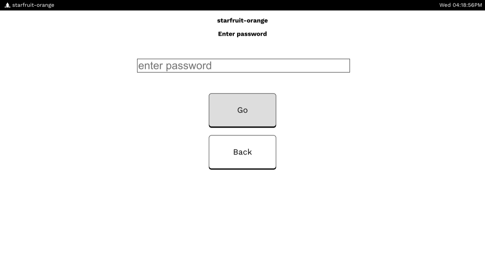
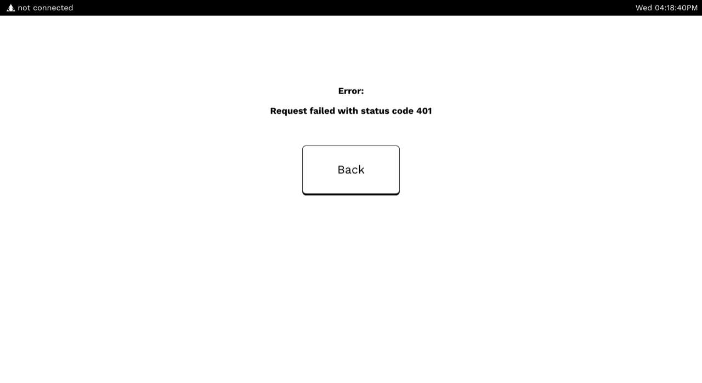
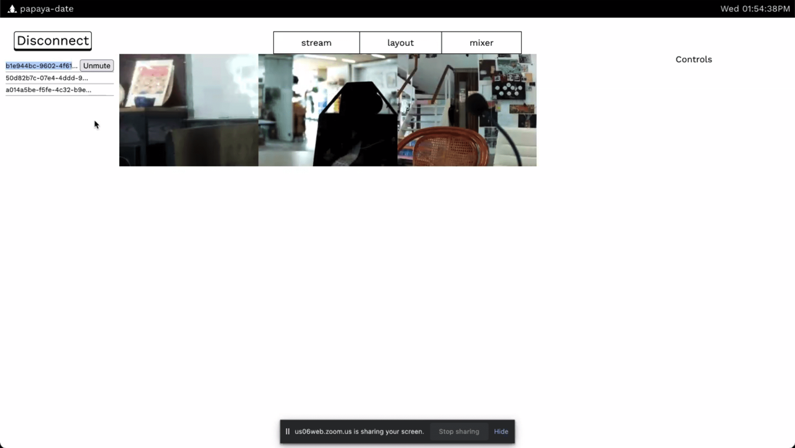
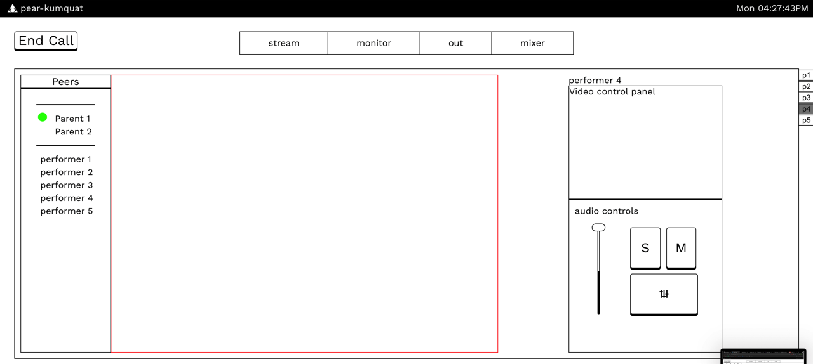
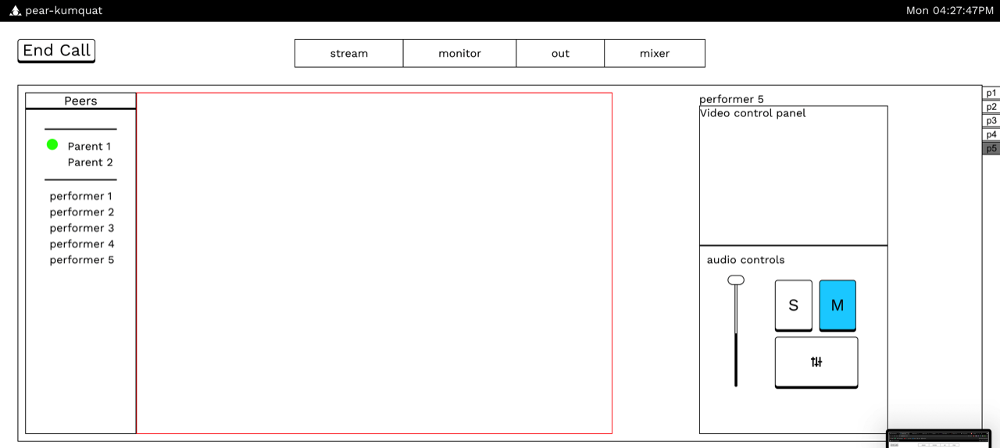
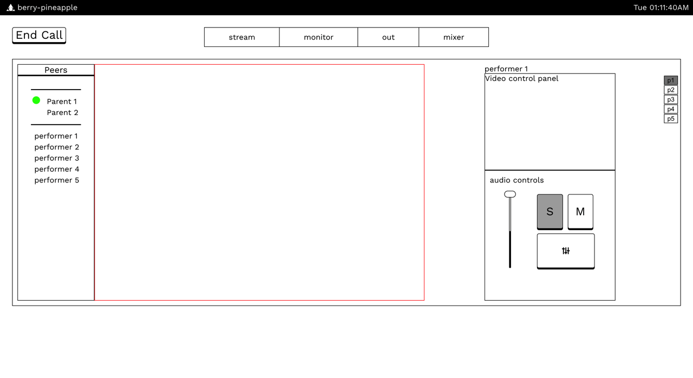
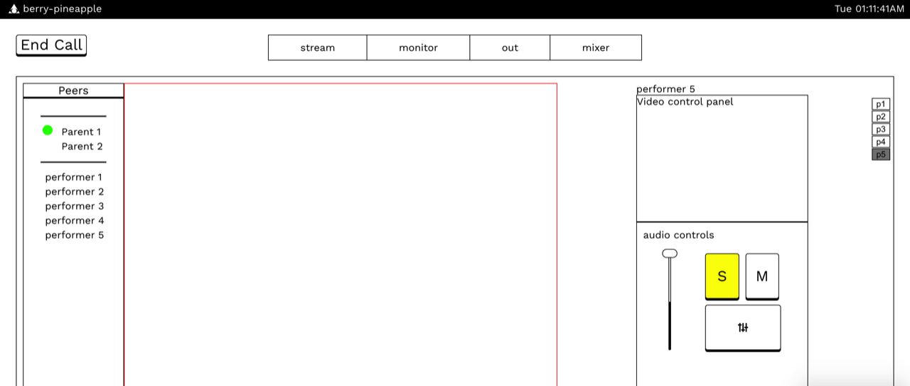
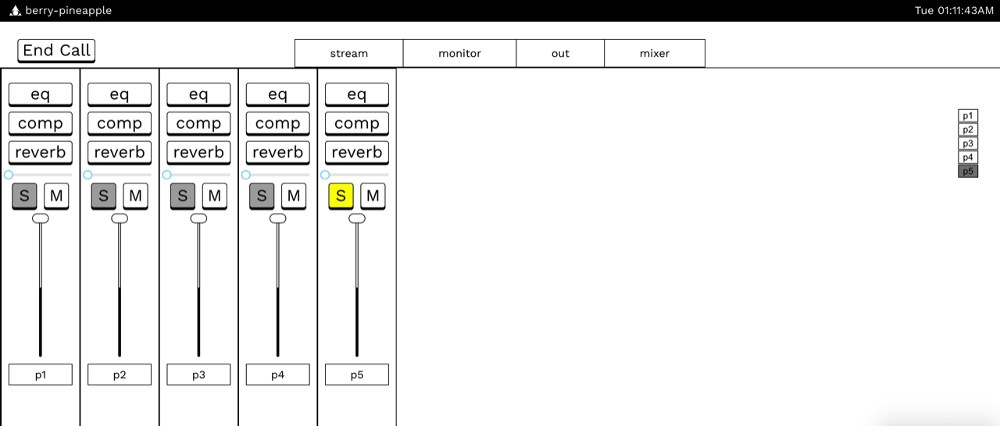
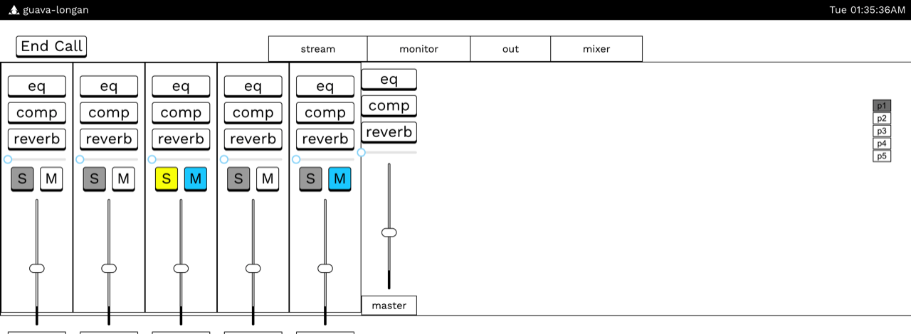

# Version 1.0

## Prototype Child

We show our prototype on 30th July 2021, displaying the application's basic server and video capabilities.

The onboard page

Creating room

Setting the password

Room created

Error page

Showing available rooms

Child node live demo of room

The quality of the webcam

## Prototype Parent

The main parent screen showing all video feeds, tabs, and the connected users.

The mixer section to adjust individual performers' audio output. This was WIP.

The upgraded UI for main screen

Interaction with the `Mute` button

Interaction with the `Solo` button

Mixer page interactions

Equalizer
