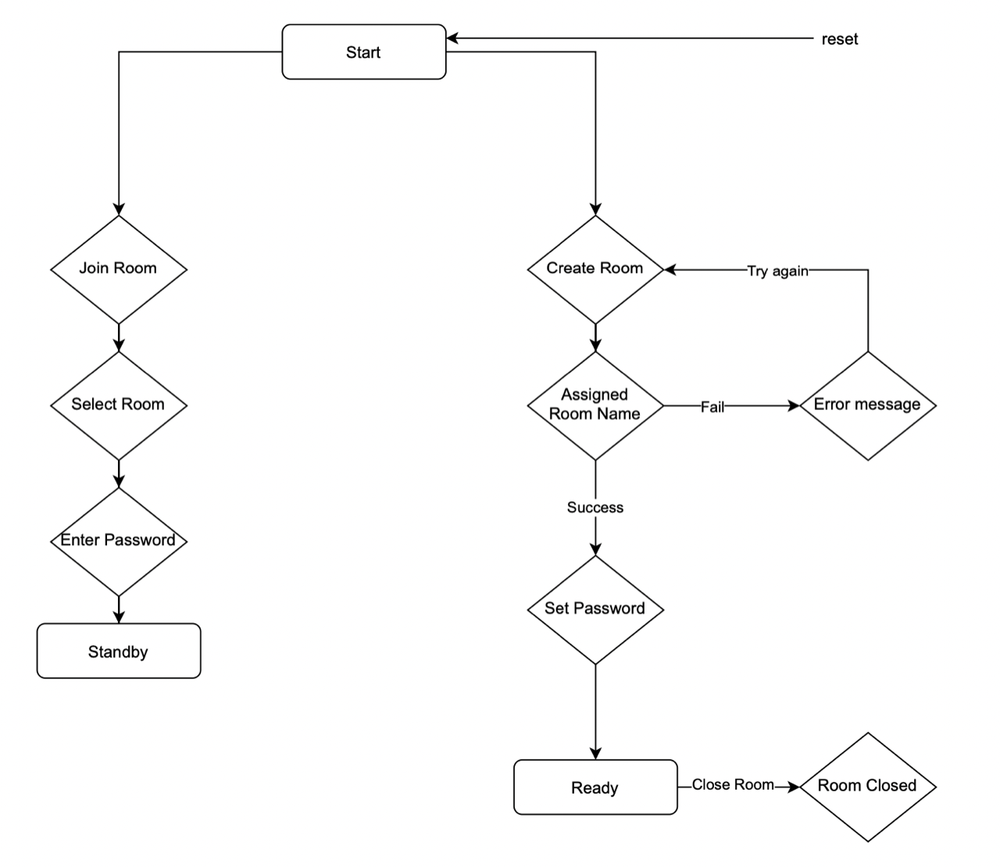
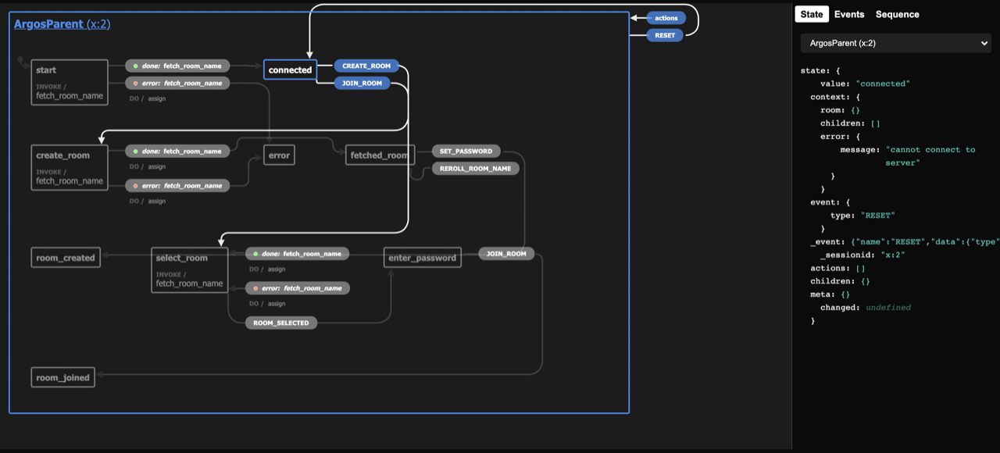

# Parent UI

This section documents the UI and appearance of the Parent software.

## Wire Frames

The start page in parent UI

The set password page in parent UI

The select room page in parent UI

The enter password page in parent UI

## UX Flowchart

We made a flow chart for the parent node to plan out the interaction

As we work in React xState, we developed a state chart that aligns with the flowchart.

## State Machine

- Show state machine

## Prototyping

- Show Prototyped UI

## Final
