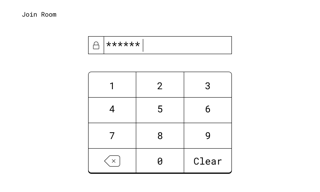
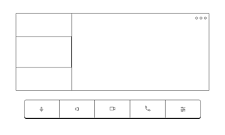
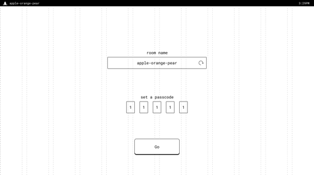
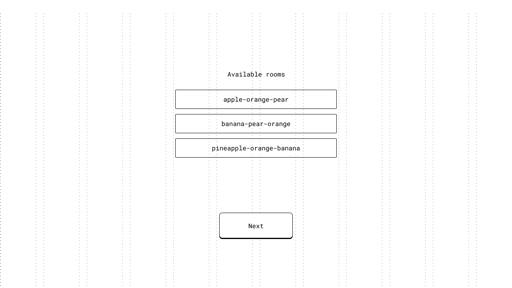
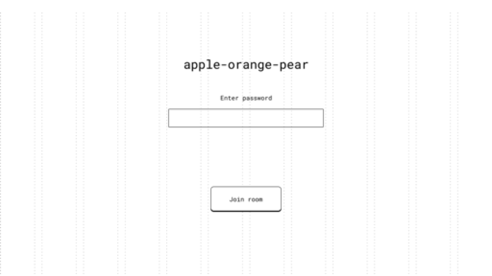
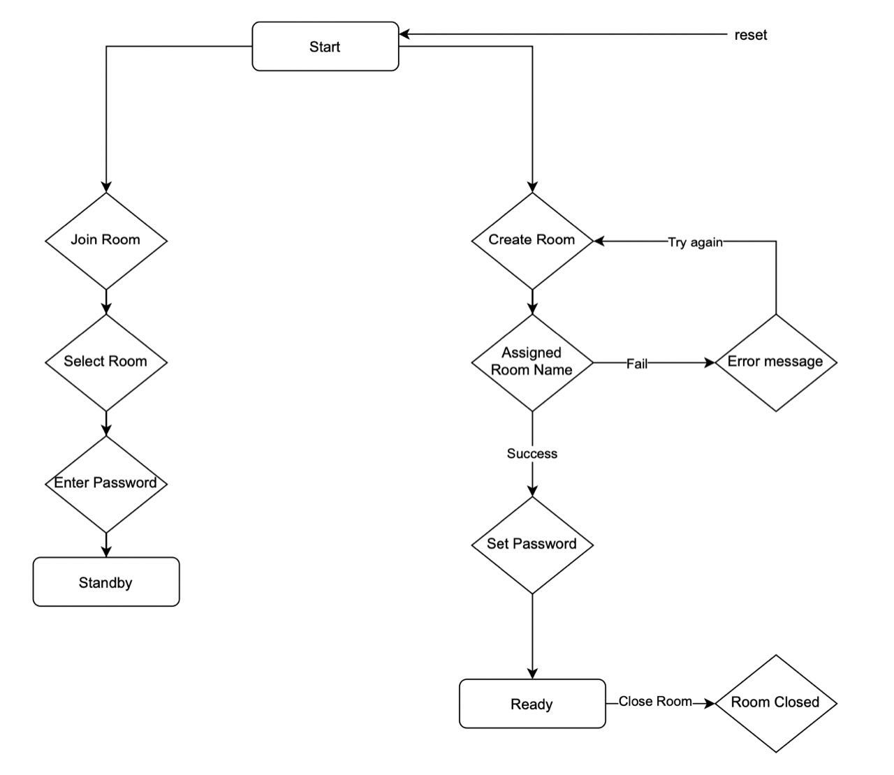
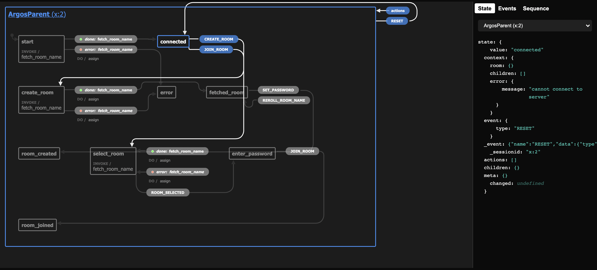

# The UI

## Wireframe

We designed the wireframe of the application using Figma.

### Child Node UI

Entering password in the child UI

Joined room in child UI

### Parent Node UI

The start page in parent UI

The set password page in parent UI

The select room page in parent UI

The enter password page in parent UI

## The workflow

We made a flow chart for the parent node to plan out the interaction

As we work in React xState, we developed a state chart that aligns with the flowchart.

## Workflow

- Start with a flowchart
- Frontend design using Figma
- Use xState machine to align with the flowchart
- Build components within xState machine
