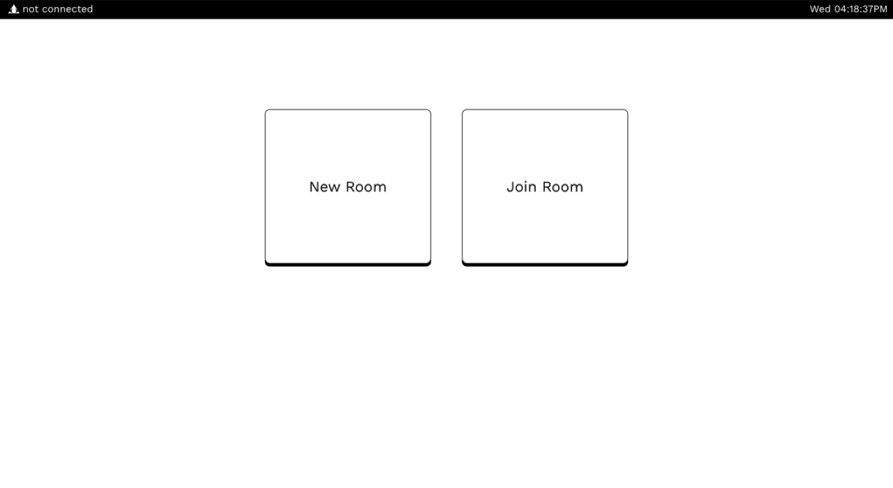

# The UI

## Wireframe

We designed the wireframe of the application using Figma.

### Child Node UI

Entering password in the child UI

Joined room in child UI

### Parent Node UI

The start page in parent UI

The set password page in parent UI

The select room page in parent UI

The enter password page in parent UI

## The workflow

We made a flow chart for the parent node to plan out the interaction

As we work in React xState, we developed a state chart that aligns with the flowchart.

## Prototype

We show our prototype on 30th July 2020, displaying the application's basic server and video capabilities.

The onboard page

Creating room

Setting the password

Room created

Error page

Showing available rooms

Child node live demo of room

The quality of the webcam

## Workflow

- Start with a flowchart
- Frontend design using Figma
- Use xState machine to align with the flowchart
- Build components within xState machine
