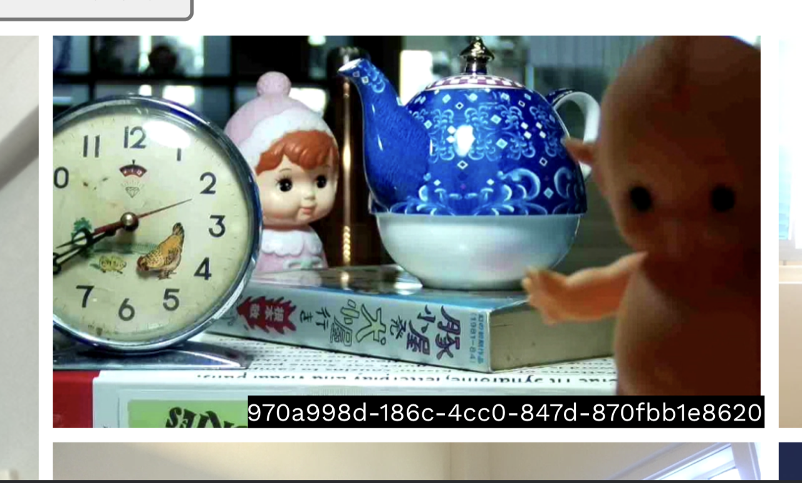

# Version 1.0

:::warning To be moved
This page is to be moved to Parent and Child page
:::

## Prototype

We show our prototype on 30th July 2021, displaying the application's basic server and video capabilities.

The onboard page

Creating room

Setting the password

Room created

Error page

Showing available rooms

Child node live demo of room

The quality of the webcam

## The Build

- document state machine (show the different parts of state machine)
- document components
  - room names randomly generated
  - through server
  - obtaining key and checking key
- document livekit and how we go about with the video and video arrangement
- document input text system and password system (how we do the password system)
  - limit 5 character
  - limit to numericals
  - shake when wrong password
