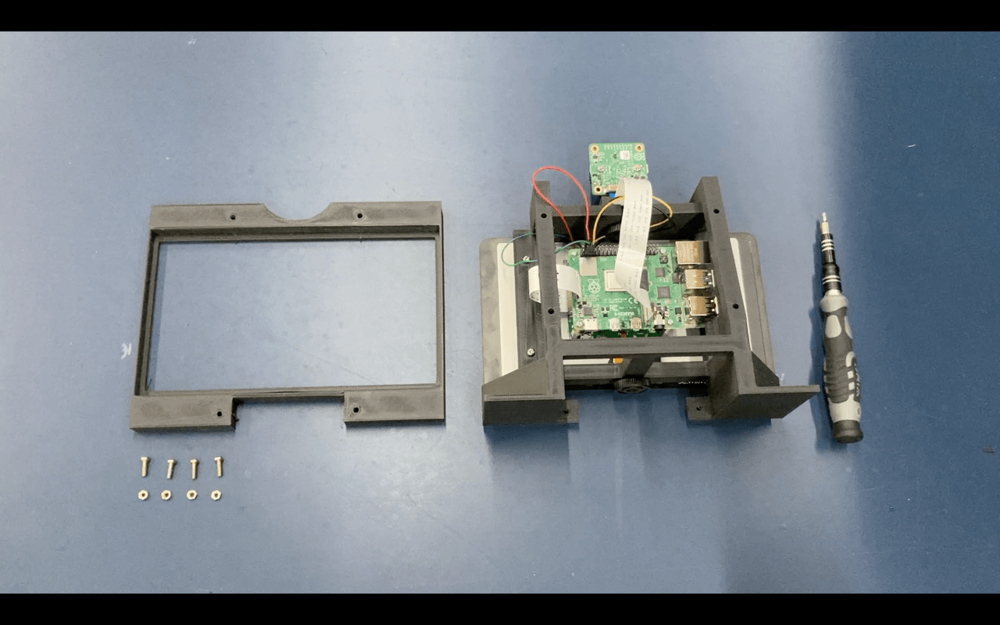
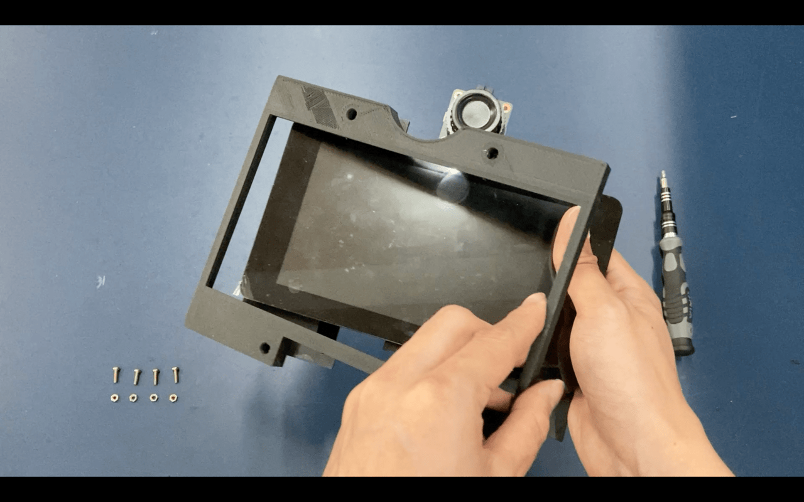
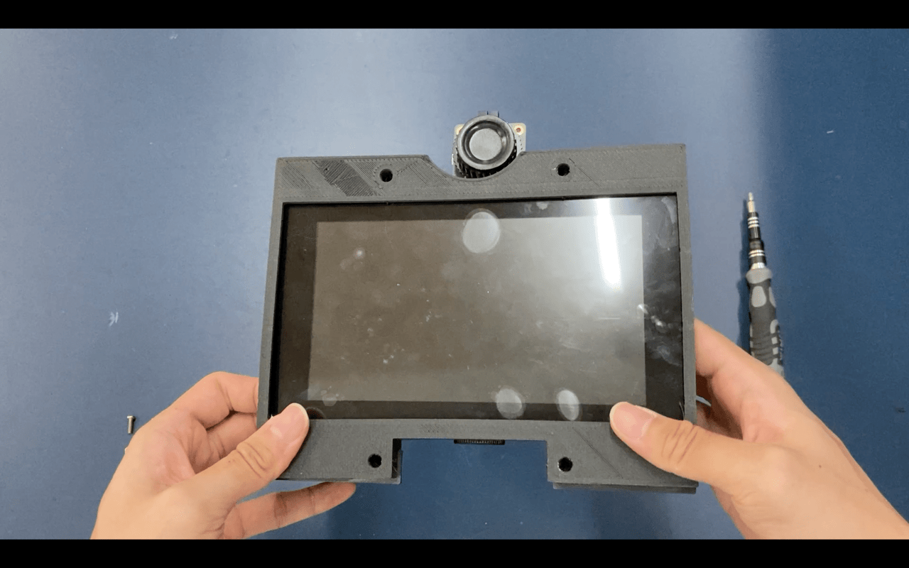
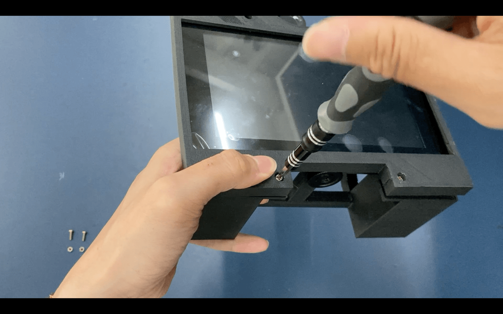

# Assembling the Front Cover

The items required for the case assembly is:

- Current assembly
- Front cover
- 4x 10mm M3 bolts
- 4x M3 nuts

Tools to use:

- Screw driver or battery drill

1. Place the cover over the screen.

2. Insert the M3 bolts in the front of the frontcover, pushing the bolt all the way in.

3. At the back, secure the protruded bolt with the M3 nut.

:::tip Note

These instructions are out of date as of current model. The new instructions will come in after the next review

:::
