# 6. Assembling the Camera

**The items required for the case assembly is:**

- Current assembly
- Raspberry Pi HD Camera Module
- 1x `1/4"` `Tripod Adapter Screw`
- 1x `8mm` CS Mount Lens

Tools to use:

- `Screw driver` or `battery drill`

## Assembly Video

<iframe width="560" height="315" src="https://www.youtube.com/embed/4fkaIyUBNZo" title="YouTube video player" frameborder="0" allow="accelerometer; autoplay; clipboard-write; encrypted-media; gyroscope; picture-in-picture" allowfullscreen></iframe>

## Step By Step Instructions

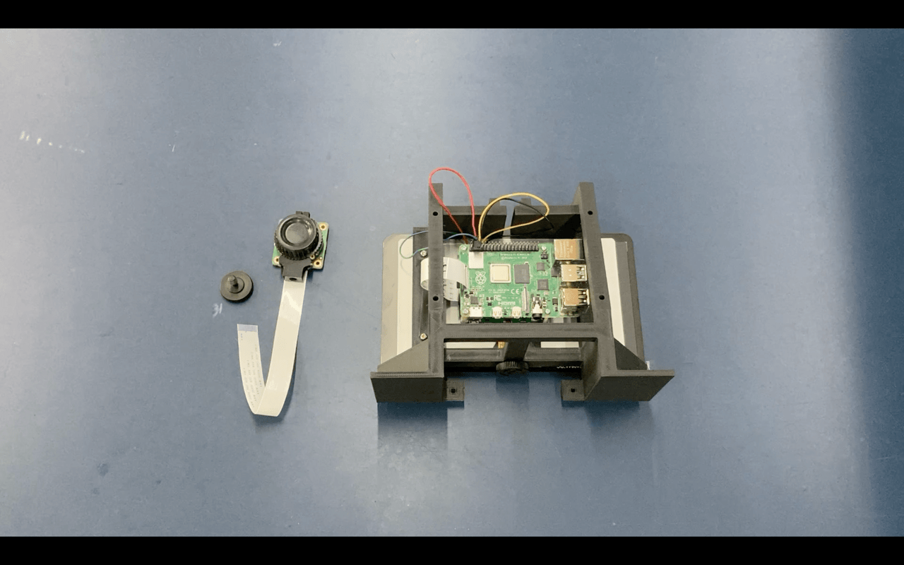

1. Start by lightly screwing the `1/4" Tripod Adaptor Screw` onto the bottom of the camera. (Just two to three turns will be enough)

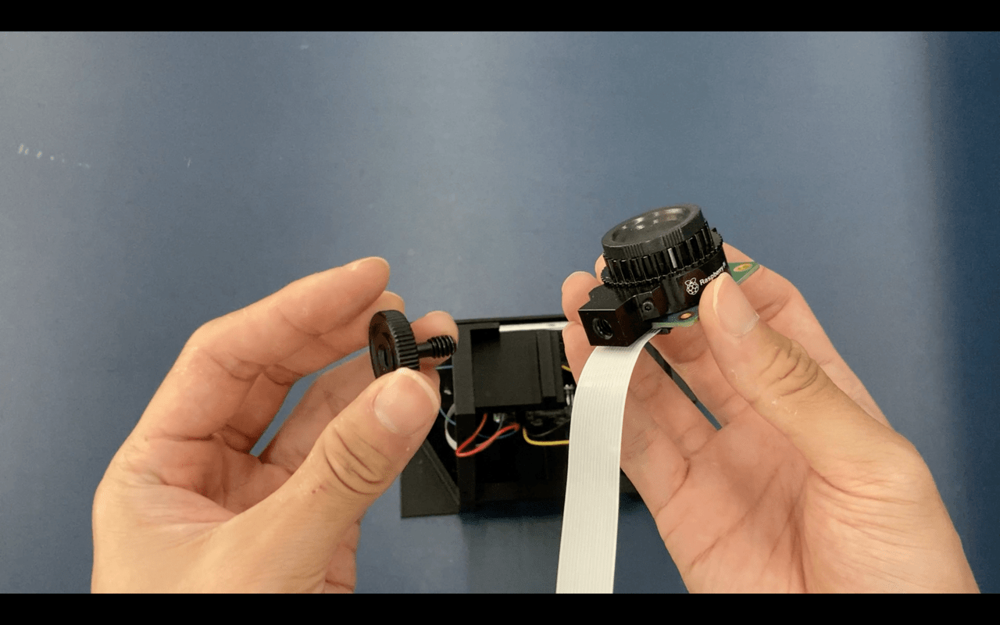

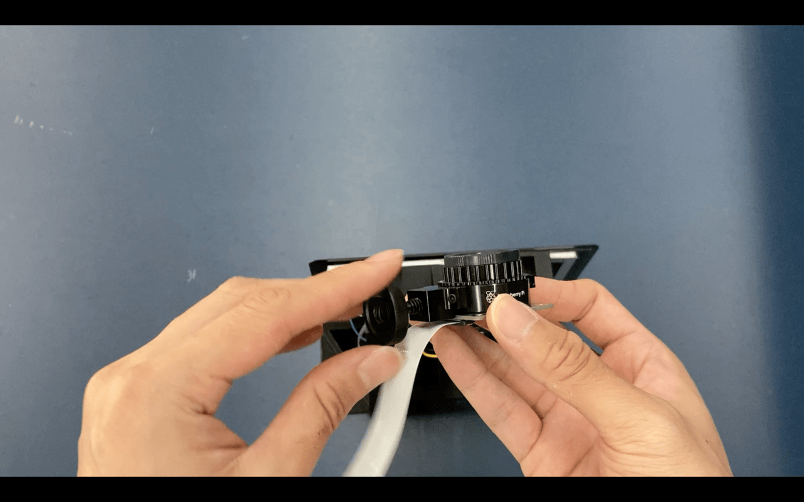

2. Next, insert the camera into the slot on the top of the main body.

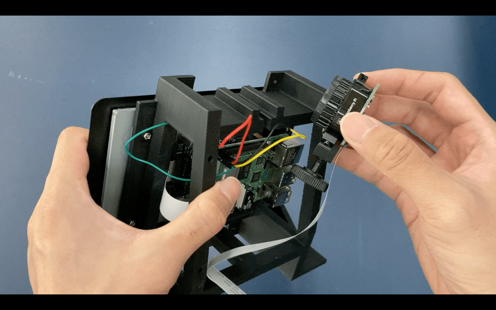

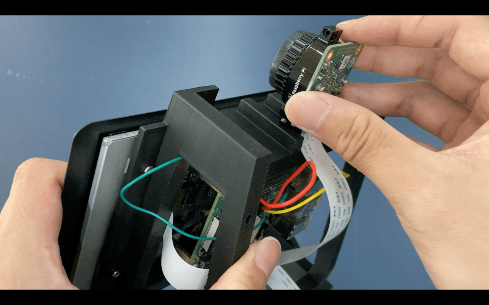

3. Once in the position you desire, tighten the screw to secure the camera onto the main body.

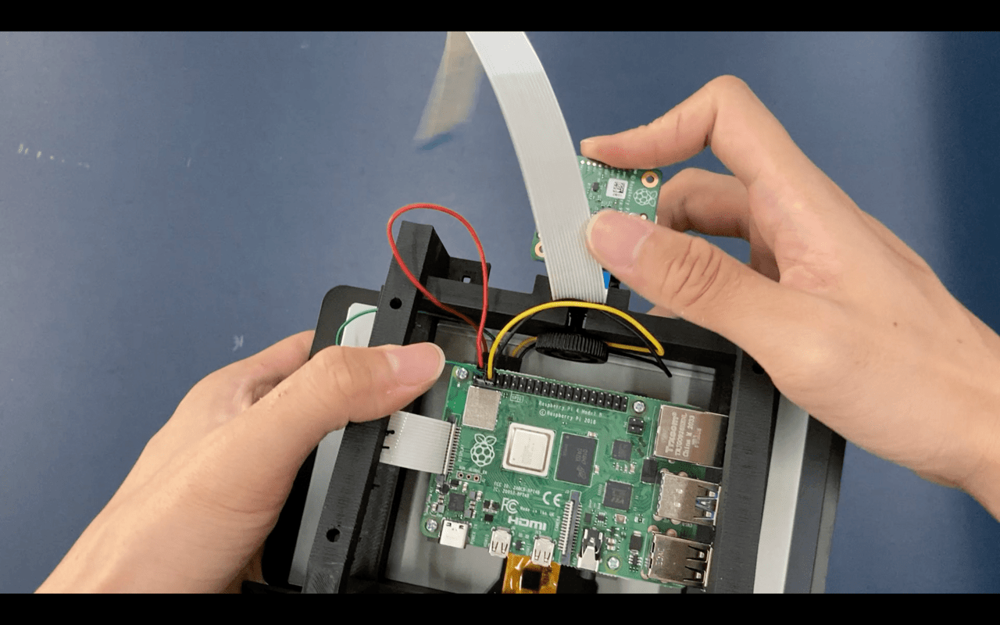

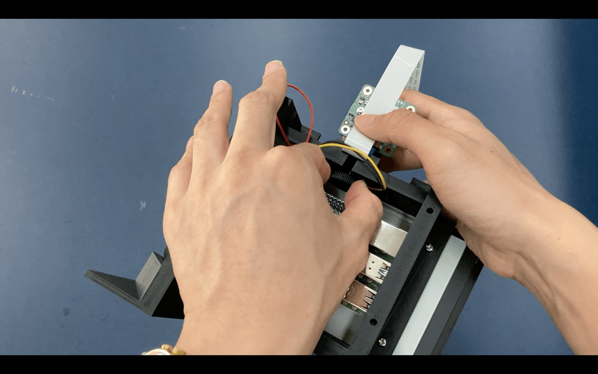

4. Open the **ribbon cable input labelled "CAMERA"** near the middle of the Raspberry Pi board.

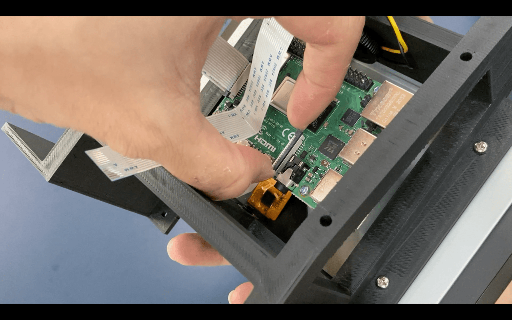

5. Note the direction of the ribbon cable pins: it has to face **away** from the black tab, or **in-line with the metal pins** below the input.

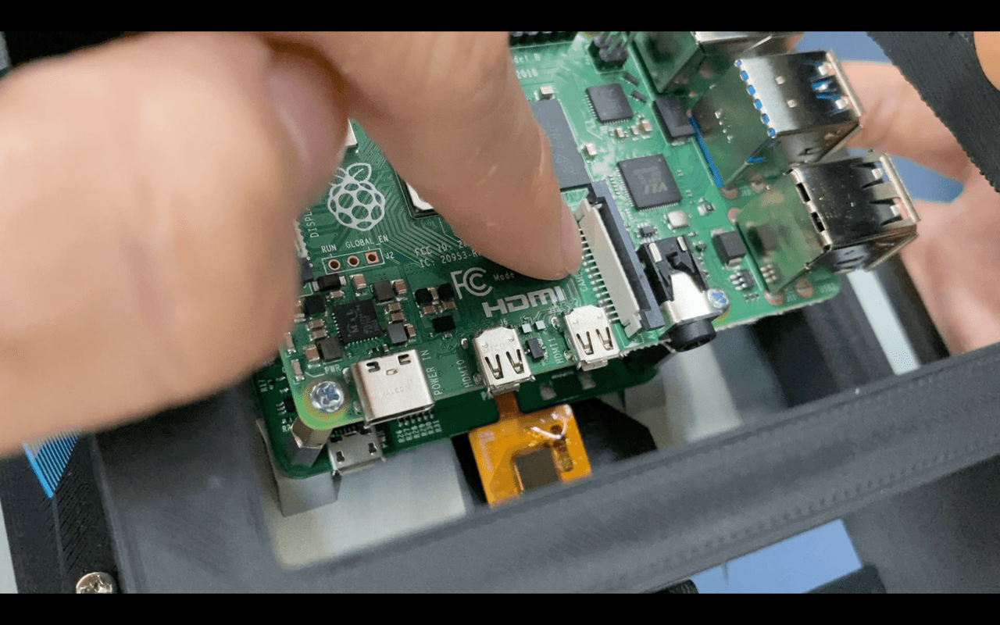

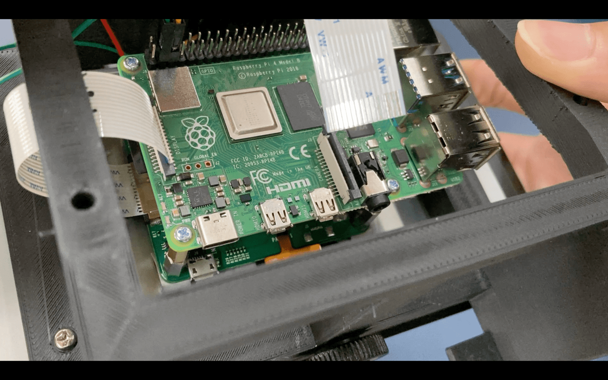

6. Insert the ribbon cable and ensure the cable is not slanted.

:::warning Fragile!
Make sure the ribbon cable is correctly aligned with the contacts before pushing down the black tab to avoid damaging the cable. Do not force the ribbon cable with excessive force.
:::

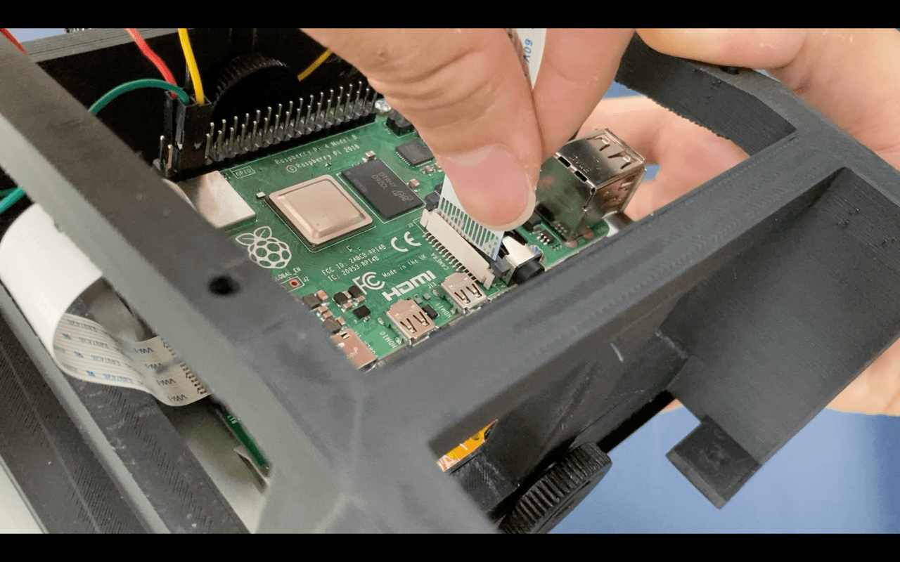

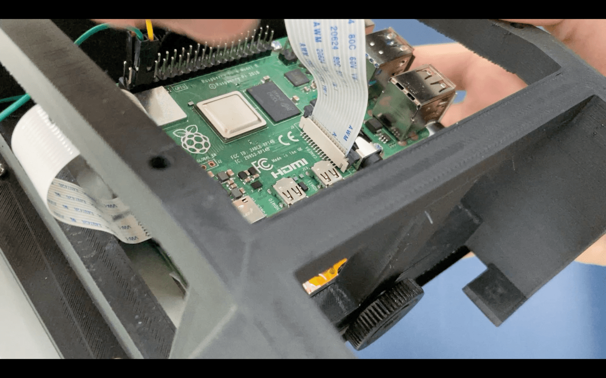

7. Close the black tab to secure the cable

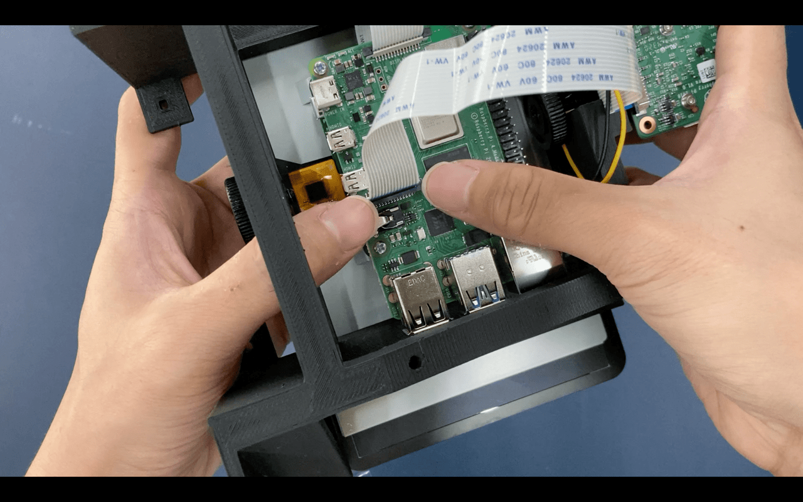

8. Install the `8mm CS Mount Lens` onto the camera
   (insert lens image)

:::warning Note

The camera module comes with an **C-CS Adaptor** that is used for certain lenses. Check if your lens require this adaptor before installation as it will cause focusing issues.

Please check this [issue](https://www.raspberrypi.org/forums/viewtopic.php?t=276558) and this [documentation](https://static.raspberrypi.org/files/product-guides/Typical_C-Mount_Lens_Guide.pdf) to understand more about this issue.
:::
