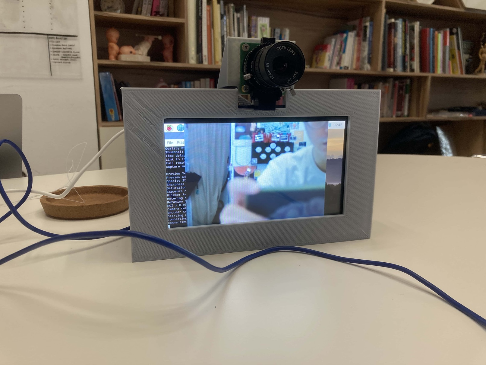

# Version 1.0

### Set Up

We started the project by assembling the hardware required (see the "Hardware" section on the hardware needed and the assembly instructions).

First, we setup the Raspberry Pi and then connected it with the touch display.

The Raspberry Pi Display

The setting up of the Raspberry Pi using an external monitor

Finish up the Raspberry Pi setup using the touch display

Connecting the ribbon wire

Connecting the jumper wires

The Raspberry Pi connected onto the touch display

Up close look at the connection

Next, we installed the camera with a simple connection of a ribbon wire.

The webcam

Connection of the ribbon wire

The webcam is now installed

### The Casing

Now that the hardware setup is completed, we needed a form for the casing. Through rough sketches, we got an idea of how the casing should look.

The form ideation on whiteboard

A design was then decided and the first model is CAD-ed out

The 3D model of the parts

Afterwhich, we 3D printed on PLA

Printing the camera mount

The 3D printed inner mount piece

The assembly of the inner mount piece with the hardware components

:::tip Tolerance

We measured the hardware and based the design on the measurements. We forgot to factor in tolerance which is important! As a result, the printed screw holes are a bit too tight and needed to be drilled in. We have since added tolerance in our next few iterations.

:::

:::tip Problem Encountered

We also made an error in measurement, resulting in 2 of the screwholes being mis-aligned. This is due to minor errors or parallex error when measuring in small scales.

:::

After printing the outer casing, we are then able to fully put everything together into our fully assembled first iteration of the module.

Testing the module
