# Version 1.2

### Changelog

Changes in model:

- We added a backplate that covers the back part of the outer case. This hides and protects the components and wires while also providing easy access during maintenance. The backplate comes with a hole that allows wire to pass if required.

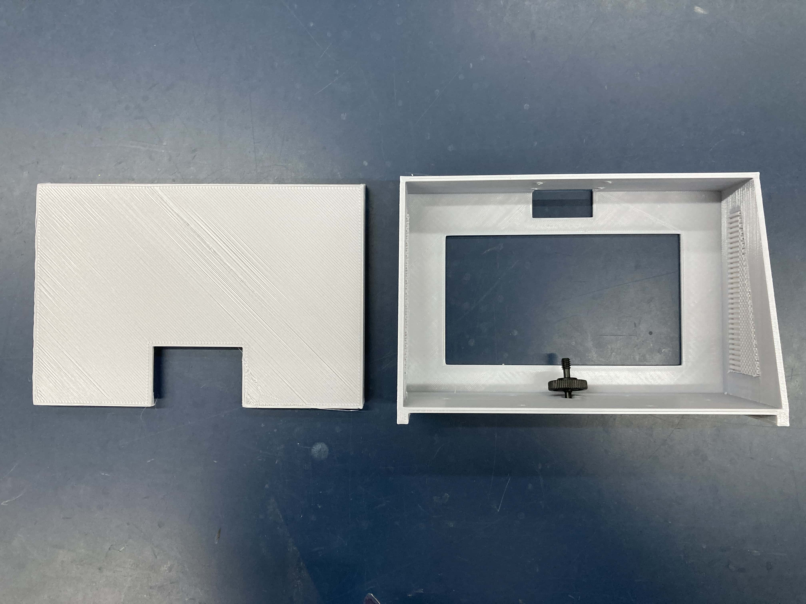

- We also adjusted the misaligned screwholes while adding tolerance to them so they can be better secured by the right-sized screws.

:::tip Problem Encountered

The screwholes are still misaligned by a slight bit. This is to be fine-tuned.

:::

- We also adjusted the supporting beam of the inner piece to allow for easier access of the wiring without compromising on the structure.

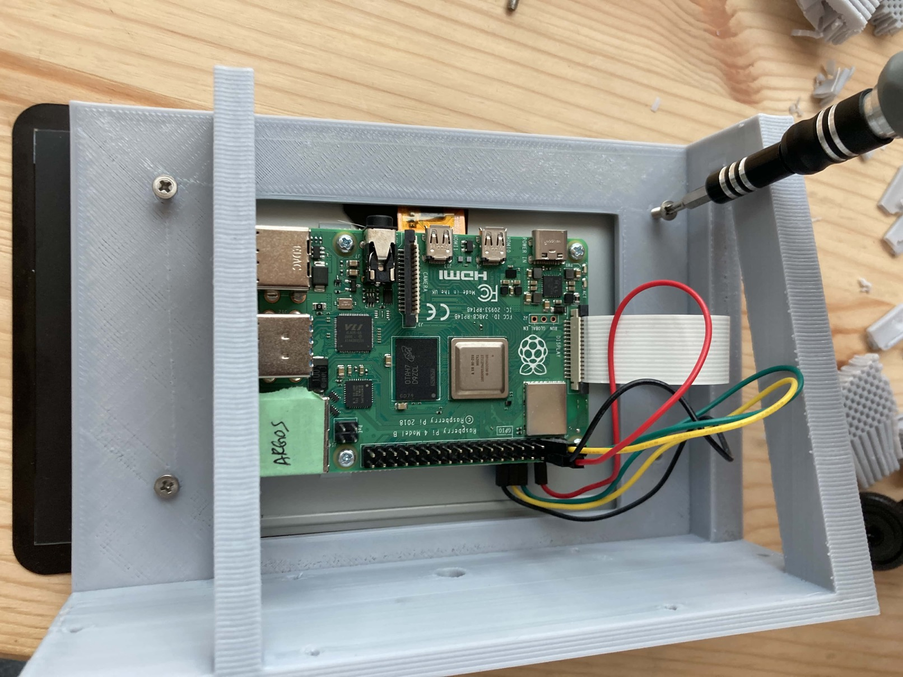
The beam is moved to the right, aligning with the cable input ports which makes it more accessible when plugging in or out.

- Lastly, we added a hole to install the screw for tripod mounting. We also raised the base floor up to account for the additional thickness that the mount screw will add when installed (this is to prevent the module to be off-balance when not mounted onto a tripod).

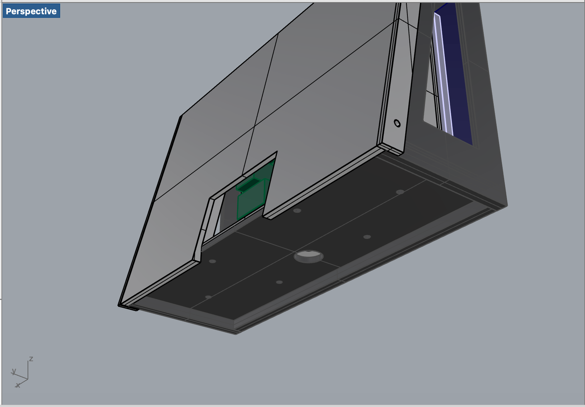

:::tip Problem Encountered

The mount screw cannot be secured tightly, therefore additional thickness is required to be added to the base for the mount screw to sit tightly.

:::

### Assembly

First, the support structure of the pieces are removed

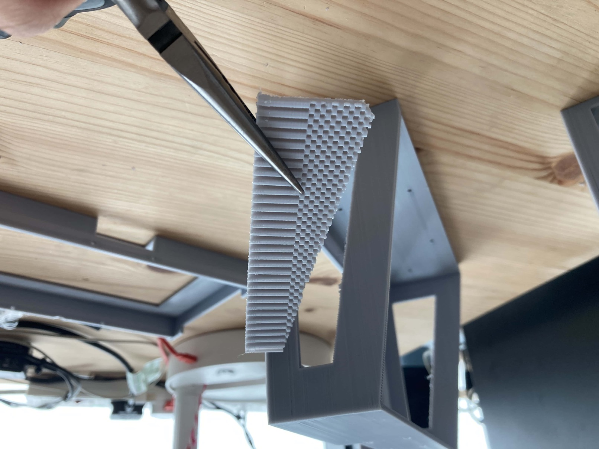

Next, the inner piece is replaced with the new version

The camera mount gets installed onto the outer piece next

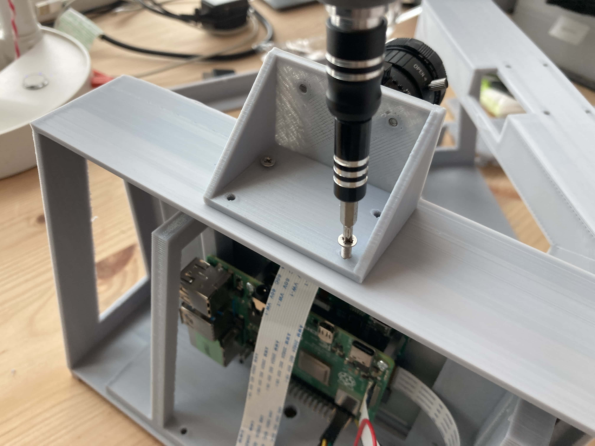

The tripod mount screw is then installed, followed by the installation of the inner piece onto the outer piece

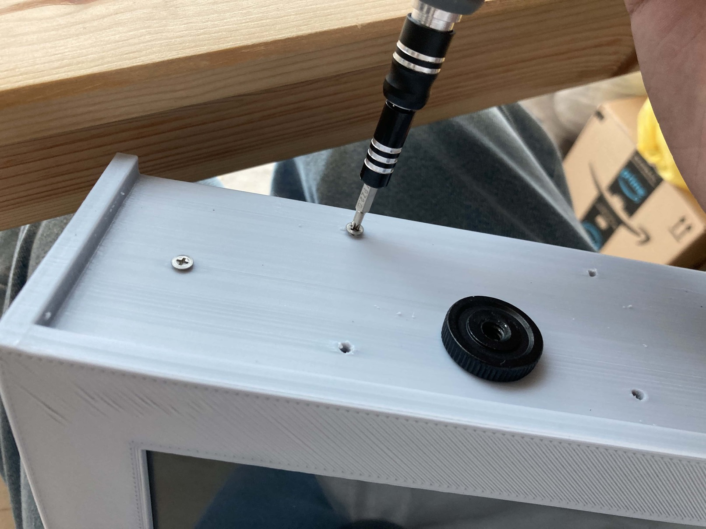
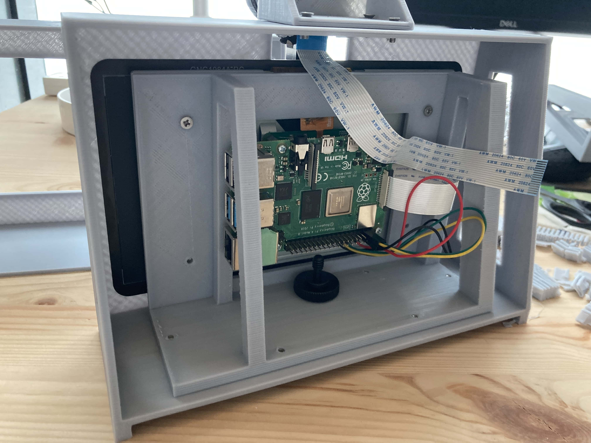

The backplate is then installed

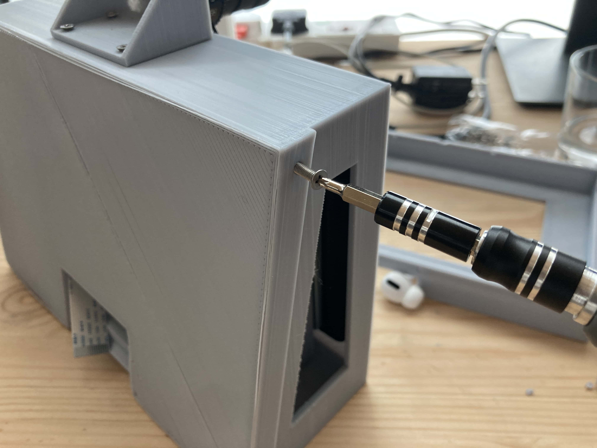

The module is fully installed!

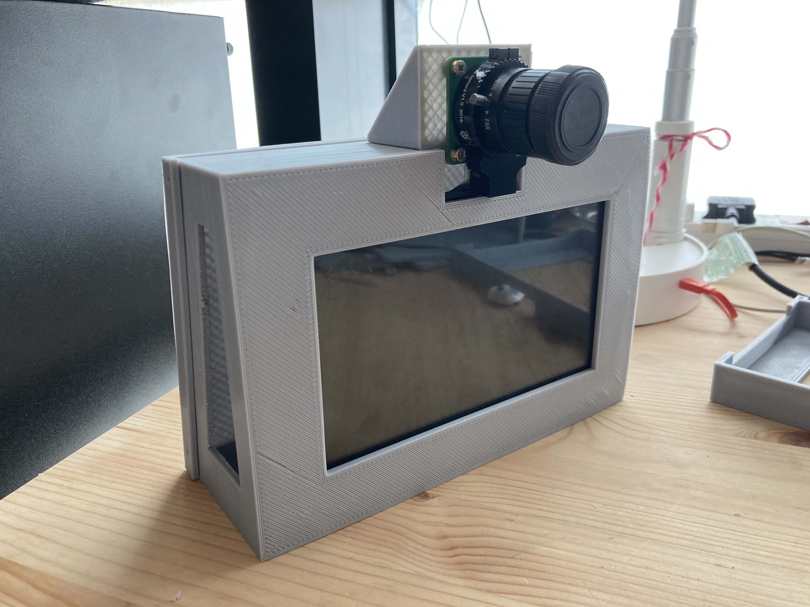
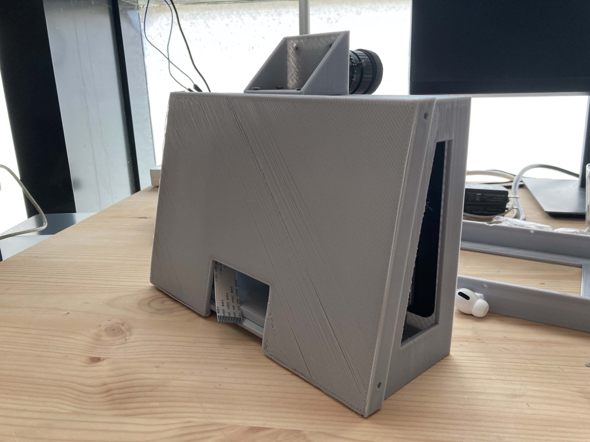
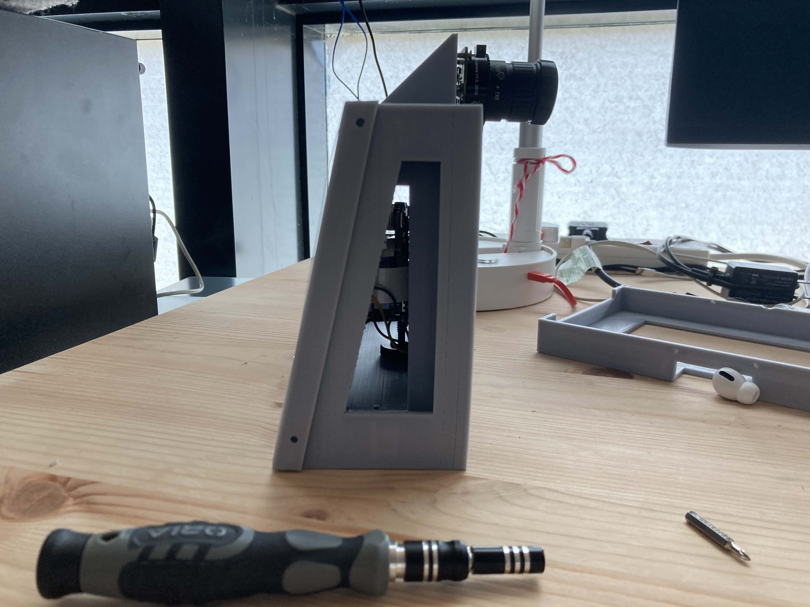
